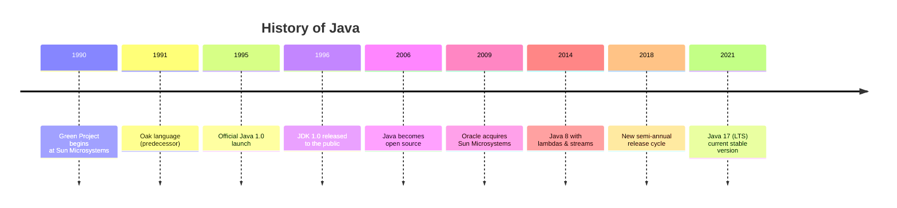
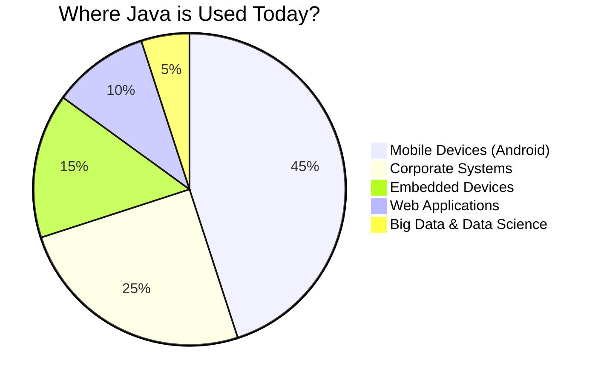

# 📚 Lesson 1 - History and Evolution of Java

---

## 🎯 Lesson Objectives
- Learn about the origin and historical context of Java
- Understand the evolution of the language over time
- Comprehend Java's importance in today's development ecosystem

---

## 📜 Java Timeline

---

## 🧩 Origin and Historical Context

### The Birth of a Revolutionary Idea

- **1990** – Created at **Sun Microsystems**, led by **James Gosling**.
- Initial goal: develop technology to enable **communication between smart devices**.
- First tests were done in **C++**, but complexity and limitations led to creating something new.

> 💡 **Did you know**: The original team was known as the "Green Team" and worked in a separate building from Sun Microsystems.

---

## 🌱 First Steps

### The Green Project
- Dedicated team developing the new language
- Initial name: **GreenTalk** (.gt extension)
- **1991** – Renamed to **Oak**, inspired by a tree visible from the office window

### Early Projects
- **Star Seven** (*7): portable controller for home entertainment (set-top box)
- **Duke**: language mascote/virtual assistant (created by Joe Palrang)

---

## 🔄 From Drawer to Web

### Incubation Period
- **1992** – Project shelved due to lack of commercial interest
- **1994** – Meanwhile, **Tim Berners-Lee** was developing **HTML** and the World Wide Web

### The Missing Link Found
- The idea of **interactivity** became the link between Oak and the Web
- The **Web Runner** project emerged, an experimental browser capable of running applets

> 🌐 **Context**: The web was being born and there was an urgent need for dynamic, interactive content

---

## ☕ The Name Choice

### The Legal Problem
- Name **Oak** was already trademarked by a technology company

### Creative Brainstorming
- Team gathered at a local café for name brainstorming
- Considered suggestions: Silk, Lyric, Pepper, NetProse, DNA

### Final Inspiration
- **Java** – inspired by **"Java Coffee"** (strong, popular coffee)
- Reflected the team's energy and coffee consumption habit
- **Web Runner** was renamed to **HotJava**

---

## 🚀 Consolidation and Mass Adoption

### The Key Differentiator
- **Interactivity**: ability to connect internal and external devices
- **"Write Once, Run Anywhere"** - revolutionary portability concept

### Important Milestones
- **2004** – **NASA** used Java for communication with Mars rovers (Spirit and Opportunity)
- Java established itself as **reliable, secure, and cross-platform**

### Corporate Expansion
- Mass adoption by companies like IBM, SAP, and Oracle
- Became enterprise development standard

---

## 📊 Java as Open Source

### Strategic Turn
- **2006** – Java becomes **open source** under **GPLv3** license
- Movement led by Jonathan Schwartz (Sun CEO)

### Ecosystem Impact
- Strengthened free software (Linux, Firefox, Chrome, PHP, WordPress, Blender)
- Greater transparency and community collaboration
- Emergence of alternative implementations (OpenJDK)

---

## 🔄 New Phase: Oracle Era

### Historic Acquisition
- **2009** – **Sun Microsystems** acquired by **Oracle** for $7.4 billion
- **2010** – James Gosling leaves the company

### Concerns and Realities
- Community feared drastic changes and platform closure
- In practice, Oracle maintained commitment to open development
- Continuous investment in improvements and new features

---

## 🌍 Java Usage Examples

### Ubiquitous Presence

### Specific Use Cases
- **Credit cards** – chips read through Java interfaces
- **Android** – systems and apps built in Java (≈ 3 billion devices)
- **Blu-ray** – interactive menus controlled by Java
- **Kindle** – system based on Java ME
- **Financial servers** – bank and stock exchange systems
- **Minecraft** – one of world's most popular games

---

## 📈 Java Version Evolution

| Version | Year | Key Innovations |
|--------|-----|---------------------|
| JDK 1.0 | 1996 | Initial version, applets |
| J2SE 1.2 | 1998 | Collections framework, JIT compiler |
| J2SE 5.0 | 2004 | Generics, autoboxing, enums, annotations |
| Java SE 6 | 2006 | Scripting support, JDBC 4.0 |
| Java SE 7 | 2011 | try-with-resources, NIO.2 |
| **Java SE 8** | **2014** | **Lambdas, Stream API, Date/Time API** |
| Java SE 9 | 2017 | Modules (Project Jigsaw) |
| Java SE 11 | 2018 | HTTP Client, var for lambdas (LTS) |
| **Java SE 17** | **2021** | **Sealed classes, pattern matching (current LTS)** |

---

## 🎓 Why Java Remains Relevant?

### Competitive Advantages
- **Portability** – works on any device with JVM
- **Performance** – JIT compiler and continuous optimizations
- **Security** – sandbox model and memory management
- **Rich Ecosystem** – vast libraries and frameworks
- **Active Community** – millions of developers worldwide

### Current Trends
- Quarkus and Micronaut for lightweight microservices
- Java in edge computing and IoT
- Continuous evolution with semi-annual releases
- Strong presence in cloud computing

---

## ✅ Learning Checklist

- [ ] Understood the historical context of Java's emergence
- [ ] Understood the importance of "Write Once, Run Anywhere"
- [ ] Recognize the importance of Java's open sourcing
- [ ] Can identify at least 5 areas where Java is used today
- [ ] Understood Java version evolution
- [ ] Understand why Java remains relevant today

---

### 💎 Final Curiosity

Did you know Java's official logo shows a steaming coffee cup? ☕  
A permanent homage to the origin of the name that revolutionized software development.

> "Java is not just a language, it's an ecosystem that forever changed how we build software." - James Gosling

