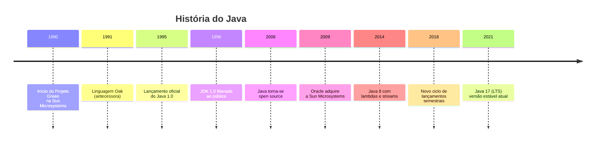
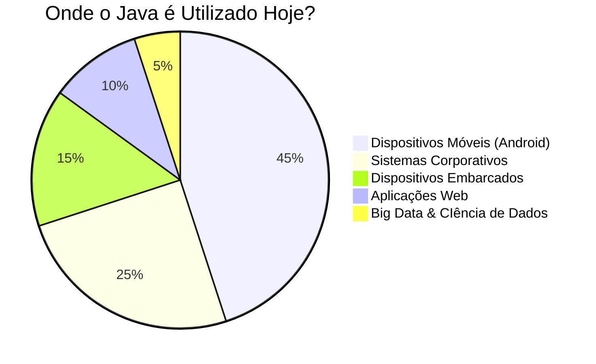

# 📚 Aula 1 - História e Evolução do Java

---

## 🎯 Objetivos da Aula
- Conhecer a origem e contexto histórico do Java
- Entender a evolução da linguagem ao longo do tempo
- Compreender a importância do Java no ecossistema atual de desenvolvimento

---

## 📜 Linha do Tempo do Java

---

## 🧩 Origem e Contexto Histórico

### O Nascimento de uma Ideia Revolucionária

- **1990** – Criado na **Sun Microsystems**, liderado por **James Gosling**.
- Objetivo inicial: desenvolver uma tecnologia para permitir a **comunicação entre dispositivos** inteligentes.
- Primeiros testes foram feitos em **C++**, mas a complexidade e limitações levaram à criação de algo novo.

> 💡 **Curiosidade**: A equipe original era conhecida como "Green Team" e trabalhava em um prédio separado da Sun Microsystems.

---

## 🌱 Primeiros Passos

### The Green Project
- Equipe dedicada ao desenvolvimento da nova linguagem
- Nome inicial: **GreenTalk** (extensão .gt)
- **1991** – Renomeada para **Oak** (Carvalho), inspirada por uma árvore vista da janela do escritório

### Projetos Iniciais
- **Star Seven** (*7): controlador portátil voltado ao entretenimento doméstico (set-top box)
- **Duke**: mascote/assistente virtual da linguagem (criado por Joe Palrang)

---

## 🔄 Da Gaveta à Web

### Período de Incubação
- **1992** – Projeto engavetado por falta de incentivo comercial
- **1994** – Paralelamente, **Tim Berners-Lee** desenvolvia o **HTML** e a World Wide Web

### O Elo Perdido Encontrado
- A ideia de **interatividade** se tornou o elo entre Oak e a Web
- Surge o projeto **Web Runner**, um navegador experimental capaz de executar applets

> 🌐 **Contexto**: A web estava nascendo e havia uma necessidade urgente de conteúdo dinâmico e interativo

---

## ☕ A Escolha do Nome

### O Problema Legal
- Nome **Oak** já estava patenteado para uma empresa de tecnologia

### Brainstorming Criativo
- Equipe reunida em um café local para brainstorm de nomes
- Sugestões consideradas: Silk, Lyric, Pepper, NetProse, DNA

### A Inspiração Final
- **Java** – inspirado em **"Java Coffee"** (café forte e popular)
- Refletia a energia da equipe e seu hábito de consumir café
- O **Web Runner** foi renomeado para **HotJava**

---

## 🚀 Consolidação e Adoção em Massa

### O Grande Diferencial
- **Interatividade**: capacidade de conectar dispositivos internos e externos
- **"Write Once, Run Anywhere"** - conceito revolucionário de portabilidade

### Marcos Importantes
- **2004** – A **NASA** utilizou Java na comunicação com robôs em Marte (rovers Spirit e Opportunity)
- Java se consolidou como linguagem **confiável, segura e multiplataforma**

### Expansão Corporativa
- Adoção massiva por empresas como IBM, SAP, e Oracle
- Tornou-se padrão para desenvolvimento enterprise

---

## 📊 Java como Código Aberto

### A Virada Estratégica
- **2006** – Java se torna **open source**, sob a licença **GPLv3**
- Movimento liderado por Jonathan Schwartz (CEO da Sun)

### Impacto no Ecossistema
- Fortalecimento do software livre (Linux, Firefox, Chrome, PHP, WordPress, Blender)
- Maior transparência e colaboração da comunidade
- Surgimento de implementações alternativas (OpenJDK)

---

## 🔄 Nova Fase: Era Oracle

### Aquisição Histórica
- **2009** – A **Sun Microsystems** é adquirida pela **Oracle** por US$ 7,4 bilhões
- **2010** – James Gosling deixa a empresa

### Preocupações e Realidades
- Comunidade temia mudanças drásticas e fechamento da plataforma
- Na prática, Oracle manteve compromisso com desenvolvimento aberto
- Investimento contínuo em melhorias e novas funcionalidades

---

## 🌍 Exemplos de Uso do Java

### Presença Ubíqua

### Casos de Uso Específicos
- **Cartões de crédito** – chips lidos em interfaces Java
- **Android** – sistemas e aplicativos construídos em Java (≈ 3 bilhões de dispositivos)
- **Blu-ray** – menus interativos controlados por Java
- **Kindle** – sistema baseado em Java ME
- **Servidores Financeiros** – sistemas de bancos e bolsas de valores
- **Minecraft** – um dos jogos mais populares do mundo

---

## 📈 Evolução das Versões do Java

| Versão | Ano | Principais Inovações |
|--------|-----|---------------------|
| JDK 1.0 | 1996 | Versão inicial, applets |
| J2SE 1.2 | 1998 | Collections framework, JIT compiler |
| J2SE 5.0 | 2004 | Generics, autoboxing, enums, annotations |
| Java SE 6 | 2006 | Scripting support, JDBC 4.0 |
| Java SE 7 | 2011 | try-with-resources, NIO.2 |
| **Java SE 8** | **2014** | **Lambdas, Stream API, Date/Time API** |
| Java SE 9 | 2017 | Modules (Project Jigsaw) |
| Java SE 11 | 2018 | HTTP Client, var for lambdas (LTS) |
| **Java SE 17** | **2021** | **Sealed classes, pattern matching (LTS atual)** |

---

## 🎓 Por que Java Continua Relevante?

### Vantagens Competitivas
- **Portabilidade** – funciona em qualquer dispositivo com JVM
- **Performance** – JIT compiler e otimizações contínuas
- **Segurança** – modelo de sandbox e gerenciamento de memória
- **Ecossistema Rico** – vastas bibliotecas e frameworks
- **Comunidade Ativa** – milhões de desenvolvedores worldwide

### Tendências Atuais
- Quarkus e Micronaut para microserviços leves
- Java no edge computing e IoT
- Continua evolução com lançamentos semestrais
- Forte presença em cloud computing

---

## ✅ Checklist de Aprendizagem

- [ ] Compreendi o contexto histórico do surgimento do Java
- [ ] Entendi a importância do conceito "Write Once, Run Anywhere"
- [ ] Reconheço a importância da abertura do código do Java
- [ ] Identifico pelo menos 5 áreas onde o Java é utilizado hoje
- [ ] Compreendi a evolução das versões do Java
- [ ] Entendi por que o Java continua relevante hoje

---

### 💎 Curiosidade Final

Sabia que o logo oficial do Java mostra uma xícara de café fumegante? ☕  
Uma homenagem permanente à origem do nome que revolucionou o desenvolvimento software.

> "Java não é apenas uma linguagem, é um ecossistema que mudou para sempre a forma como construímos software." - James Gosling
