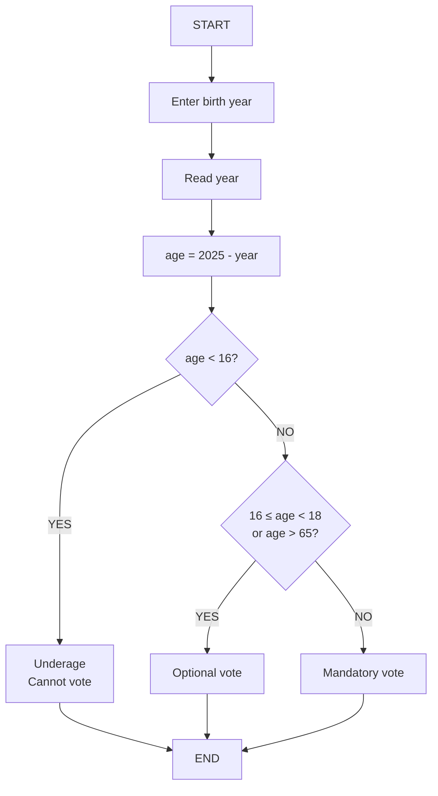
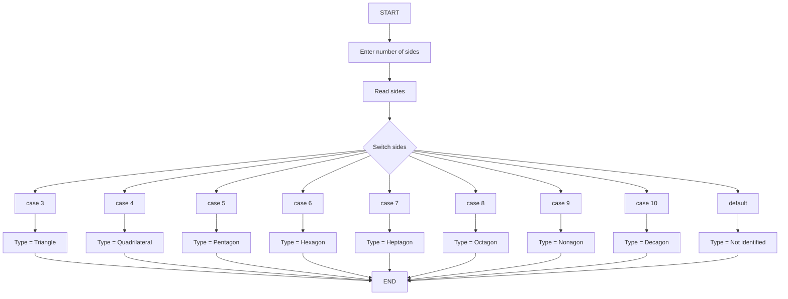

# 📚 Lesson 10 - Conditional Structures (Part 2)

Continuing from **Lesson 9**, in this class we’ll explore a more advanced type of decision structure:
**Nested Conditional Structures** (also called **Composite Conditional Structures**).

---

## 🎯 Lesson Objectives

* Understand nested conditional structures
* Master the use of `else if` to simplify code
* Learn the `switch` structure for multiple options
* Know when to use each type of conditional structure
* Develop programs with complex decisions

---

## 🔗 What Are Nested Structures?

We call **nested decision structures** those in which one decision is placed inside the *false branch* of another.
This type of structure is also known as **"nested selection"** or **"chained selection"**.

---

## 🗺️ Example: Voting System

### Flowchart – Age Verification for Voting



---

### Portugol Version

```portugol
algorithm "VotingSystem"
var
    age, year: integer
begin
    write("Enter the year you were born: ")
    read(year)
    age <- 2025 - year
    write("You are ", age, " years old")
    
    if (age < 16) then
        write("You are underage and cannot vote yet!")
    else
        if ((age >= 16) and (age < 18)) or (age > 65) then
            write("Your vote is optional")
        else
            write("Your vote is mandatory")
        endif
    endif
endalgorithm
```

---

## 💻 Java Implementation – Nested Version

### Code with Nested Ifs

```java
import java.util.Scanner;

public class VotingSystem {
    public static void main(String[] args) {
        Scanner input = new Scanner(System.in);

        System.out.print("Enter your birth year: ");
        int year = input.nextInt();
        int age = 2025 - year;

        System.out.println("Your age is: " + age);

        if (age < 16) {
            System.out.println("You are underage and cannot vote yet");
        } else {
            if (((age >= 16) && (age < 18)) || (age > 65)) {
                System.out.println("Your vote is optional");
            } else {
                System.out.println("Your vote is mandatory");
            }
        }
    }
}
```

---

## ✨ Simplifying with `Else If`

The same code can be written more cleanly using **else if**:

```java
import java.util.Scanner;

public class VotingSystemImproved {
    public static void main(String[] args) {
        Scanner input = new Scanner(System.in);

        System.out.print("Enter your birth year: ");
        int year = input.nextInt();
        int age = 2025 - year;

        System.out.println("Your age is: " + age);

        if (age < 16) {
            System.out.println("You are underage and cannot vote yet");
        } else if (((age >= 16) && (age < 18)) || (age > 65)) {
            System.out.println("Your vote is optional");
        } else {
            System.out.println("Your vote is mandatory");
        }
    }
}
```

### ✅ Advantages of `Else If`

* **Cleaner and more readable** code
* **Less indentation** (no deep nesting)
* **Easier to maintain** and debug

---

## 🔄 The `Switch` Structure – For Multiple Options

### When to Use Switch?

`Switch` is useful when you need to test **multiple specific cases** of the same variable,
like in a menu or a shape classifier.

---

## 📐 Example: Polygon Classifier

### Flowchart – Polygon Identifier



---

### Portugol Version

```portugol
algorithm "PolygonClassifier"
var
    sides: integer
    type: character
begin
    write("Enter the number of sides: ")
    read(sides)
    
    switch sides
        case 3:
            type <- "Triangle"
        case 4:
            type <- "Quadrilateral"
        case 5:
            type <- "Pentagon"
        case 6:
            type <- "Hexagon"
        case 7:
            type <- "Heptagon"
        case 8:
            type <- "Octagon"
        case 9:
            type <- "Nonagon"
        case 10:
            type <- "Decagon"
        default:
            type <- "Not identified"
    endswitch
    
    write("Type: ", type)
endalgorithm
```

---

## 💻 Java Implementation with Switch

### Complete Switch Example

```java
import java.util.Scanner;

public class PolygonClassifier {
    public static void main(String[] args) {
        Scanner input = new Scanner(System.in);
        
        System.out.print("Enter the number of sides: ");
        int sides = input.nextInt();
        String type;
        
        switch (sides) {
            case 3:
                type = "Triangle";
                break;
            case 4:
                type = "Quadrilateral";
                break;
            case 5:
                type = "Pentagon";
                break;
            case 6:
                type = "Hexagon";
                break;
            case 7:
                type = "Heptagon";
                break;
            case 8:
                type = "Octagon";
                break;
            case 9:
                type = "Nonagon";
                break;
            case 10:
                type = "Decagon";
                break;
            default:
                type = "Not identified";
                break;
        }
        
        System.out.println("Type: " + type);
    }
}
```

---

## ⚠️ Important Switch Rules

### 1. **Always Use `break`**

`break` ends the current case. Without it, the program continues executing the next cases.

```java
// ✅ CORRECT
case 3:
    type = "Triangle";
    break;

// ❌ WRONG - executes all cases below
case 3:
    type = "Triangle";
// missing break!
```

---

### 2. **Does Not Work with Ranges**

```java
// ❌ INVALID
switch (age) {
    case 1..17:  // ERROR!
        type = "Minor";
        break;
}

// ✅ USE IF/ELSE for ranges
if (age >= 1 && age <= 17) {
    type = "Minor";
}
```

---

### 3. **Accepts Only Certain Types**

`switch` accepts **integers, characters, enums, and strings** (since Java 7).

```java
// ✅ ACCEPTED
switch (intVar) { }
switch (charVar) { }
switch (stringVar) { }  // Java 7+
switch (enumVar) { }

// ❌ NOT ACCEPTED
switch (doubleVar) { }  // ERROR!
switch (floatVar) { }   // ERROR!
```

---

## 🎯 When to Use Each One?

### Use **If/Else** when:

* You need to test **value ranges**
* Conditions involve **logical operators**
* Working with **float/double values**
* You need **independent conditions**

### Use **Switch** when:

* You test **specific discrete values**
* Want **cleaner and more readable code**
* Implementing **menus or code lookups**
* Handling **many distinct cases** for one variable

---

## 🚀 Practice Exercises

### Exercise 1: Grade Classifier

```java
// Use else if to classify grades:
// A (9–10), B (7–8.9), C (5–6.9), D (0–4.9)
```

### Exercise 2: BMI Calculator

```java
// Use switch to classify BMI:
// Underweight, Normal, Overweight, Obese
```

### Exercise 3: Menu System

```java
// Use switch to create a menu with options:
// 1-Register, 2-List, 3-Delete, 4-Exit
```

---

## ✅ Learning Checklist

* [ ] Understand nested conditional structures
* [ ] Use `else if` to simplify code
* [ ] Master the full `switch` syntax
* [ ] Know when to use `if/else` vs `switch`
* [ ] Understand `switch` limitations
* [ ] Create programs with complex decisions
* [ ] Apply concepts through practical examples

---

> 💡 **Tip:** “Choose the structure that makes your code clearer.
> Use `if/else` for ranges or complex conditions, and `switch` for specific values.
> Practice will help you build this intuition!”
