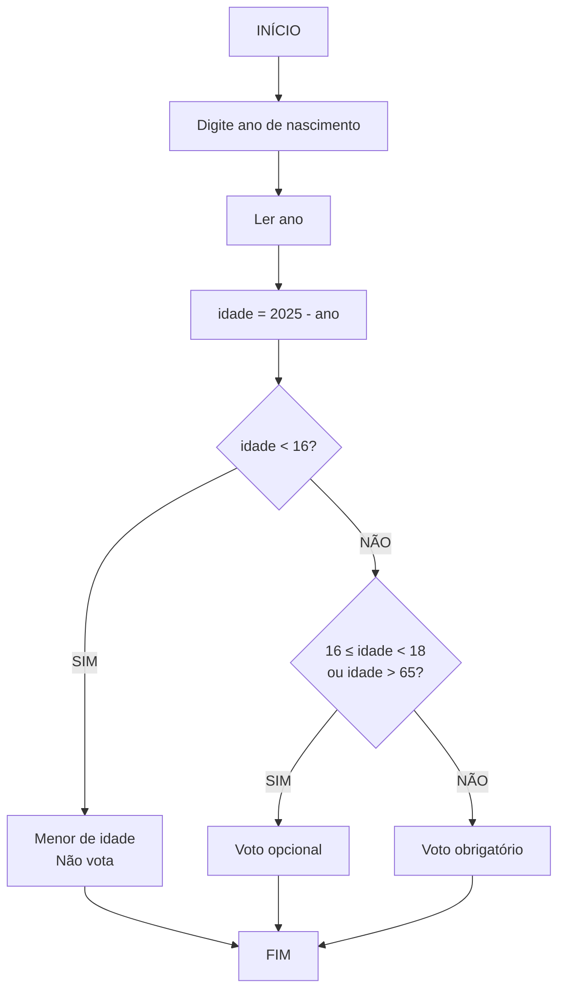
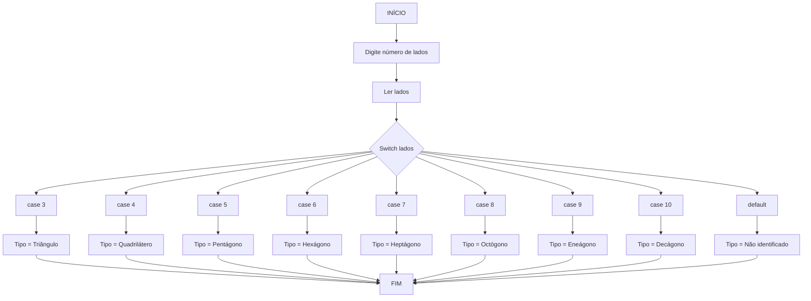

# 📚 Aula 10 - Estruturas Condicionais (Parte 2)
Dando continuidade à **Aula 9**, nesta aula veremos um tipo mais avançado de estrutura de decisão:
as **Estruturas Condicionais Encadeadas** (ou **Condição Composta Encadeada**).

---

## 🎯 Objetivos da Aula
- Compreender estruturas condicionais encadeadas
- Dominar o uso do `else if` para simplificar código
- Aprender a estrutura `switch` para múltiplas opções
- Saber quando usar cada tipo de estrutura condicional
- Desenvolver programas com decisões complexas

---

## 🔗 O que são Estruturas Encadeadas?
Chamamos de **estruturas de decisão encadeadas** quando uma estrutura de decisão está localizada dentro do lado falso de outra. Este tipo de estrutura também é conhecida como seleção **"aninhada"** ou **"encaixada"**.

---

## 🗺️ Exemplo: Sistema de Votação

### Fluxograma - Verificação de Idade para Votação



### Versão em Portugol

```portugol
algoritmo "SistemaVotacao"
var
    idade, ano: inteiro
inicio
    Escreva("Digite o ano em que nasceu: ")
    Leia(ano)
    idade <- 2025 - ano
    Escreva("Você tem: ", idade, " anos")
    
    Se (idade < 16) então
        Escreva("Você é menor de idade, ainda não pode votar!")
    Senão
        Se ((idade >= 16) e (idade < 18)) ou (idade > 65) então
            Escreva("Seu voto é opcional")
        Senão
            Escreva("Seu voto é obrigatório")
        FimSe
    FimSe
fimalgoritmo
```

---

## 💻 Implementação em Java - Versão Encadeada

### Código com Ifs Aninhados
```java
import java.util.Scanner;

public class SistemaVotacao {
    public static void main(String[] args) {
        Scanner teclado = new Scanner(System.in);

        System.out.print("Digite o ano em que nasceu: ");
        int ano = teclado.nextInt();
        int idade = 2025 - ano;

        System.out.println("Sua idade é: " + idade);

        if (idade < 16) {
            System.out.println("Você é menor de idade, não pode votar ainda");
        } else {
            if (((idade >= 16) && (idade < 18)) || (idade > 65)) {
                System.out.println("Seu voto é opcional");
            } else {
                System.out.println("Seu voto é obrigatório");
            }
        }
    }
}
```

---

## ✨ Simplificando com `Else If`

O mesmo código pode ser escrito de forma mais limpa com **else if**:
```java
import java.util.Scanner;

public class SistemaVotacaoMelhorado {
    public static void main(String[] args) {
        Scanner teclado = new Scanner(System.in);

        System.out.print("Digite o ano em que nasceu: ");
        int ano = teclado.nextInt();
        int idade = 2025 - ano;

        System.out.println("Sua idade é: " + idade);

        if (idade < 16) {
            System.out.println("Você é menor de idade, não pode votar ainda");
        } else if (((idade >= 16) && (idade < 18)) || (idade > 65)) {
            System.out.println("Seu voto é opcional");
        } else {
            System.out.println("Seu voto é obrigatório");
        }
    }
}
```

### ✅ Vantagens do `Else If`
- **Código mais limpo** e legível
- **Menos indentação** (menos aninhamento)
- **Mais fácil** de manter e debugar

---

## 🔄 Estrutura `Switch` - Para Múltiplas Opções

### Quando usar o Switch?
O `switch` serve para testar **vários casos possíveis de um mesmo valor**, como um menu de opções ou um verificador de tipo.

---

## 📐 Exemplo: Classificador de Polígonos

### Fluxograma - Identificador de Polígonos



### Versão em Portugol
```portugol
algoritmo "ClassificaPoligono"
var
    lados: inteiro
    tipo: caractere
inicio
    Escreva("Digite o número de lados: ")
    Leia(lados)
    
    Escolha lados
        caso 3:
            tipo <- "Triângulo"
        caso 4:
            tipo <- "Quadrilátero"
        caso 5:
            tipo <- "Pentágono"
        caso 6:
            tipo <- "Hexágono"
        caso 7:
            tipo <- "Heptágono"
        caso 8:
            tipo <- "Octógono"
        caso 9:
            tipo <- "Eneágono"
        caso 10:
            tipo <- "Decágono"
        outrocaso:
            tipo <- "Não identificado"
    FimEscolha
    
    Escreva("Tipo: ", tipo)
fimalgoritmo
```

---

## 💻 Implementação em Java com Switch

### Código Completo do Switch
```java
import java.util.Scanner;

public class ClassificadorPoligonos {
    public static void main(String[] args) {
        Scanner teclado = new Scanner(System.in);
        
        System.out.print("Digite o número de lados: ");
        int lados = teclado.nextInt();
        String tipo;
        
        switch (lados) {
            case 3:
                tipo = "Triângulo";
                break;
            case 4:
                tipo = "Quadrilátero";
                break;
            case 5:
                tipo = "Pentágono";
                break;
            case 6:
                tipo = "Hexágono";
                break;
            case 7:
                tipo = "Heptágono";
                break;
            case 8:
                tipo = "Octógono";
                break;
            case 9:
                tipo = "Eneágono";
                break;
            case 10:
                tipo = "Decágono";
                break;
            default:
                tipo = "Não identificado";
                break;
        }
        
        System.out.println("Tipo: " + tipo);
       
    }
}
```

---

## ⚠️ Regras Importantes do Switch

### 1. **Sempre use `break`**
-  Ele encerra o caso atual.
```java
// ✅ CORRETO
case 3:
    tipo = "Triângulo";
    break;

// ❌ ERRADO - executa todos os cases abaixo
case 3:
    tipo = "Triângulo";
// falta break!
```

### 2. **Não funciona com intervalos**

```java
// ❌ NÃO FUNCIONA
switch (idade) {
    case 1..17:  // ERRO!
        tipo = "Menor";
        break;
}

// ✅ USE IF/ELSE para intervalos
if (idade >= 1 && idade <= 17) {
    tipo = "Menor";
}
```

### 3. **Aceita apenas tipos específicos**
* Aceita **somente valores inteiros ou caracteres** (não funciona com números decimais).
```java
// ✅ ACEITA
switch (inteiro) { }
switch (char) { }
switch (String) { }  // Java 7+
switch (enum) { }

// ❌ NÃO ACEITA
switch (double) { }   // ERRO!
switch (float) { }    // ERRO!
```

---


## 🎯 Quando usar cada um?

### Use **If/Else** quando:
- Precisa verificar **intervalos** de valores
- Tem **condições complexas** com operadores lógicos
- Trabalha com **tipos float/double**
- Precisa de **múltiplas condições** independentes

### Use **Switch** quando:
- Tem **valores específicos** para testar
- Quer **código mais limpo** e legível
- Trabalha com **opções discretas** (menus, códigos, etc.)
- Precisa de **múltiplos casos** para uma variável

---


## 🚀 Exercícios Práticos

### Exercício 1: Classificador de Notas
```java
// Use else if para classificar notas:
// A (9-10), B (7-8.9), C (5-6.9), D (0-4.9)
```

### Exercício 2: Calculadora de IMC com Classificação
```java
// Use switch para classificar IMC:
// Abaixo, Normal, Sobrepeso, Obesidade
```

### Exercício 3: Sistema de Menu
```java
// Use switch para criar um menu com opções:
// 1-Cadastrar, 2-Listar, 3-Excluir, 4-Sair
```

---
## ✅ Conclusão: Checklist de Aprendizagem

- [ ] Compreendo estruturas condicionais encadeadas
- [ ] Sei usar `else if` para simplificar código
- [ ] Domino a sintaxe completa do `switch`
- [ ] Entendo quando usar `if/else` vs `switch`
- [ ] Conheço as limitações do `switch`
- [ ] Consigo criar programas com decisões complexas
- [ ] Apliquei os conceitos em exemplos práticos

---

> 💡 **Dica**: "Escolha a estrutura que deixa seu código mais claro. Se você precisa testar intervalos ou condições complexas, use if/else. Se está trabalhando com valores específicos, switch pode ser mais legível. A prática te ajudará a desenvolver essa intuição!"