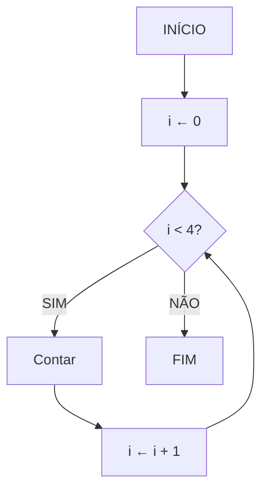

# 📚 Aula 11 - Estruturas de Repetição (Parte 1): While

---

## 🎯 Objetivos da Aula
- Compreender o conceito de estruturas de repetição
- Dominar a estrutura `while` em Java
- Aprender a usar contadores e condições de parada
- Conhecer os comandos `break` e `continue`
- Desenvolver programas com loops controlados

---

## 🔄 Introdução às Estruturas de Repetição

### Por que usar estruturas de repetição?
Imagine que precisamos contar de 1 até 4. Sem estruturas de repetição, faríamos:

```java
System.out.println("Contar 1");
System.out.println("Contar 2"); 
System.out.println("Contar 3");
System.out.println("Contar 4");
```
Perceba que o processo de **contagem se repete 4 vezes**.

**Problema:** E se precisássemos contar até 100? Seria muito código repetitivo!

Em vez de escrever o mesmo comando várias vezes, podemos **simplificar isso usando uma estrutura de repetição**.

---

## 🏗️ Fluxograma - Estrutura de Repetição

### Fluxograma: Contador com While



### Explicação do Fluxo:
1. **Inicialização**: `i = 0`
2. **Condição**: `i < 4` (verdadeira enquanto i for menor que 4)
3. **Execução**: Bloco "Contar" é executado
4. **Incremento**: `i = i + 1` (aumenta o contador)
5. **Repete** até a condição se tornar falsa

---

## 💡 Representação em Pseudocódigo

```portugol
algoritmo "Contador"
var
    i: inteiro
inicio
    i <- 0
    
    Enquanto (i < 4) faca
        Escreva("Contar ", i)
        i <- i + 1
    FimEnquanto
fimalgoritmo
```

---

## 💻 Implementação em Java: While Básico

### Código Básico do While
```java
public class ContadorBasico {
    public static void main(String[] args) {
        int i = 0;
        
        while (i < 4) {
            System.out.println("Contar " + i);
            i++; // incremento
        }
    }
}
```

### 🧩 Explicação Detalhada:
- `int i = 0;` → **Inicialização** do contador
- `while (i < 4)` → **Condição** de repetição
- `System.out.println("Contar " + i);` → **Ação** a ser repetida
- `i++;` → **Incremento** do contador (equivale a `i = i + 1`)

---
## 🔍 Execução Passo a Passo

1. A variável **`i` começa em 0**
2. O `while` verifica se `i < 4`
3. Se for **verdadeiro**, o bloco é executado
4. No final, `i++` soma +1
5. O laço continua até que `i` se torne 4
6. Quando `i` = 4, a condição deixa de ser verdadeira e o laço é encerrado

> Ou seja: o `while` **repete enquanto a condição for verdadeira**.

---

## ⚙️ Estrutura Geral do `while`

| Parte             | Função                                       |
| ----------------- | -------------------------------------------- |
| **Inicialização** | Define o ponto de partida (ex: `int i = 0;`) |
| **Condição**      | Expressão lógica que será testada (`i < 4`)  |
| **Corpo**         | O que será repetido                          |
| **Incremento**    | Atualiza a variável de controle (`i++`)      |


---

## ⚡ Comandos Especiais: Break e Continue

### Exemplo com Break e Continue
```java
public class ContadorAvancado {
    public static void main(String[] args) {
        int i = 0;
        
        while (i < 15) {
            i++;
            
            // Continue - pula iterações específicas
            if (i == 2 || i == 3 || i == 4) {
                continue; // Pula para próxima iteração
            }
            
            // Break - interrompe o loop
            if (i == 7) {
                break; // Para completamente o loop
            }
            
            System.out.println("Contar " + i);
        }
    }
}
```

### 🔍 Saída do Programa:
```
Contar 1
Contar 5
Contar 6
```
---
## 🧩 Entendendo o `continue` e o `break`

### 🔹 `continue`

Quando o `if` é verdadeiro, o comando **pula** a execução do restante do bloco e **volta ao início do laço**.
No exemplo acima, os números 2, 3 e 4 são ignorados.

➡️ Saída parcial:

```
contar 1
contar 5
contar 6
```

*(2, 3 e 4 foram pulados)*

---

### 🔹 `break`

O comando **interrompe totalmente** o laço, encerrando a execução.

➡️ Saída final:

```
contar 1
contar 5
contar 6
```

*(Quando o `i` chega a 7, o programa para)*


---

## ⚠️ Cuidados Importantes com While

### 1. **Loop Infinito**
```java
// ❌ PERIGO - loop infinito
int i = 0;
while (i < 5) {
    System.out.println("Preso aqui!");
    // Esqueceu do i++
}
```

### 2. **Condição Sempre Verdadeira**
```java
// ❌ CUIDADO - condição sempre true
while (true) {
    System.out.println("Executando forever...");
    // Precisa de break para sair
}
```

### 3. **Solução Correta**
```java
// ✅ CORRETO - contador controlado
int i = 0;
while (i < 5) {
    System.out.println("Iteração: " + i);
    i++; // SEMPRE atualize o contador
}
```

---

## 🔧 Padrões Comuns com While

### Padrão 1: Contador Crescente
```java
int i = 0;
while (i < 10) {
    // Processamento
    i++;
}
```

### Padrão 2: Contador Decrescente
```java
int i = 10;
while (i > 0) {
    // Processamento
    i--;
}
```

### Padrão 3: Loop com Condição de Saída
```java
while (condicao) {
    // Processamento
    if (condicaoDeSaida) {
        break;
    }
}
```

---

## 🚀 Exercícios Práticos

-  Exemplo 1: Contagem Regressiva
```java
// Use while para contar de 10 à 0
```
- Exemplo 2: Somatório de Números
```java
// Use while para somar os numeros contados
```
- Exercício 3: Tabuada
```java
// Use while para mostrar a tabuada do 5 (1 a 10)
```

- Exercício 4: Números Pares
```java
// Use while para mostrar números pares de 0 a 20
// Use continue para pular números ímpares
```


---

## ✅ Checklist de Aprendizagem

- [ ] Compreendo o conceito de estruturas de repetição
- [ ] Sei implementar loops com `while`
- [ ] Entendo a importância do contador e incremento
- [ ] Domino a diferença entre `break` e `continue`
- [ ] Consigo evitar loops infinitos
- [ ] Criei programas com repetições controladas
- [ ] Apliquei `while` em situações práticas

---

> 💡 **Dica**: Sempre teste seus loops com valores pequenos primeiro. Use `System.out.println()` para verificar como suas variáveis estão mudando a cada iteração. A prática é essencial para dominar as estruturas de repetição!
---