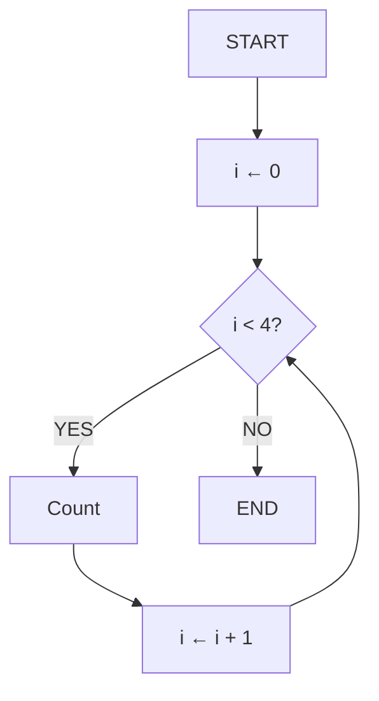
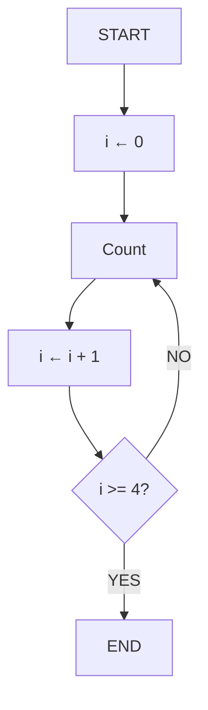

# 📚 Lesson 12 - Loop Structures (Part 2): **Do While**

---

## 🎯 Lesson Objectives

* Understand how the `do while` loop works
* Compare the behavior of `while` and `do while`
* Implement loops with a **logical test at the end**
* Use loops with user input and stop conditions

---

## 🔄 Reviewing the `while` Loop

In the previous lesson, we studied the **`while`** command, where the **logical condition is tested at the beginning** of the block.

### 📊 Flowchart – Test at the Beginning (`while`)



🔹 **Explanation:**
The `while` loop **checks the condition before executing** the block.
If the condition is **false at the start**, the block **is not executed even once**.

---

## 🧩 Introducing the `do while` Loop

Now let’s look at the **`do while`** loop.
The main difference is that the **logical test is performed at the end** of the block.

That means the loop will **always execute at least once**, even if the condition is false from the beginning.

---

## 🏗️ Flowchart – Test at the End (`do while`)



🔹 **Notice:**
In this structure, **the condition is inverted** compared to the `while` loop.
While the `while` loop uses `i < 4`,
the `do while` loop uses the **stop condition** `i >= 4`.

---

## 💡 Pseudocode Example

```portugol
algorithm "DoWhile_Example"
var
    i: integer
begin
    i <- 0
    repeat
        write("Count ", i)
        i <- i + 1
    until (i >= 4)
endalgorithm
```

➡️ Here the test happens **at the end**.
Even if `i` starts greater than or equal to 4, the block **will still run once**.

---

## 💻 Java Implementation

```java
public class DoWhileExample {
    public static void main(String[] args) {
        int i = 0;
        
        do {
            System.out.println("Count " + i);
            i++; // increment
        } while (i < 4);
    }
}
```

---

## 🧩 Step-by-Step Explanation

1. The variable `i` is initialized with 0.
2. The block inside `do { ... }` runs **without checking the condition first**.
3. At the end, the condition `i < 4` is tested.
4. If true, the loop **repeats**.
5. When `i` becomes 4, the condition is false and the loop ends.

🔹 **Conclusion:** The `do while` loop **always runs at least once**, regardless of the condition.

---

## ⚙️ General Structure of a `do while` Loop

| Part                | Purpose                                           |
| ------------------- | ------------------------------------------------- |
| **Initialization**  | Defines the starting point (`int i = 0;`)         |
| **Block**           | Executes the desired actions                      |
| **Final Condition** | Checks whether the loop should continue (`i < 4`) |

---

## 💬 Practical Example with User Input

```java
import java.util.Scanner;

public class Numbers {
    public static void main(String[] args) {
        int number;
        int sum = 0;
        String answer;
        Scanner input = new Scanner(System.in);
        
        do {
            System.out.print("Enter a number: ");
            number = input.nextInt();
            
            sum += number;
            
            System.out.print("Do you want to continue [Y/N]? ");
            answer = input.next();
            
        } while (answer.equalsIgnoreCase("Y"));
        
        System.out.println("The total sum is: " + sum);
    }
}
```

---

### 🧠 Understanding the Code

* The block inside `do { ... }` **executes first**
* The program asks the user if they want to continue
* If the user answers `"Y"` or `"y"`, the loop **repeats**
* If they answer `"N"` or `"n"`, the loop **ends**
* Finally, the program displays the total sum

---

## 🔍 Difference Between `while` and `do while`

| Structure    | Logical Test | Runs at Least Once? | Test Position    |
| ------------ | ------------ | ------------------- | ---------------- |
| **while**    | At the start | ❌ No                | Before the block |
| **do while** | At the end   | ✅ Yes               | After the block  |

---

## ⚠️ Important Details

### 1. **Semicolon Is Required**

```java
// ✅ CORRECT
do {
    // code
} while (condition); // ← SEMICOLON REQUIRED!

// ❌ WRONG
do {
    // code
} while (condition) // ← MISSING SEMICOLON!
```

---

### 2. **Control Variables**

```java
// ✅ CORRECT – variable declared outside
String answer;
do {
    // code
    answer = input.next();
} while (answer.equalsIgnoreCase("Y"));

// ❌ WRONG – variable declared inside the loop
do {
    String answer = input.next(); // redeclared every loop
} while (answer.equalsIgnoreCase("Y")); // ERROR: variable not in scope
```

---

### 3. **Make Sure the Exit Condition Is Reachable**

* Update control variables inside the loop
* Use `break` if necessary
* Avoid **infinite loops**

---

## 🚀 Practice Exercises

### Exercise 1: Average Calculator

```java
// Use do-while to calculate averages for multiple students.
// Ask if the user wants to continue after each calculation.
```

### Exercise 2: Password Validator

```java
// Use do-while to make the user type the correct password.
// Keep asking until it matches.
```

### Exercise 3: Banking System

```java
// Create a menu with options: Balance, Withdraw, Deposit, Exit.
// Use do-while to repeat until the user chooses "Exit".
```

### Exercise 4: Custom Counter

```java
// Ask for a start and end number.
// Count between them and ask if the user wants to repeat.
```

---

## ✅ Learning Checklist

* [ ] I understand the concept of `do while`
* [ ] I can differentiate between `while` and `do while`
* [ ] I can implement loops with the test at the end
* [ ] I know how to use `Scanner` to control repetition
* [ ] I can avoid infinite loops
* [ ] I created practical examples using user input

---

> 💡 **Tip:** Use `do while` whenever you need the block to **run at least once**, such as in **interactive menus**, **data input**, or **validation loops**.

---

