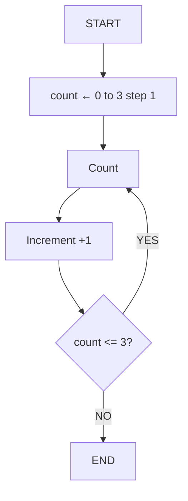
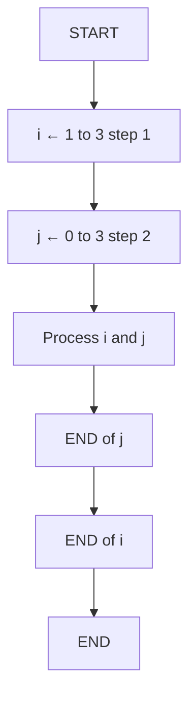

# 📚 Lesson 13 - Repetition Structures (Part 3): **For and Nested Loops**

---

## 🎯 Lesson Objectives

* Understand how the `for` structure works
* Identify the differences between `while`, `do while`, and `for`
* Implement loops with a **control variable**
* Apply **nested loops** (a loop inside another loop)

---

## 🔁 Reviewing the Previous Structures

So far, we’ve seen two repetition structures:

| Structure    | Type of Test | Test Position    | Executes at least once? |
| ------------ | ------------ | ---------------- | ----------------------- |
| **while**    | Logical test | At the beginning | ❌ No                    |
| **do while** | Logical test | At the end       | ✅ Yes                   |

Now we’ll study the **`for`**, a structure that uses an **automatic control variable** — ideal when you already know **how many times** you want to repeat an action.

---

## 🧩 Introduction to `for`

Unlike `while` and `do while`, the `for` loop **automatically controls the start, the end, and the increment** of the repetition variable.

---

## 📊 Flowchart – `for` Structure



🔹 **Note:**
The `for` structure performs the **loop automatically** — there’s no need to write `count = count + 1` manually!

---

## 💡 Representation in Pseudocode

```
algorithm "ForCounter"
var
    count: integer
begin
    for count from 0 to 3 step 1 do
        write("Count ", count)
    endfor
end
```

➡️ The loop starts with `count = 0` and repeats until `count = 3`, adding **+1 with each iteration**.

---

## 💻 Implementation in Java

```java
public class ForExample {
    public static void main(String[] args) {
        for (int count = 0; count <= 3; count++) {
            System.out.println("Count " + count);
        }
    }
}
```

### 🔍 Step-by-Step Execution

| Iteration | count | Condition | Output    |
| --------- | ----- | --------- | --------- |
| 1         | 0     | 0 <= 3 ✓  | "Count 0" |
| 2         | 1     | 1 <= 3 ✓  | "Count 1" |
| 3         | 2     | 2 <= 3 ✓  | "Count 2" |
| 4         | 3     | 3 <= 3 ✓  | "Count 3" |
| 5         | 4     | 4 <= 3 ✗  | (stops)   |

---

### 🧠 Understanding the Structure

The `for` loop is composed of **three main parts:**

```java
for (initialization; condition; increment)
```

| Part               | Function                                              |
| ------------------ | ----------------------------------------------------- |
| **Initialization** | Defines the starting point (`int count = 0`)          |
| **Condition**      | Defines when the loop will stop (`count <= 3`)        |
| **Increment**      | Updates the variable after each iteration (`count++`) |

---

## ⚙️ Practical Example: Multiplication Table

```java
import java.util.Scanner;

public class MultiplicationTable {
    public static void main(String[] args) {
        Scanner input = new Scanner(System.in);

        System.out.print("Enter a number: ");
        int number = input.nextInt();

        for (int i = 0; i <= 10; i++) {
            int result = number * i;
            System.out.printf("%d x %d = %d\n", number, i, result);
        }
    }
}
```

### 🧩 Explanation

1. The user enters a number
2. The `for` loop goes from 0 to 10
3. Each iteration multiplies the number by `i`
4. The result is printed in a formatted way
5. At the end, the complete multiplication table is displayed

---

## 🧱 Nested Loops

A **nested loop** occurs when a loop is executed **inside another loop**. It’s very useful when working with matrices, grids, or tables.

---

### 📊 Flowchart – Nested Loop



🔹 In this example, the loop **`j`** runs completely **for each cycle of loop `i`**.

---

## 💡 Pseudocode Example

```portugol
algorithm "NestedLoop"
var
    i, j: integer
begin
    for i ← 1 to 3 step 1 do
        for j ← 0 to 3 step 2 do
            write(i, " ", j)
        endfor
    endfor
end
```

---

## 💻 Java Example – Nested Loops

```java
public class Matrix {
    public static void main(String[] args) {
        for (int i = 0; i < 3; i++) {
            for (int j = 0; j < 2; j++) {
                System.out.printf("%d %d\n", i + 1, j + 1);
            }
        }
    }
}
```

### 🧠 Expected Output

| i | j |
| - | - |
| 1 | 1 |
| 1 | 2 |
| 2 | 1 |
| 2 | 2 |
| 3 | 1 |
| 3 | 2 |

---

## 🔍 Understanding the Flow of Nested Loops

| Step | i | j | Action       |
| ---- | - | - | ------------ |
| 1    | 1 | 1 | Prints "1 1" |
| 2    | 1 | 2 | Prints "1 2" |
| 3    | 2 | 1 | Prints "2 1" |
| 4    | 2 | 2 | Prints "2 2" |
| 5    | 3 | 1 | Prints "3 1" |
| 6    | 3 | 2 | Prints "3 2" |

🔹 The inner loop (`j`) repeats **entirely for each value of `i`**.
🔹 This is how we build structures like **matrices**, **tables**, or **grids**.

---

## ⚠️ Cautions with the `for` Loop

1. **Avoid infinite loops:**
   Always make sure the stop condition can be reached.
2. **Variable control:**
   Declare the variable inside the `for` unless you need to access it outside.
3. **Performance:**
   Nested loops increase complexity — use them only when necessary.

---

## 🚀 Practical Exercises

### 🧮 Exercise 1: Countdown

```java
// Create a for loop that counts down from 10 to 0 and prints each number
```

### 🧠 Exercise 2: Sum of Numbers

```java
// Ask the user for 5 numbers and calculate their sum using a for loop
```

### 🧾 Exercise 3: Full Multiplication Tables

```java
// Display all multiplication tables from 1 to 10 using nested loops
```

### 🧊 Exercise 4: Coordinate Table

```java
// Display all combinations of coordinates (x, y) from 1 to 3
```

---

## ✅ Learning Checklist

* [ ] I understand how the `for` loop works
* [ ] I know the difference between `for`, `while`, and `do while`
* [ ] I can implement loops with control variables
* [ ] I can use nested loops
* [ ] I can avoid infinite loops
* [ ] I’ve created practical examples using `for`

---

> 💡 **Tip:** Use `for` when you **know exactly how many times** you want to repeat an action.
> For uncertain or condition-based repetitions, use `while` or `do while`.

---
