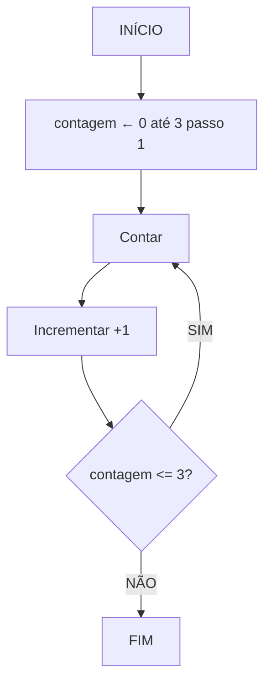
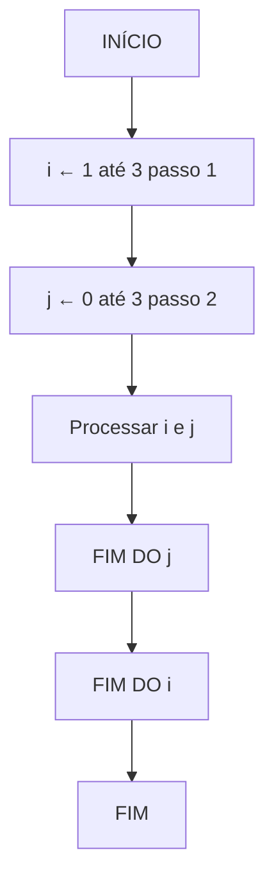

# 📚 Aula 13 - Estruturas de Repetição (Parte 3): **For e Laços Aninhados**

---

## 🎯 Objetivos da Aula

* Compreender o funcionamento da estrutura `for`
* Identificar as diferenças entre `while`, `do while` e `for`
* Implementar repetições com **variável de controle**
* Aplicar **laços aninhados** (um loop dentro de outro)

---

## 🔁 Revisando as Estruturas Anteriores

Até agora, vimos duas estruturas de repetição:

| Estrutura    | Tipo de Teste | Posição do Teste | Executa ao menos 1 vez? |
| ------------ | ------------- | ---------------- | ----------------------- |
| **while**    | Teste lógico  | No início        | ❌ Não                   |
| **do while** | Teste lógico  | No final         | ✅ Sim                   |

Agora veremos o **`for`**, uma estrutura com **variável de controle automática** — ideal para quando já sabemos **quantas vezes queremos repetir**.

---
## 🧩 Introdução ao `for`

Diferente do `while` e do `do while`, o `for` **controla automaticamente o início, o fim e o incremento** da variável de repetição.

---

## 📊 Fluxograma – Estrutura `for`


🔹 **Observação:**
A estrutura `for` já faz o **looping automaticamente** - não precisamos fazer `contagem = contagem + 1` manualmente!

---

## 💡 Representação em Pseudocódigo
```
algoritmo "ContadorFor"
var
    contagem: inteiro
inicio
    para contagem de 0 até 3 passo 1 faça
        escreva("Conte ", contagem)
    fimpara
fimalgoritmo
```
➡️ O loop começa com `contagem = 0` e repete até `contagem = 3`, somando **+1 a cada repetição**.

---

## 💻 Implementação em Java

```java
public class ExemploFor {
    public static void main(String[] args) {
        for (int contagem = 0; contagem <= 3; contagem++) {
            System.out.println("Contar " + contagem);
        }
    }
}
```
### 🔍 Execução Passo a Passo:
| Iteração | contagem | Condição | Saída |
|----------|----------|----------|-------|
| 1 | 0 | 0 <= 3 ✓ | "Conte 0" |
| 2 | 1 | 1 <= 3 ✓ | "Conte 1" |
| 3 | 2 | 2 <= 3 ✓ | "Conte 2" |
| 4 | 3 | 3 <= 3 ✓ | "Conte 3" |
| 5 | 4 | 4 <= 3 ✗ | (para) |

### 🧠 Explicando a Estrutura

O `for` é composto por **três partes principais:**

```java
for (inicialização; condição; incremento)
```

| Parte             | Função                                                    |
| ----------------- | --------------------------------------------------------- |
| **Inicialização** | Define o ponto de partida (`int contagem = 0`)            |
| **Condição**      | Define até quando o loop será executado (`contagem <= 3`) |
| **Incremento**    | Atualiza a variável a cada repetição (`contagem++`)       |

---
## ⚙️ Exemplo Prático: Tabuada

```java
import java.util.Scanner;

public class Tabuada {
    public static void main(String[] args) {
        Scanner teclado = new Scanner(System.in);

        System.out.print("Digite um número: ");
        int indice = teclado.nextInt();

        for (int contador = 0; contador <= 10; contador++) {
            int resultado = indice * contador;
            System.out.printf("%d x %d = %d\n", indice, contador, resultado);
        }
    }
}
```

### 🧩 Explicação

1. O usuário informa um número
2. O loop `for` percorre de 0 a 10
3. A cada iteração, o programa calcula `n * contador`
4. Mostra o resultado formatado
5. Ao final, a tabuada completa é exibida
---
## 🧱 Laços Aninhados (Nested Loops)

Um **laço aninhado** ocorre quando um loop é executado **dentro de outro loop**. Muito útil para trabalhar com matrizes e tabelas.

---

### 📊 Fluxograma – Laço Aninhado



🔹 No exemplo acima, o loop **`j`** é executado completamente **a cada ciclo do loop `i`**.

---

## 💡 Exemplo em Pseudocódigo

```portugol
algoritmo "Laco_Aninhado"
var
    i, j: inteiro
inicio
    para i <- 1 até 3 passo 1 faça
        para j <- 0 até 3 passo 2 faça
            escreva(i, " ", j)
        fimpara
    fimpara
fimalgoritmo
```

---

## 💻 Exemplo em Java – Laços Aninhados

```java
public class Matriz {
    public static void main(String[] args) {
        for (int i = 0; i < 3; i++) {
            for (int j = 0; j < 2; j++) {
                System.out.printf("%d %d\n", i + 1, j + 1);
            }
        }
    }
}
```

### 🧠 Saída Esperada

| i | j |
|---|---|
| 1 | 0 |
| 1 | 2 |
| 2 | 0 |
| 2 | 2 |
| 3 | 0 |
| 3 | 2 |

---

## 🔍 Entendendo o Fluxo do Laço Aninhado

| Etapa | i | j | Ação          |
| ----- | - | - | ------------- |
| 1     | 1 | 1 | Imprime "1 1" |
| 2     | 1 | 2 | Imprime "1 2" |
| 3     | 2 | 1 | Imprime "2 1" |
| 4     | 2 | 2 | Imprime "2 2" |
| 5     | 3 | 1 | Imprime "3 1" |
| 6     | 3 | 2 | Imprime "3 2" |

🔹 O loop `j` se repete **inteiramente para cada valor de `i`**.

🔹 É assim que criamos estruturas como **matrizes**, **tabelas** e **grades**.

---
## ⚠️ Cuidados com o `for`

1. **Evite loops infinitos**:
   Certifique-se de que a condição de parada será atingida.
2. **Controle de variáveis**:
   Declare as variáveis do `for` dentro dele, a menos que precise acessá-las fora.
3. **Performance**:
   Laços aninhados aumentam a complexidade — use apenas quando necessário.

---

## 🚀 Exercícios Práticos

### 🧮 Exercício 1: Contador Decrescente

```java
// Crie um for que conte de 10 até 0 e exiba a contagem na tela
```

### 🧠 Exercício 2: Soma de Números

```java
// Peça 5 números ao usuário e calcule a soma usando um for
```

### 🧾 Exercício 3: Tabuada Completa

```java
// Mostre todas as tabuadas de 1 a 10 com laços aninhados
```

### 🧊 Exercício 4: Tabela de Coordenadas

```java
// Exiba todas as combinações de coordenadas (x, y) de 1 a 3
```

---

## ✅ Checklist de Aprendizagem

* [ ] Entendo o funcionamento do `for`
* [ ] Sei a diferença entre `for`, `while` e `do while`
* [ ] Sei implementar loops com variável de controle
* [ ] Sei usar laços aninhados
* [ ] Evito loops infinitos
* [ ] Criei exemplos práticos com `for`

---

> 💡 **Dica:** Use o `for` quando você **souber exatamente quantas vezes** deseja repetir uma ação.
> Para repetições baseadas em condições incertas, prefira `while` ou `do while`.

---
