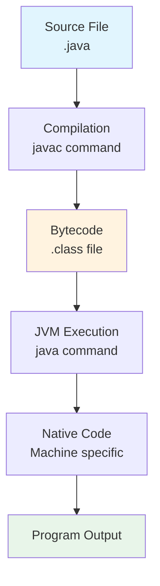
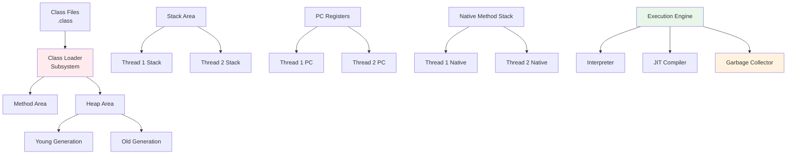

# 📚 Lesson 2 - How Java Works

---

## 🎯 Lesson Objectives
- Understand the Java compilation and execution process
- Differentiate between JDK, JRE, and JVM
- Learn about Java development tools and environments
- Comprehend Java's "Write Once, Run Anywhere" philosophy

---

## 🔄 Java Code Flow (From `.java` to Execution)



### The Java Execution Process
1. **Source File (`.java`)** - Human-readable Java code
2. **Compilation (`javac`)** → generates **bytecode** (`.class`)
3. **JVM Execution** → bytecode runs on any OS with compatible **JRE/JDK**

> ✨ **Write once, run anywhere** - Java's revolutionary cross-platform capability

---

## 🔤 Java "Alphabet Soup" (Overview)

### JDK — Java Development Kit
**Everything needed for development**
- Includes **JRE**, compiler **`javac`**, **`jdb`** (debugger)
- Tools: **`jar`**, **`javadoc`**, **`jshell`**, **`jlink`**
- Additional libraries and development utilities

### JRE — Java Runtime Environment
**Everything needed for execution**
- **JVM** + **platform libraries** (Java SE APIs)
- Required to run Java applications
- No development tools included

### JVM — Java Virtual Machine
**Virtual machine that executes bytecode**
- **Class Loader** - loads classes into memory
- **Bytecode Verifier** - checks code safety and validity
- **Interpreter** + **JIT (Just-In-Time) Compiler** - executes code
- **Garbage Collector** - automatic memory management

```java
// Example of compilation and execution
public class HelloWorld {
    public static void main(String[] args) {
        System.out.println("Hello, Java World!");
    }
}
```

**Compile:** `javac HelloWorld.java` → generates `HelloWorld.class`  
**Execute:** `java HelloWorld` → runs on JVM

---

## ⏰ Two Moments (Who Uses What)

### Developer Workflow
- Uses **JDK** for compiling, testing, and packaging
- Needs development tools and full library access
- Works with source code and development environments

### End User Experience
- Needs only **runtime environment** (JRE/JDK)
- Runs pre-compiled Java applications
- Requires no development tools

> **Note**: Since **Java 11**, many vendors no longer distribute separate JRE;
> applications typically come with their own **runtime** (e.g., `jlink`)
> or require **JDK** installation.

---

## 🛠️ Development Environments

### IDE (Integrated Development Environment)
Tools that accelerate Java development:

| IDE | Strengths | Best For |
|------|-----------|----------|
| **IntelliJ IDEA** | Smart coding assistance, extensive plugins | Professional development, all levels |
| **Eclipse** | Modular architecture, strong ecosystem | Enterprise development, education |
| **NetBeans** | Built-in GUI builder, easy setup | Beginners, desktop applications |
| **VS Code** | Lightweight, excellent extensions | Web development, lightweight editing |

### Command Line Tools
- **`javac`** - Java compiler
- **`java`** - Java application launcher
- **`jar`** - Java archive tool
- **`jdb`** - Java debugger
- **`jshell`** - Java REPL (Read-Eval-Print Loop)

---

## 🏗️ JVM Architecture Deep Dive



### Key JVM Components
- **Class Loader** - Dynamic class loading and linking
- **Runtime Data Areas** - Memory management during execution
- **Execution Engine** - Converts bytecode to machine code
- **Native Method Interface** - Integration with native libraries

---

## 🔍 Java 11+ Changes

### Modularization Impact
- **JPMS (Java Platform Module System)** introduced in Java 9
- **`jlink`** tool creates custom runtime images
- Reduced application footprint
- No separate JRE distributions from Oracle

### Current Recommendations
- For development: Install **JDK** (Amazon Corretto, OpenJDK, Oracle JDK)
- For distribution: Use **`jlink`** to create application-specific runtime
- For end users: Provide bundled runtime or require JDK installation

---

## ✅ Quick Summary

- **`javac`** transforms `.java` → `.class` (**bytecode**)
- **JVM** executes bytecode, independent of operating system
- **JDK** = development; **JRE** = execution; **JVM** = execution environment
- Java's architecture enables **platform independence**
- Modern Java emphasizes **modularity** and **custom runtimes**

---

## 🧪 Hands-On Exercise

1. **Install JDK** on your system
2. **Write a simple Java program** (Hello World)
3. **Compile manually** using `javac` command
4. **Execute manually** using `java` command
5. **Explore your JDK installation** to find tools directory

---

## 📋 Learning Checklist

- [ ] Understand the Java compilation process
- [ ] Differentiate between JDK, JRE, and JVM
- [ ] Know what happens during JVM execution
- [ ] Recognize modern Java distribution changes
- [ ] Can explain "Write Once, Run Anywhere"
- [ ] Familiar with major Java development tools

