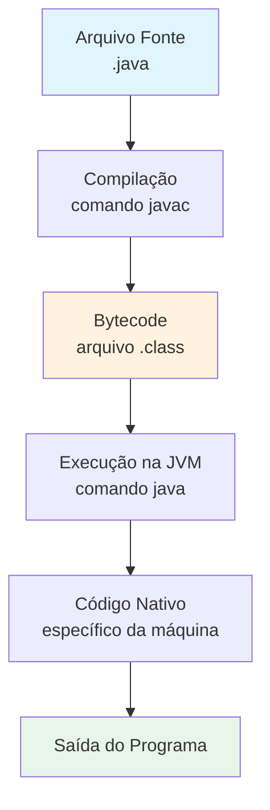
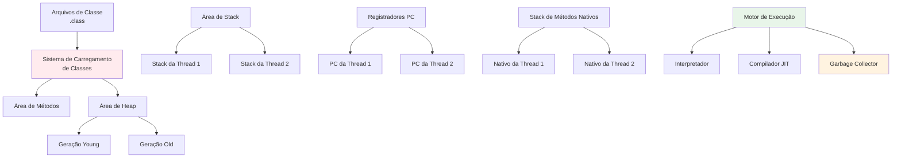

# 📚 Aula 2 - Como o Java Funciona?

---

## 🎯 Objetivos da Aula
- Entender o processo de compilação e execução do Java
- Diferenciar entre JDK, JRE e JVM
- Conhecer as ferramentas e ambientes de desenvolvimento Java
- Compreender a filosofia "Escreva Uma Vez, Execute em Qualquer Lugar" do Java

---

## 🔄 Fluxo de Execução do Java (Do `.java` à Execução)



### O Processo de Execução do Java
1. **Arquivo Fonte (`.java`)** - Código Java legível por humanos
2. **Compilação (`javac`)** → gera **bytecode** (`.class`)
3. **Execução na JVM** → o bytecode roda em qualquer SO com **JRE/JDK** compatível

> ✨ **Escreva uma vez, execute em qualquer lugar** - A capacidade revolucionária multiplataforma do Java

---

## 🔤 "Sopa de Letrinhas" do Java (Visão Geral)

### JDK — Java Development Kit
**Tudo necessário para desenvolvimento**
- Inclui **JRE**, compilador **`javac`**, **`jdb`** (debugger)
- Ferramentas: **`jar`**, **`javadoc`**, **`jshell`**, **`jlink`**
- Bibliotecas adicionais e utilitários de desenvolvimento

### JRE — Java Runtime Environment
**Tudo necessário para execução**
- **JVM** + **bibliotecas da plataforma** (APIs Java SE)
- Necessário para executar aplicações Java
- Não inclui ferramentas de desenvolvimento

### JVM — Java Virtual Machine
**Máquina virtual que executa bytecode**
- **Carregador de Classes** - carrega classes na memória
- **Verificador de Bytecode** - verifica segurança e validade do código
- **Interpretador** + **Compilador JIT (Just-In-Time)** - executa o código
- **Garbage Collector** - gerenciamento automático de memória

```java
// Exemplo de compilação e execução
public class OlaMundo {
    public static void main(String[] args) {
        System.out.println("Olá, Mundo Java!");
    }
}
```

**Compilar:** `javac OlaMundo.java` → gera `OlaMundo.class`  
**Executar:** `java OlaMundo` → executa na JVM

---

## ⏰ Dois Momentos (Quem Usa o Quê)

### Fluxo de Trabalho do Desenvolvedor
- Usa **JDK** para compilar, testar e empacotar
- Precisa de ferramentas de desenvolvimento e acesso completo às bibliotecas
- Trabalha com código fonte e ambientes de desenvolvimento

### Experiência do Usuário Final
- Precisa apenas do **ambiente de execução** (JRE/JDK)
- Executa aplicações Java pré-compiladas
- Não requer ferramentas de desenvolvimento

> **Nota**: A partir do **Java 11**, muitos fornecedores não distribuem JRE separado;
> as aplicações normalmente vêm com seu próprio **runtime** (ex.: `jlink`)
> ou exigem instalação do **JDK**.

---

## 🛠️ Ambientes de Desenvolvimento

### IDE (Ambiente de Desenvolvimento Integrado)
Ferramentas que aceleram o desenvolvimento Java:

| IDE | Pontos Fortes | Melhor Para |
|------|-----------|----------|
| **IntelliJ IDEA** | Assistência inteligente, extensos plugins | Desenvolvimento profissional, todos os níveis |
| **Eclipse** | Arquitetura modular, ecossistema robusto | Desenvolvimento empresarial, educação |
| **NetBeans** | Construtor GUI integrado, configuração fácil | Iniciantes, aplicações desktop |
| **VS Code** | Leve, extensões excelentes | Desenvolvimento web, edição leve |

### Ferramentas de Linha de Comando
- **`javac`** - compilador Java
- **`java`** - lançador de aplicações Java
- **`jar`** - ferramenta de arquivo Java
- **`jdb`** - debugger Java
- **`jshell`** - REPL Java (Read-Eval-Print Loop)

---

## 🏗️ Arquitetura da JVM em Detalhe



### Componentes Principais da JVM
- **Carregador de Classes** - Carregamento e linking dinâmico de classes
- **Áreas de Dados de Runtime** - Gerenciamento de memória durante execução
- **Motor de Execução** - Converte bytecode em código de máquina
- **Interface de Métodos Nativos** - Integração com bibliotecas nativas

---

## 🔍 Mudanças do Java 11+

### Impacto da Modularização
- **JPMS (Java Platform Module System)** introduzido no Java 9
- **`jlink`** cria imagens de runtime personalizadas
- Redução do footprint das aplicações
- Não há mais distribuições separadas de JRE pela Oracle

### Recomendações Atuais
- Para desenvolvimento: Instalar **JDK** (Amazon Corretto, OpenJDK, Oracle JDK)
- Para distribuição: Usar **`jlink`** para criar runtime específico da aplicação
- Para usuários finais: Fornecer runtime empacotado ou exigir instalação do JDK

---

## ✅ Resumo Rápido

- **`javac`** transforma `.java` → `.class` (**bytecode**)
- **JVM** executa bytecode, independente do sistema operacional
- **JDK** = desenvolvimento; **JRE** = execução; **JVM** = ambiente de execução
- A arquitetura do Java permite **independência de plataforma**
- O Java moderno enfatiza **modularidade** e **runtimes personalizados**

---

## 🧪 Exercício Prático

1. **Instale o JDK** no seu sistema
2. **Escreva um programa Java simples** (Olá Mundo)
3. **Compile manualmente** usando o comando `javac`
4. **Execute manualmente** usando o comando `java`
5. **Explore sua instalação JDK** para encontrar o diretório de ferramentas

---

## 📋 Checklist de Aprendizagem

- [ ] Entender o processo de compilação do Java
- [ ] Diferenciar entre JDK, JRE e JVM
- [ ] Saber o que acontece durante a execução na JVM
- [ ] Reconhecer as mudanças na distribuição moderna do Java
- [ ] Conseguir explicar "Escreva Uma Vez, Execute em Qualquer Lugar"
- [ ] Familiarizar-se com as principais ferramentas de desenvolvimento Java
