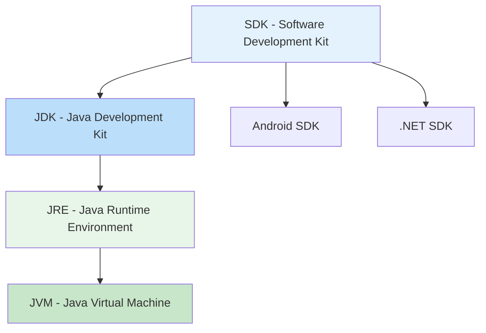

# 📚 Lesson 3 - IDE and JDK: Setting Up Your Java Environment

---

## 🎯 Lesson Objectives
- Understand the role of IDEs in Java development
- Differentiate between JDK, SDK, and JRE
- Learn to install and configure IntelliJ IDEA
- Install and configure JDK properly
- Understand different Java editions (SE, EE, ME)

---

## 🛠️ IDE — Integrated Development Environment

An **IDE (Integrated Development Environment)** is comprehensive software that assists in application development by offering integrated tools for writing, compiling, debugging, and managing projects.

### Main Java IDEs Comparison

| IDE | Strengths | Best For | Learning Curve |
|-----|-----------|----------|---------------|
| **IntelliJ IDEA** | Smart completion, advanced refactoring | Professional development | Moderate |
| **Eclipse** | Highly customizable, large ecosystem | Enterprise projects | Moderate |
| **NetBeans** | Easy setup, built-in GUI builder | Beginners, education | Easy |
| **VS Code** | Lightweight, excellent extensions | Web development, small projects | Easy |

**Key Features of Modern IDEs:**
- ✅ Intelligent code completion
- ✅ Integrated debugging tools
- ✅ Version control integration (Git)
- ✅ Plugin ecosystem
- ✅ Project management tools
- ✅ Database integration
- ✅ Built-in terminal

> 💡 **Tip**: IDEs significantly accelerate development with features like: syntax highlighting, auto-completion, integrated debugger, version control (Git), and dependency management.

---

## ☕ Which JDK to Install?

### Java Editions

| Edition | Purpose | Use Cases |
|---------|---------|-----------|
| **SE - Standard Edition** | Desktop and basic applications | GUI applications, simple programs |
| **EE - Enterprise Edition** | Complex corporate systems | Databases, distributed systems |
| **ME - Micro Edition** | Embedded and mobile devices | IoT, resource-limited devices |

### JDK Distributions

| Distribution | Type | Best For |
|-------------|------|----------|
| **Oracle JDK** | Commercial | Enterprise production |
| **OpenJDK** | Open Source | General development |
| **Amazon Corretto** | Free | Cloud production |
| **Azul Zulu** | Free | Cross-platform |

> 🔍 **Recommendation for beginners**: OpenJDK or Amazon Corretto

---

## 🔄 Difference Between JDK, SDK, and JRE



### Detailed Definitions

**JDK — Java Development Kit**
- Complete set for Java development
- Includes: **JRE**, compiler (`javac`), debugger (`jdb`), documentation (`javadoc`)
- Additional tools: `jar`, `jlink`, `jshell`

**SDK — Software Development Kit**
- Generic concept for software development
- May include: libraries, tools, documentation, examples
- Examples: Android SDK, .NET SDK, Java SDK

**JRE — Java Runtime Environment**
- Environment only for running Java applications
- Includes: JVM + standard libraries
- Does not contain development tools

> 📌 **Summary**: Every JDK is a specific SDK for Java, but not every SDK is a JDK.

---

## 🚀 How to Install IntelliJ IDEA (Step by Step)

### 1. Download
Visit: [https://www.jetbrains.com/idea/download/](https://www.jetbrains.com/idea/download/)

### 2. Version Choice
| Version | Price | Recommendation |
|---------|-------|---------------|
| **Community** | Free | Students and beginners |
| **Ultimate** | Paid | Professional development |

### 3. Installation
- Run the installer
- Accept terms of use
- Choose installation folder
- Select options:
    - ✅ Create desktop icon
    - ✅ Associate `.java` files
    - ✅ Add to PATH

### 4. Initial Configuration
- Select theme (Light/Dark)
- Choose essential plugins
- Configure keyboard shortcuts

### 5. Configure JDK
```
File → New → Project → 
SDK → Add JDK → 
Select JDK 24 folder
```

---

## ⬇️ How to Install JDK 24

### Method 1: Official Website
1. Visit: [JDK 24 Documentation](https://docs.oracle.com/en/java/javase/24/index.html)
2. Download for your operating system
3. Run the installer
4. Accept license terms

### Method 2: Package Manager (Linux/Mac)
```bash
# Ubuntu/Debian
sudo apt install openjdk-24-jdk

# macOS with Homebrew
brew install openjdk@24
```

### Environment Variables Configuration (Windows)

**JAVA_HOME**
```
C:\Program Files\Java\jdk-24
```

**Add to PATH**
```
%JAVA_HOME%\bin
```

### Installation Verification
```bash
java -version
javac -version
```

> ✅ Should display: `java version "24"` and `javac 24`

---

## 🧪 First Project in IntelliJ

### Creating a New Project
1. **File → New → Project**
2. Select **Java**
3. Choose **JDK 24** as SDK
4. Check **Create project from template**
5. Select **Java Hello World**
6. Name the project: `MyFirstProject`

### Project Structure
```
MyFirstProject/
├── src/
│   └── Main.java
├── .idea/
└── MyFirstProject.iml
```

### Running the Project
1. Right-click on `Main.java`
2. Select **Run 'Main.main()'**
3. Check output in console

---

## ⚠️ Common Problem Solutions

### JDK Not Recognized
- Verify JDK path is correct
- Confirm environment variables
- Restart IntelliJ after installation

### Compilation Error
- Check configured JDK version
- Confirm project uses correct JDK

### Execution Problems
- Verify JRE is installed
- Check run/debug configurations

---

## ✅ Setup Checklist

- [ ] JDK 24 installed correctly
- [ ] JAVA_HOME variable configured
- [ ] PATH updated with JDK bin
- [ ] IntelliJ IDEA installed
- [ ] JDK configured in IntelliJ
- [ ] First project created successfully
- [ ] "Hello World" program executed

---

## 📊 Quick Summary

| Concept | Definition | Examples |
|---------|------------|----------|
| **IDE** | Complete development environment | IntelliJ, Eclipse, NetBeans |
| **JDK** | Kit for Java development | OpenJDK, Oracle JDK |
| **SDK** | Generic development kit | Android SDK, Java SDK |
| **SE** | Standard edition for simple apps | Desktop applications |
| **EE** | Enterprise edition for complex systems | Corporate systems |
| **ME** | Micro edition for limited devices | IoT, mobile devices |


---

### 💡 Final Tip

Try different IDEs to find which one best fits your workflow. Each developer has different preferences, and choosing the right tool can significantly increase your productivity.

> "The tool doesn't make the craftsman, but a good craftsman knows their tools."