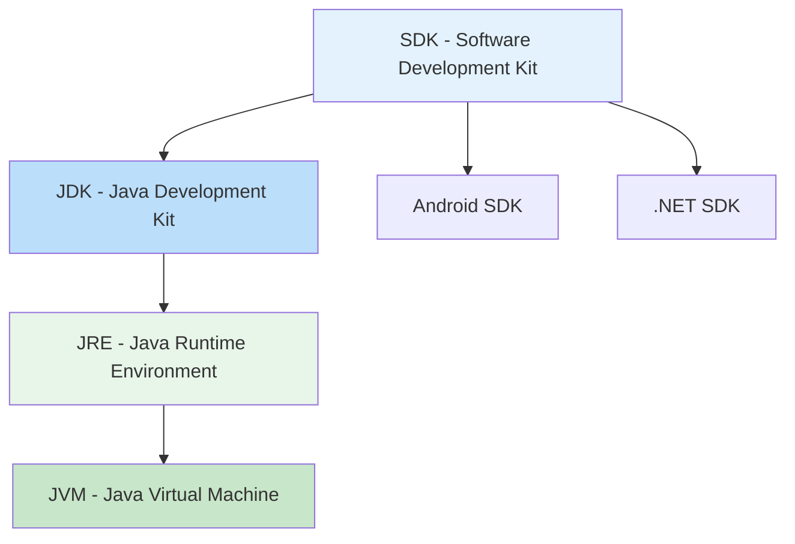

# 📚 Aula 3 - IDE e JDK: Configurando Seu Ambiente Java

---

## 🎯 Objetivos da Aula
- Compreender o papel das IDEs no desenvolvimento Java
- Diferenciar entre JDK, SDK e JRE
- Aprender a instalar e configurar o IntelliJ IDEA
- Instalar e configurar o JDK corretamente
- Entender as diferentes edições do Java (SE, EE, ME)

---

## 🛠️ IDE — Ambiente de Desenvolvimento Integrado

Uma **IDE (Integrated Development Environment)** é um software completo que auxilia no desenvolvimento de aplicações, oferecendo ferramentas integradas para escrever, compilar, depurar e gerenciar projetos.

### Comparativo das Principais IDEs Java

| IDE | Pontos Fortes | Melhor Para | Curva de Aprendizado |
|-----|---------------|-------------|---------------------|
| **IntelliJ IDEA** | Autocompletamento inteligente, refatoração avançada | Desenvolvimento profissional | Moderada |
| **Eclipse** | Altamente customizável, grande ecossistema | Projetos empresariais | Moderada |
| **NetBeans** | Configuração fácil, construtor GUI integrado | Iniciantes, educação | Fácil |
| **VS Code** | Leve, excelentes extensões | Desenvolvimento web, pequenos projetos | Fácil |


**IntelliJ IDEA**
- ✅ Autocompletamento inteligente
- ✅ Refatoração avançada
- ✅ Integração com ferramentas
- ✅ Plugins extensivos

**Eclipse**
- ✅ Modular e customizável
- ✅ Grande comunidade
- ✅ Ideal para enterprise
- ✅ Rico ecossistema de plugins

**NetBeans**
- ✅ Fácil para iniciantes
- ✅ Construtor GUI integrado
- ✅ Boa documentação
- ✅ Setup simplificado

**VS Code** (com extensões Java)
- ✅ Leve e rápido
- ✅ Boa para projetos menores
- ✅ Excelente para web
- ✅ Customizável

> 💡 **Dica**: IDEs aceleram o desenvolvimento com: destaque de sintaxe, autocomplete, depurador integrado, controle de versão (Git), e gerenciamento de dependências.

---

## ☕ Qual JDK Instalar?

### Edições do Java

| Edição | Para que serve? | Casos de Uso |
|--------|-----------------|-------------|
| **SE - Standard Edition** | Aplicações desktop e simples | Interfaces gráficas, aplicações básicas |
| **EE - Enterprise Edition** | Sistemas corporativos complexos | Bancos de dados, sistemas distribuídos |
| **ME - Micro Edition** | Dispositivos embarcados e móveis | IoT, dispositivos com recursos limitados |

### Distribuições do JDK

| Distribuição | Tipo | Melhor para |
|-------------|------|------------|
| **Oracle JDK** | Comercial | Produção empresarial |
| **OpenJDK** | Open Source | Desenvolvimento geral |
| **Amazon Corretto** | Gratuita | Produção cloud |
| **Azul Zulu** | Gratuita | Multiplataforma |

> 🔍 **Recomendação para iniciantes**: OpenJDK ou Amazon Corretto

---

## 🔄 Diferença entre JDK, SDK e JRE



### Definições Detalhadas

**JDK — Java Development Kit**
- Conjunto completo para desenvolvimento Java
- Inclui: **JRE**, compilador (`javac`), debugger (`jdb`), documentação (`javadoc`)
- Ferramentas adicionais: `jar`, `jlink`, `jshell`

**SDK — Software Development Kit**
- Conceito genérico para desenvolvimento de software
- Pode incluir: bibliotecas, ferramentas, documentação, exemplos
- Exemplos: Android SDK, .NET SDK, Java SDK

**JRE — Java Runtime Environment**
- Ambiente apenas para execução de aplicações Java
- Inclui: JVM + bibliotecas padrão
- Não contém ferramentas de desenvolvimento

> 📌 **Resumo**: Todo JDK é um SDK específico para Java, mas nem todo SDK é JDK.

---

## 🚀 Como Instalar o IntelliJ IDEA (Passo a Passo)

### 1. Download
Acesse: [https://www.jetbrains.com/idea/download/](https://www.jetbrains.com/idea/download/)

### 2. Escolha da Versão
| Versão | Preço | Recomendação |
|--------|-------|-------------|
| **Community** | Gratuita | Estudantes e iniciantes |
| **Ultimate** | Paga | Desenvolvimento profissional |

### 3. Instalação
- Execute o instalador
- Aceite os termos de uso
- Escolha pasta de instalação
- Marque opções:
    - ✅ Criar ícone na área de trabalho
    - ✅ Associar arquivos `.java`
    - ✅ Adicionar ao PATH

### 4. Configuração Inicial
- Selecione o tema (Claro/Escuro)
- Escolha plugins essenciais
- Configure atalhos de teclado

### 5. Configurar JDK
```
File → New → Project → 
SDK → Add JDK → 
Selecione pasta do JDK 24
```

---

## ⬇️ Como Instalar o JDK 24

### Método 1: Site Oficial
1. Acesse: [JDK 24 Documentation](https://docs.oracle.com/en/java/javase/24/index.html)
2. Baixe para seu sistema operacional
3. Execute o instalador
4. Aceite os termos de licença

### Método 2: Gerenciador de Pacotes (Linux/Mac)
```bash
# Ubuntu/Debian
sudo apt install openjdk-24-jdk

# macOS com Homebrew
brew install openjdk@24
```

### Configuração de Variáveis de Ambiente (Windows)

**JAVA_HOME**
```
C:\Program Files\Java\jdk-24
```

**Adicionar ao PATH**
```
%JAVA_HOME%\bin
```

### Verificação da Instalação
```bash
java -version
javac -version
```

> ✅ Deve aparecer: `java version "24"` e `javac 24`

---

## 🧪 Primeiro Projeto no IntelliJ

### Criando um Novo Projeto
1. **File → New → Project**
2. Selecione **Java**
3. Escolha **JDK 24** como SDK
4. Marque **Create project from template**
5. Selecione **Java Hello World**
6. Nomeie o projeto: `MeuPrimeiroProjeto`

### Estrutura do Projeto
```
MeuPrimeiroProjeto/
├── src/
│   └── Main.java
├── .idea/
└── MeuPrimeiroProjeto.iml
```

### Executando o Projeto
1. Clique com botão direito em `Main.java`
2. Selecione **Run 'Main.main()'**
3. Verifique a saída no console

---

## ⚠️ Solução de Problemas Comuns

### JDK Não Reconhecido
- Verifique se o caminho do JDK está correto
- Confirme as variáveis de ambiente
- Reinicie o IntelliJ após instalação

### Erro de Compilação
- Verifique a versão do JDK configurada
- Confirme se o projeto usa o JDK correto

### Problemas de Execução
- Verifique se o JRE está instalado
- Confirme as configurações de run/debug

---

## ✅ Checklist de Configuração

- [ ] JDK 24 instalado corretamente
- [ ] Variável JAVA_HOME configurada
- [ ] PATH atualizado com bin do JDK
- [ ] IntelliJ IDEA instalado
- [ ] JDK configurado no IntelliJ
- [ ] Primeiro projeto criado com sucesso
- [ ] Programa "Hello World" executado

---

## 📊 Resumo Rápido

| Conceito | Definição | Exemplos |
|----------|-----------|----------|
| **IDE** | Ambiente completo de desenvolvimento | IntelliJ, Eclipse, NetBeans |
| **JDK** | Kit para desenvolvimento Java | OpenJDK, Oracle JDK |
| **SDK** | Kit de desenvolvimento genérico | Android SDK, Java SDK |
| **SE** | Edição Standard para aplicações simples | Aplicações desktop |
| **EE** | Edição Enterprise para sistemas complexos | Sistemas corporativos |
| **ME** | Edição Micro para dispositivos limitados | IoT, dispositivos móveis |

---

### 💡 Dica Final

Experimente diferentes IDEs para encontrar a que melhor se adapta ao seu fluxo de trabalho. Cada desenvolvedor tem preferências diferentes, e a escolha da ferramenta certa pode significativamente aumentar sua produtividade.

> "A ferramenta não faz o artesão, mas um bom artesão conhece suas ferramentas."