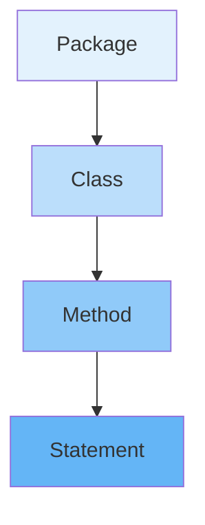

# 📚 Lesson 4 - First Java Program!

---

## 🎯 Lesson Objectives
- Write and execute your first Java program
- Understand the basic structure of a Java program
- Learn naming conventions (CamelCase)
- Master useful IDE shortcuts
- Understand the importance of the main method

---

## 🏗️ Basic Structure of a Java Program

A Java program is hierarchically organized into **packages**, **classes**, and **methods**.

### Code Example:

```java
package myfirstprogram; // optional

public class FirstProgram { // Class (main container)
    public static void main(String[] args) { // Main method
        System.out.println("Hello, Java World!");
    }
}
```



---

## 🔍 Code Analysis

### Essential Components:

* **`package myfirstprogram;`** → Optional, indicates the package where the class is organized
* **`public class FirstProgram { ... }`** → Defines the **class** (main program container)
* **`public static void main(String[] args) { ... }`** → Main method, **entry point** of the program
* **`System.out.println("Hello, Java World!");`** → Statement that displays text in the console

> 📦 **Hierarchical Structure**:
> **Package** → **Class** → **Method** → **Statement**

---

## ⚠️ Mind the Letters! (Case Sensitivity)

Java is **case sensitive** → distinguishes between uppercase and lowercase letters.

### Common Examples:
- `System` ≠ `system`
- `String` ≠ `string`
- `Main` ≠ `main`
- `println` ≠ `Println`

**💡 Tip:** Case sensitivity compilation errors are common for beginners. Always check capitalization!

---

## ⌨️ Useful IDE Shortcuts

Modern IDEs offer **code shortcuts** that speed up development:

### IntelliJ IDEA:
* **`psvm`** + Tab → Automatically generates:
```java
public static void main(String[] args) {
    
}
```

* **`sout`** + Tab → Automatically generates:
```java
System.out.println();
```

### Eclipse:
* **`main`** + Ctrl+Space → Generates main method
* **`syso`** + Ctrl+Space → Generates System.out.println()

---

## 🐪 CamelCase Conventions in Java

**CamelCase** is a writing style where compound words are joined and each word (except the first) starts with an **uppercase letter**.

### 📌 Naming Rules:

| Element | Convention | Examples |
|----------|-----------|----------|
| **Class/Interface** | **PascalCase** (first letter uppercase) | `Calculator`, `UniversityStudent` |
| **Attribute/Variable/Method** | **camelCase** (first letter lowercase) | `fullName`, `calculateAverage()` |
| **Package** | **all lowercase** (dot separated) | `com.company.project` |
| **Constants** | **UPPERCASE** with underscore | `PI_VALUE`, `INTEREST_RATE` |

### Detailed Examples:

```java
// Class (PascalCase)
public class ScientificCalculator { ... }

// Variable (camelCase)
double bankBalance = 1000.50;

// Method (camelCase)
public void calculateFinalAverage() { ... }

// Constant (UPPERCASE)
static final int MAX_ATTEMPTS = 3;
```

---

## 🧪 Hands-On: Creating Our First Program

### Step by Step in IntelliJ:

1. **Create new project** → File → New → Project → Java
2. **Name the project** → `MyFirstJava`
3. **Create new class** → Right-click on src → New → Java Class
4. **Name the class** → `FirstProgram`
5. **Type the code**:

```java
public class FirstProgram {
    public static void main(String[] args) {
        System.out.println("🎉 My first Java program!");
        System.out.println("I'm learning Java!");
    }
}
```

6. **Run** → Right-click → Run 'FirstProgram.main()'

---

## 🔧 Debugging Tips

### Common Errors and Solutions:
1. **"Cannot find symbol"** → Check spelling and case sensitivity
2. **"; expected"** → Don't forget semicolon at the end of statements
3. **"Class name is public"** → File name must match public class name
4. **"Main method not found"** → Verify exact main method signature

### Best Practices:
- Always use braces `{}` even for one-line blocks
- Maintain consistent indentation (4 spaces recommended)
- Comment your code to explain logic

---

## 📋 Learning Checklist

- [ ] Understood the basic structure of a Java program
- [ ] Understood the role of main method as entry point
- [ ] Learned CamelCase naming conventions
- [ ] Used IDE shortcuts to generate code automatically
- [ ] Created and executed my first program successfully
- [ ] Recognized the importance of case sensitivity in Java

---

## 📊 Quick Summary

* Every Java program has a **class** and **main method**
* The hierarchical structure is: **Package → Class → Method → Statement**
* Java is **case sensitive** → distinguishes uppercase from lowercase
* IDEs help with **shortcuts** like `psvm` and `sout`
* Writing conventions:
    - **Class**: `PascalCase`
    - **Variable/Method**: `camelCase`
    - **Package**: `lowercase`
    - **Constant**: `UPPERCASE_WITH_UNDERSCORE`

---

### 💡 Teacher's Tip

"Practice makes perfect! Try modifying the program, changing messages, and adding new output lines. Every error you find and fix is a learning opportunity."

> 💻 **Exercise**: Create a program that displays a short biography of yourself with at least 3 lines of information.