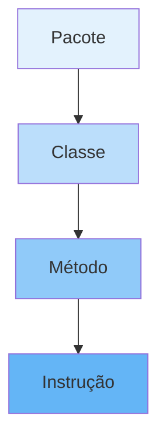

# 📚 Aula 4 - Primeiro Programa em Java!

---

## 🎯 Objetivos da Aula
- Escrever e executar seu primeiro programa Java
- Entender a estrutura básica de um programa Java
- Aprender as convenções de nomenclatura (CamelCase)
- Dominar atalhos úteis da IDE
- Compreender a importância do método main

---

## 🏗️ Estrutura Básica de um Programa Java

Um programa em Java é organizado hierarquicamente em **pacotes**, **classes** e **métodos**.

### Exemplo de Código:

```java
package meuprimeiroprograma; // opcional

public class PrimeiroPrograma { // Classe (bloco principal)
    public static void main(String[] args) { // Método principal
        System.out.println("Olá, Mundo Java!");
    }
}
```



---

## 🔍 Analisando o Código

### Componentes Essenciais:

* **`package meuprimeiroprograma;`** → Opcional, indica o pacote onde a classe está organizada
* **`public class PrimeiroPrograma { ... }`** → Define a **classe** (container principal do programa)
* **`public static void main(String[] args) { ... }`** → Método principal, **ponto de entrada** do programa
* **`System.out.println("Olá, Mundo Java!");`** → Instrução que exibe texto no console

> 📦 **Estrutura Hierárquica**:
> **Pacote** → **Classe** → **Método** → **Instrução**

---

## ⚠️ Atenção às Letras! (Case Sensitivity)

Java é **case sensitive** → diferencia letras maiúsculas e minúsculas.

### Exemplos Comuns:
- `System` ≠ `system`
- `String` ≠ `string`
- `Main` ≠ `main`
- `println` ≠ `Println`

**💡 Dica:** Erros de compilação por case sensitivity são comuns para iniciantes. Sempre verifique a capitalização!

---

## ⌨️ Atalhos Úteis da IDE

As IDEs modernas oferecem **atalhos de código** que aceleram o desenvolvimento:

### IntelliJ IDEA:
* **`psvm`** + Tab → Gera automaticamente:
```java
public static void main(String[] args) {
    
}
```

* **`sout`** + Tab → Gera automaticamente:
```java
System.out.println();
```

### Eclipse:
* **`main`** + Ctrl+Space → Gera método main
* **`syso`** + Ctrl+Space → Gera System.out.println()

---

## 🐪 Convenções CamelCase em Java

O **CamelCase** é um estilo de escrita onde palavras compostas são unidas e cada palavra (exceto a primeira) começa com **letra maiúscula**.

### 📌 Regras de Nomenclatura:

| Elemento | Convenção | Exemplos |
|----------|-----------|----------|
| **Classe/Interface** | **PascalCase** (primeira maiúscula) | `Calculadora`, `AlunoUniversitario` |
| **Atributo/Variável/Método** | **camelCase** (primeira minúscula) | `nomeCompleto`, `calcularMedia()` |
| **Pacote** | **todas minúsculas** (separado por pontos) | `com.empresa.projeto` |
| **Constantes** | **MAIÚSCULAS** com underscore | `VALOR_PI`, `TAXA_JUROS` |

### Exemplos Detalhados:

```java
// Classe (PascalCase)
public class CalculadoraCientifica { ... }

// Variável (camelCase)
double saldoBancario = 1000.50;

// Método (camelCase)
public void calcularMediaFinal() { ... }

// Constante (MAIÚSCULAS)
static final int MAXIMO_TENTATIVAS = 3;
```

---

## 🧪 Mão na Massa: Criando Nosso Primeiro Programa

### Passo a Passo no IntelliJ:

1. **Crie um novo projeto** → File → New → Project → Java
2. **Nomeie o projeto** → `MeuPrimeiroJava`
3. **Crie uma nova classe** → Botão direito em src → New → Java Class
4. **Nomeie a classe** → `PrimeiroPrograma`
5. **Digite o código**:

```java
public class PrimeiroPrograma {
    public static void main(String[] args) {
        System.out.println("🎉 Meu primeiro programa Java!");
        System.out.println("Estou aprendendo Java!");
    }
}
```

6. **Execute** → Clique direito → Run 'PrimeiroPrograma.main()'

---

## 🔧 Dicas de Depuração

### Erros Comuns e Soluções:
1. **"Cannot find symbol"** → Verifique ortografia e case sensitivity
2. **"; expected"** → Não esqueça o ponto e vírgula no final das instruções
3. **"Class name is public"** → Nome do arquivo deve corresponder ao nome da classe pública
4. **"Main method not found"** → Verifique a assinatura exata do método main

### Boas Práticas:
- Sempre use chaves `{}` mesmo para blocos de uma linha
- Mantenha indentação consistente (4 espaços recomendado)
- Comente seu código para explicar a lógica

---

## 📋 Checklist de Aprendizagem

- [ ] Entendi a estrutura básica de um programa Java
- [ ] Compreendi o papel do método main como ponto de entrada
- [ ] Aprendi as convenções CamelCase de nomenclatura
- [ ] Utilizei atalhos da IDE para gerar código automaticamente
- [ ] Criei e executei meu primeiro programa com sucesso
- [ ] Reconheci a importância da case sensitivity em Java

---

## 📊 Resumo Rápido

* Todo programa Java possui **classe** e **método main**
* A estrutura hierárquica é: **Pacote → Classe → Método → Instrução**
* Java é **case sensitive** → diferencia maiúsculas de minúsculas
* IDEs ajudam com **atalhos** como `psvm` e `sout`
* Convenções de escrita:
    - **Classe**: `PascalCase`
    - **Variável/Método**: `camelCase`
    - **Pacote**: `minusculas`
    - **Constante**: `MAIUSCULAS_COM_UNDERSCORE`


---

### 💡 Dica do Professor

"A prática leva à perfeição! Experimente modificar o programa, mudar as mensagens e adicionar novas linhas de output. Cada erro que você encontrar e corrigir é uma oportunidade de aprendizado."

> 💻 **Exercício**: Crie um programa que exiba uma pequena biografia sua com pelo menos 3 linhas de informação.