# 📚 Lesson 1 – What is Object-Oriented Programming (OOP)?

---

## 🎯 Lesson Objectives

* Understand the origin and evolution of Object-Oriented Programming (OOP)
* Learn the reasons that led to the development of the OOP paradigm
* Know the contributions of Alan Kay and other OOP pioneers
* Identify the main advantages of object-oriented programming
* Relate OOP concepts to real-world examples

---

## 🕰️ The Evolution of Programming

### 1960s – Machine Language and Assembly

```text
- Low-level language
- Code specific to each computer
- Limited portability
```

**Advantage**: Full control over hardware and extremely efficient execution.

---

### 1970s – Linear Programming

```text
- High-level sequential language
- Step-by-step execution: A → B → C
```

**Advantage**: More readable than Assembly, but still poorly structured.

---

### 1980s – Structured Programming

```text
- Introduction of procedures and functions
- Problems divided into smaller parts
```

**Advantage**: More organized code, easier maintenance, initial reusability.

---

### 1990s – Modular Programming

```text
- Creation of independent modules
- Grouping of data and functionalities
```

**Advantage**: Larger and more complex systems can be maintained and expanded easily.

---

## 🧠 The Birth of OOP: Alan Kay’s Vision

### Who was Alan Kay?

* Computer scientist with a background in mathematics and biology
* Worked at Xerox PARC (Palo Alto Research Center)
* Developed the first concepts of Object-Oriented Programming
* Creator of Smalltalk (the first true OOP language)
* Visionary of the Dynabook concept (which inspired modern laptops)

### Biological Inspiration

Alan Kay proposed a revolutionary postulate:

> "The ideal computer should work like a living organism, where each cell interacts with others to achieve a goal, but each functions autonomously. The 'cells' could also group together to solve other problems or perform other functions."

### Smalltalk

The first truly object-oriented language already included:

* Classes and objects
* Attributes and methods
* Inheritance and polymorphism
* Messages between objects

---

## 🔄 Paradigm Shift: Data vs Objects

### Traditional Programming (Structured/Modular)

```mermaid
flowchart TD
    A[Data Pool] --> B[Procedure 1]
    A --> C[Procedure 2]
    A --> D[Procedure 3]
    A --> E[Procedure 4]
    
    style A fill:#1E1F22
```



**Problem**: All procedures access the same data pool, needing to filter only what they require.

### Object-Oriented Programming

```mermaid
flowchart TD
    subgraph O1 [Object 1]
        D1[Data] --> M1[Methods]
    end

    subgraph O2 [Object 2]
        D2[Data] --> M2[Methods]
    end

    subgraph O3 [Object 3]
        D3[Data] --> M3[Methods]
    end

    O1 --> O2
    O2 --> O3

    style O1 fill:#1E1F22
    style O2 fill:#1E1F22
    style O3 fill:#1E1F22
```



**Advantage**: Each object contains only the data it needs and the methods to manipulate it, working autonomously but collaboratively.

---

## 🎮 Practical Example: The Remote Control

### Traditional Approach

We would need to worry about:

* Complex electrical circuits
* Low-level programming
* All implementation details

### OOP Approach

```java
// Base remote model (already exists)
RemoteControl myRemote = new RemoteControl();

// We just adapt what is necessary
myRemote.configureButton("Volume+", increaseVolume);
myRemote.configureButton("Channel+", nextChannel);
```

**Benefit**: We reuse an existing model, focusing only on the necessary customizations.

### Simplified Class Structure

```java
class RemoteControl {
    void increaseVolume() { /* ... */ }
    void nextChannel() { /* ... */ }
}
```

---

## 💎 The Advantages of OOP: COMERN

Object-oriented programming has six main advantages, remembered with the acronym **COMERN**.

### C – Reliable

**Principle**: Isolation between parts generates secure software. Changing one part does not affect others.

```text
Example - Remote Control:
- "Battery" object and "remote control" object work together
- Changing battery brand A to B: still works
- Using a rechargeable battery: works without altering the remote
```

### O – Opportune

**Principle**: By dividing everything into parts, multiple parts can be developed in parallel.

```
Example:
- Develop casing, circuit, buttons, and LCD separately
- Simultaneous development speeds up the process
```

### M – Maintainable

**Principle**: Updating software is easier – small changes benefit all parts using the object.

```
Example:
- Replacing standard battery with rechargeable does not affect functionality
- Gain advantage (no more battery purchases) without rework
```

### E – Extensible

**Principle**: Software is not static – it should grow to remain useful.

```
Example:
- Remote with 4 functions can gain 2 new functions
- No need to recreate from scratch, just extend capabilities
```

### R – Reusable

**Principle**: Can be used again in another context.

```
Example:
- Camera A remote works with compatible Camera B
- Same object, different contexts
```

### N – Natural

**Principle**: Easier to understand – focuses more on functionality than implementation details.

```
Example:
- Explain OOP with real-world analogies (remotes, organisms)
- Accessible even to non-programmers for conceptual explanations
```

---

## 🌍 OOP in the Real World

### Languages that Use OOP

* Java (widely adopted in enterprise)
* C++ (systems and games)
* Python (data science, web, automation)
* C# (Windows applications, games)
* PHP (web development)
* Ruby (web development)
* **Kotlin** (Android)
* **Swift** (iOS)

### Practical Applications

* Banking systems
* Social networks
* Video games
* Mobile applications
* Operating system components
* Artificial Intelligence

---

## 📊 Quick Summary

* OOP arose from the need to create software closer to the real world
* Alan Kay and the creators of **Simula** were pioneers in the object paradigm
* Evolution: **Linear → Structured → Modular → Object-Oriented**
* OOP advantages are remembered with **COMERN**
* OOP is present in major modern languages and various practical applications

---

### 💡 Tip

"Object-Oriented Programming is like playing with Lego: you have specific pieces (objects) that fit together in certain ways (methods) to build complex things (systems). Each piece knows exactly what to do and how to connect with others."

> 🧠 **Reflection Exercise**: Think of three objects in your daily life (e.g., cellphone, car, microwave) and identify how each illustrates OOP principles – what would be their attributes, methods, and how they relate to other objects?

---
