# 📚 Aula 1 - O que é Programação Orientada a Objetos?

---

## 🎯 Objetivos da Aula

* Compreender a origem e evolução da Programação Orientada a Objetos
* Entender os motivos que levaram ao desenvolvimento do paradigma POO
* Conhecer a contribuição de Alan Kay e outros pioneiros da POO
* Identificar as principais vantagens da programação orientada a objetos
* Relacionar conceitos de POO com exemplos do mundo real

---

## 🕰️ A Evolução da Programação


### Anos 60 – Linguagem de Máquina e Assembly

```text
- Linguagem de baixo nível
- Código específico para cada computador
- Pouca portabilidade
```

**Vantagem**: Controle total sobre o hardware e execução extremamente eficiente.

---

### Anos 70 – Programação Linear

```text
- Linguagem de alto nível ainda sequencial
- Execução passo a passo: A → B → C
```

**Vantagem**: Mais legível que Assembly, mas pouco estruturada.

---

### Anos 80 – Programação Estruturada

```text
- Introdução de procedimentos e funções
- Problemas divididos em partes menores
```

**Vantagem**: Código mais organizado, manutenção facilitada e reuso inicial.

---

### Anos 90 – Programação Modular

```text
- Criação de módulos independentes
- Agrupamento de dados e funcionalidades
```

**Vantagem**: Sistemas maiores e mais complexos podem ser mantidos e expandidos facilmente.

---

## 🧠 O Nascimento da POO: A Visão de Alan Kay

### Quem foi Alan Kay?
- Cientista da computação com formação em matemática e biologia
- Trabalhou no Xerox PARC (Palo Alto Research Center)
- Desenvolveu os primeiros conceitos de Programação Orientada a Objetos
- Criador da linguagem Smalltalk (primeira linguagem POO)
- Visionário do conceito do Dynabook (que inspirou os notebooks modernos)

### A Inspiração Biológica:
Alan Kay propôs um postulado revolucionário:
> "O computador ideal deve funcionar como um organismo vivo, onde cada célula se relaciona com outras para alcançar um objetivo, mas cada uma funcionando de forma autônoma. As 'células' poderiam também agrupar-se para resolver outros problemas ou desempenhar outras funções."

### O Smalltalk:
A primeira linguagem verdadeiramente orientada a objetos já contava com:
- Classes e objetos
- Atributos e métodos
- Herança e polimorfismo
- Mensagens entre objetos

---

## 🔄 Mudança de Paradigma: Dados vs Objetos

### Programação Tradicional (Estruturada/Modular):

```mermaid
flowchart TD
    A[Massa de Dados] --> B[Procedimento 1]
    A --> C[Procedimento 2]
    A --> D[Procedimento 3]
    A --> E[Procedimento 4]
    
    style A fill:#1E1F22
```


**Problema**: Todos os procedimentos acessam a mesma massa de dados, precisando filtrar o que realmente necessitam.

### Programação Orientada a Objetos:

```mermaid
flowchart TD
    subgraph O1 [Objeto 1]
        D1[Dados] --> M1[Métodos]
    end

    subgraph O2 [Objeto 2]
        D2[Dados] --> M2[Métodos]
    end

    subgraph O3 [Objeto 3]
        D3[Dados] --> M3[Métodos]
    end

    O1 --> O2
    O2 --> O3

    style O1 fill:#1E1F22
    style O2 fill:#1E1F22
    style O3 fill:#1E1F22
```


**Vantagem**: Cada objeto contém apenas os dados que precisa e os métodos que os manipulam, trabalhando de forma autônoma mas colaborativa.


## 🎮 Exemplo Prático: O Controle Remoto

### Abordagem Tradicional:

Precisaríamos nos preocupar com:

* Circuitos elétricos complexos
* Programação de baixo nível
* Todos os detalhes de implementação

### Abordagem POO:

```java
// Modelo base de controle (já existe)
ControleRemoto meuControle = new ControleRemoto();

// Apenas adaptamos o necessário
meuControle.configurarBotao("Volume+", aumentarVolume);
meuControle.configurarBotao("Canal+", proximoCanal);
```

**Benefício**: Reutilizamos um modelo existente, focando apenas nas customizações necessárias.

### Estrutura Simplificada de uma Classe

```java
class ControleRemoto {
    void aumentarVolume() { /* ... */ }
    void proximoCanal() { /* ... */ }
}
```

---

## 💎 As Vantagens da POO: COMERN

A programação orientada a objetos apresenta seis vantagens principais, memorizadas como COMERN.

### C – Confiável (Reliable)
**Princípio**: O isolamento entre as partes gera software seguro. Alterar uma parte não afeta outras.

```text
Exemplo - Controle Remoto:
- Objeto "pilha" e objeto "controle remoto" trabalham em conjunto
- Trocar pilha da marca A por B: funciona igual
- Trocar por pilha recarregável: funciona sem alterar o controle
```

### O – Oportuno (Opportune)
**Princípio**: Ao dividir tudo em partes, várias podem ser desenvolvidas em paralelo.

```
Exemplo:
- Desenvolver carcaça, circuito, botões e LCD separadamente
- Desenvolvimento simultâneo acelera o processo
```

### M – Manutenível (Maintainable)
**Princípio**: Atualizar software é mais fácil - pequenas modificações beneficiam todas as partes que usam o objeto.

```
Exemplo:
- Trocar pilha comum por recarregável não altera funcionamento
- Ganha vantagem (não comprar mais pilhas) sem retrabalho
```

### E – Extensível (Extensible)
**Princípio**: O software não é estático - deve crescer para permanecer útil.

```
Exemplo:
- Controle com 4 funções pode ganhar 2 novas funções
- Não precisa recriar do zero, apenas estender capacidades
```

### R – Reutilizável (Reusable)
**Princípio**: Pode ser usado novamente em outro contexto.

```
Exemplo:
- Controle da câmera A funciona na câmera B compatível
- Mesmo objeto, diferentes contextos
```

### N – Natural (Natural)
**Princípio**: Mais fácil de entender - preocupa-se mais com funcionalidade que com detalhes de implementação.

```
Exemplo:
- Explicar POO com analogias do mundo real (controles, organismos)
- Acessível mesmo para não-programadores nas explicações conceituais
```
---

## 🌍 POO no Mundo Real

### Linguagens que usam POO:

* Java (amplamente adotada em enterprise)
* C++ (sistemas e jogos)
* Python (data science, web, automação)
* C# (aplicações Windows, games)
* PHP (web development)
* Ruby (web development)
* **Kotlin** (Android)
* **Swift** (iOS)

### Aplicações Práticas:

* Sistemas bancários
* Redes sociais
* Jogos eletrônicos
* Aplicativos móveis
* Componentes de sistemas operacionais
* Inteligência Artificial

---

## 📊 Resumo Rápido

* A POO surgiu da necessidade de criar software mais organizado e próximo do mundo real
* Alan Kay e os criadores do **Simula** foram pioneiros no paradigma de objetos
* A evolução foi: **Linear → Estruturada → Modular → Orientada a Objetos**
* As vantagens da POO são memorizadas como **COMERN**
* A POO está presente nas principais linguagens modernas e em diversas aplicações práticas

---

### 💡 Dica

"A Programação Orientada a Objetos é como brincar de Lego: você tem peças específicas (objetos) que se encaixam de determinadas formas (métodos) para construir coisas complexas (sistemas). Cada peça sabe exatamente o que fazer e como se conectar com as outras."

> 🧠 **Exercício de Reflexão**: Pense em três objetos do seu dia a dia (ex: celular, carro, microondas) e identifique como cada um exemplifica os princípios da POO - quais seriam seus atributos, métodos e como se relacionam com outros objetos?
---