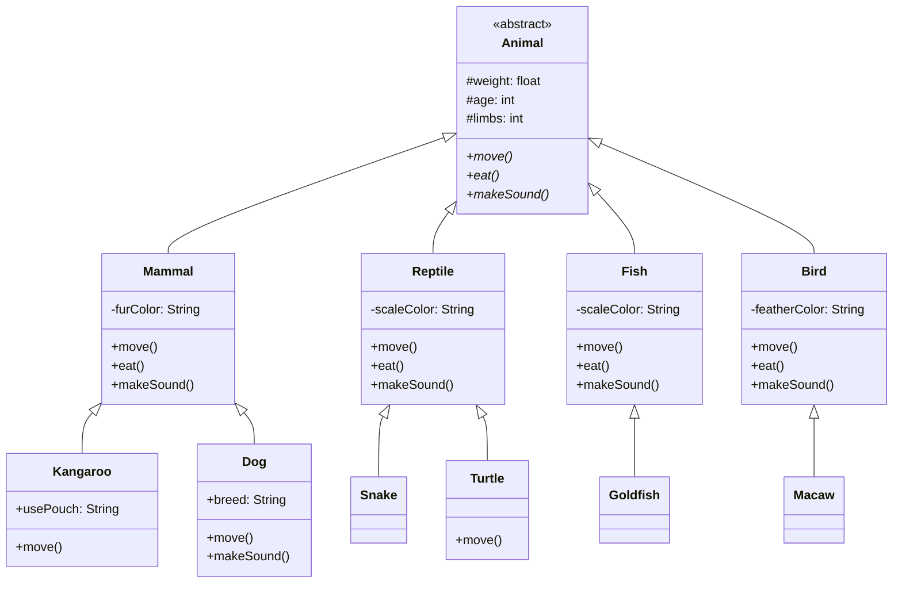

# 📚 Lesson 10 – Polymorphism in Java

## 🎯 Lesson Objectives

* Understand the **concept of polymorphism**
* Understand the role of **method signatures**
* Apply **polymorphism through overriding**
* Implement hierarchies using **abstract classes**
* Identify the **practical advantages** of polymorphism in Java

---

## 🧠 What Is Polymorphism?

**Polymorphism** is the ability of the same method to represent **different behaviors**, depending on the object that executes it.

📌 The word comes from Greek:

* **Poly** → many
* **Morph** → forms

➡️ In other words: **“many ways to perform the same action.”**

---

## 🧾 Method Signature

To understand polymorphism, it is essential to understand the concept of a **method signature**.

### 🔑 Signature =

✔ Method name
✔ Number of parameters
✔ Types of parameters

❌ **The return type is NOT part of the signature**

```java
// SIGNATURE = name + parameters (number and types)
public void move(int x, int y) {
    // signature: move(int, int)
}

public void move(double x, double y) {
    // signature: move(double, double) → DIFFERENT!
}

public int move(int x, int y) {
    // signature: move(int, int) → SAME! (return type does not count)
}
```

### 📋 Important Rules:

1. **Return type is NOT part** of the signature
2. **Modifiers** (public, private) are NOT part
3. **Method name + parameters** = full signature

---

### 📊 Types of Polymorphism:

| Type            | Definition                        | Example                                  |
| --------------- | --------------------------------- | ---------------------------------------- |
| **Overriding**  | Same signature, different classes | `animal.makeSound()`                     |
| **Overloading** | Different signatures, same class  | `sum(int, int)` vs `sum(double, double)` |

**Focus of this lesson**: **Polymorphism by Overriding**

---

## 🔄 Polymorphism by Overriding

### 📌 What is it?

It occurs when a **subclass replaces the behavior** of a method inherited from its superclass, keeping:

* Same name
* Same signature
* Same return type

```java
@Override
public void move() {
    System.out.println("Running");
}
```

---

## 💻 Java Implementation

👉 Full implementation available at:
🔗 [https://github.com/ThayronyVonHeld/Introduction-JAVA/tree/main/src-projects/Module02/Exercicies/Lesson10](https://github.com/ThayronyVonHeld/Introduction-JAVA/tree/main/src-projects/Module02/Exercicies/Lesson10)

---

### 🐾 Animal Hierarchy – Diagram



---

## 🐾 Class Hierarchy

### 🧬 Abstract Class `Animal`

* Cannot be instantiated
* Defines **mandatory behaviors**
* Serves as a base model

```java
public abstract class Animal {
    protected float weight;
    protected int age;
    protected int limbs;

    public abstract void move();
    public abstract void eat();
    public abstract void makeSound();
}
```

---

## 🧩 First-Level Subclasses

Each subclass **overrides** the abstract methods with its specific behavior.

### 🐕 Mammal

```java
@Override
public void move() {
    System.out.println("Running");
}
```

### 🐟 Fish

```java
@Override
public void move() {
    System.out.println("Swimming");
}
```

### 🦅 Bird

```java
@Override
public void move() {
    System.out.println("Flying");
}
```

➡️ **Same method, different behaviors.**

---

## 🧠 Second-Level Subclasses (Specialization)

Polymorphism allows **even more specific specializations**.

### 🦘 Kangaroo (specialization of Mammal)

```java
@Override
public void move() {
    System.out.println("Jumping");
}
```

➡️ Still a mammal, but with a different way of moving.

---

### 🐶 Dog

```java
@Override
public void makeSound() {
    System.out.println("Woof woof");
}
```

➡️ Overrides only the behavior that makes sense.

---

## ▶️ Polymorphism in Action (Main Class)

```java
Mammal m1 = new Mammal();
Fish p1 = new Fish();
Bird a1 = new Bird();

m1.move(); // Running
p1.move(); // Swimming
a1.move(); // Flying
```

### 📌 What happens here?

* The called method is the **same**
* Execution depends on the **actual object type**
* Java decides **at runtime**

➡️ This is **polymorphism**.

---

## 🚫 Important Restriction

```java
Animal a = new Animal(); // ERROR
```

❌ Abstract classes **cannot be instantiated**
✔ Ensures only concrete types are used

---

## 🎮 Analogy: The “Play” Command

Polymorphism works like the **“Play”** button on different devices:

```java
// ABSTRACT CLASS
abstract class Device {
    public abstract void play();
}

// SUBCLASSES
class MusicPlayer extends Device {
    @Override
    public void play() {
        System.out.println("Playing music... 🎵");
    }
}

class VideoGame extends Device {
    @Override
    public void play() {
        System.out.println("Starting game... 🎮");
    }
}

class StreamingService extends Device {
    @Override
    public void play() {
        System.out.println("Playing movie... 🎬");
    }
}

// MAIN PROGRAM
public class Test {
    public static void main(String[] args) {
        Device[] devices = {
            new MusicPlayer(),
            new VideoGame(),
            new StreamingService()
        };
        
        for (Device d : devices) {
            d.play(); // SAME COMMAND, DIFFERENT BEHAVIORS!
        }
    }
}
```

**Output**:

```
Playing music... 🎵
Starting game... 🎮
Playing movie... 🎬
```

---

## ⚡ Benefits of Polymorphism

### 1. **Cleaner Code**

```java
// WITHOUT polymorphism (bad):
if (animal instanceof Dog) {
    ((Dog) animal).bark();
} else if (animal instanceof Cat) {
    ((Cat) animal).meow();
} else if (animal instanceof Cow) {
    ((Cow) animal).moo();
}

// WITH polymorphism (good):
animal.makeSound(); // Each one knows how to do it!
```

### 2. **Easy Extensibility**

```java
// Adding a new animal is easy:
class Wolf extends Mammal {
    @Override
    public void makeSound() {
        System.out.println("Auuuuu!");
    }
}

// Existing code keeps working!
Animal wolf = new Wolf();
wolf.makeSound();
```

### 3. **Simplified Maintenance**

* Change behavior → modify only one class
* Add functionality → create a new subclass
* Isolated testing → each class is independent

---

## 🚨 Important Considerations

### 1. **Do Not Force Polymorphism**

```java
// BAD - No "is-a" relationship:
class Car extends Animal { // ❌ A car IS NOT an animal!
    @Override
    public void move() {
        System.out.println("Driving");
    }
}
```

### 2. **Always Use @Override**

```java
class Cat extends Animal {
    @Override // ✅ Good - compiler checks it
    public void makeSound() {
        System.out.println("Meow");
    }
    
    // public void makSound() { // ❌ Typo!
    //     System.out.println("Meow");
    // } // Without @Override, error may go unnoticed!
}
```

### 3. **Respect the Liskov Substitution Principle**

> “Subtypes must be substitutable for their base types.”

```java
// GOOD:
Animal animal = new Dog(); // ✅ Dog IS an Animal

assert animal instanceof Animal; // true
```

---

## 🚀 Implementation Challenge

**Extend the Animal system:**

1. **Add new classes**:

    * `Reptile` with method `shedSkin()`
    * `Snake` extending `Reptile` and overriding `move()` to `"Crawling"`
    * `Turtle` extending `Reptile` with method `hideHead()`

2. **Create interfaces**:

    * `Domesticable` with method `play()`
    * `Flyer` with method `flyHigh()`
    * Implement them in appropriate classes

3. **Feeding System**:

    * Interface `Feeding` with `foodType()`
    * Classes: `Carnivore`, `Herbivore`, `Omnivore`
    * Use multiple inheritance via interfaces

4. **Animal Factory**:

    * Class `AnimalFactory` with a static method
    * `createAnimal(String type)` returns the appropriate Animal
    * Use polymorphism during creation

---

> 💡 Tip: **Polymorphism is like being multilingual** — you express the same idea in different ways, depending on who you’re talking to! 🌍
