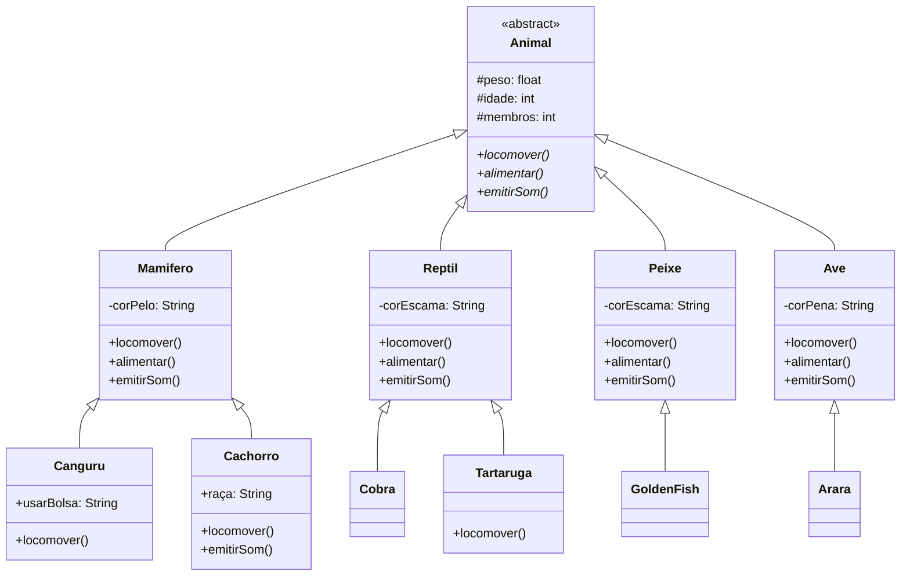

# 📚 Aula 10 – Polimorfismo em Java

## 🎯 Objetivos da Aula

* Compreender o **conceito de polimorfismo**
* Entender o papel da **assinatura de métodos**
* Aplicar **polimorfismo por sobreposição (overriding)**
* Implementar hierarquias com **classes abstratas**
*  Identificar as **vantagens práticas** do polimorfismo em Java

---
## 🧠 O que é Polimorfismo?

**Polimorfismo** é a capacidade de um mesmo método representar **comportamentos diferentes**, dependendo do objeto que o executa.

📌 A palavra vem do grego:

* **Poli** → muitas
* **Morfo** → formas

➡️ Ou seja: **“muitas formas de executar a mesma ação”**.

---
## 🧾 Assinatura de Métodos

Para entender polimorfismo, é essencial compreender o conceito de **assinatura de método**.

### 🔑 Assinatura =

✔ Nome do método
✔ Quantidade de parâmetros
✔ Tipos dos parâmetros

❌ **O tipo de retorno NÃO faz parte da assinatura**

```java
// ASSINATURA = nome + parâmetros (quantidade e tipos)
public void mover(int x, int y) {
    // assinatura: mover(int, int)
}

public void mover(double x, double y) {
    // assinatura: mover(double, double) → DIFERENTE!
}

public int mover(int x, int y) {
    // assinatura: mover(int, int) → MESMA! (retorno não conta)
}
```

### 📋 Regras Importantes:
1. **Tipo de retorno NÃO faz parte** da assinatura
2. **Modificadores** (public, private) NÃO fazem parte
3. **Nome do método + parâmetros** = assinatura completa
---

### 📊 Tipos de Polimorfismo:

| Tipo | Definição | Exemplo |
|------|-----------|---------|
| **Sobreposição (Overriding)** | Mesma assinatura, classes diferentes | `animal.emitirSom()` |
| **Sobrecarga (Overloading)** | Assinaturas diferentes, mesma classe | `somar(int, int)` vs `somar(double, double)` |

**Foco desta aula**: **Polimorfismo por Sobrep**osição!

---

## 🔄 Polimorfismo de Sobreposição (Overriding)

### 📌 O que é?

Ocorre quando uma **subclasse substitui o comportamento** de um método herdado da superclasse, mantendo:

* Mesmo nome
* Mesma assinatura
* Mesmo tipo de retorno

```java
@Override
public void locomover() {
    System.out.println("Correndo");
}
```

---

## 💻 Implementação em Java

👉 Implementação completa disponível em:
🔗 [https://github.com/ThayronyVonHeld/Introduction-JAVA/tree/main/src-projects/Module02/Exercicies/Lesson10](https://github.com/ThayronyVonHeld/Introduction-JAVA/tree/main/src-projects/Module02/Exercicies/Lesson8)

### 🐾 Hierarquia Animal - Diagrama



---

## 🐾 Hierarquia de Classes:

### 🧬 Classe Abstrata `Animal`

* Não pode ser instanciada
* Define **comportamentos obrigatórios**
* Serve como modelo base

```java
public abstract class Animal {
    protected float peso;
    protected int idade;
    protected int membros;

    public abstract void locomover();
    public abstract void alimentar();
    public abstract void emitirSom();
}
```

---

## 🧩 Subclasses de Primeiro Nível

Cada subclasse **sobrescreve** os métodos abstratos com seu comportamento específico.

### 🐕 Mamífero

```java
@Override
public void locomover() {
    System.out.println("Correndo");
}
```

### 🐟 Peixe

```java
@Override
public void locomover() {
    System.out.println("Nadando");
}
```

### 🦅 Ave

```java
@Override
public void locomover() {
    System.out.println("Voando");
}
```

➡️ **Mesmo método, comportamentos diferentes**.

---

## 🧠 Subclasses de Segundo Nível (Especialização)

O polimorfismo permite **especializações ainda mais específicas**.

### 🦘 Canguru (especialização de Mamífero)

```java
@Override
public void locomover() {
    System.out.println("Saltando");
}
```

➡️ Continua sendo um mamífero, mas se locomove de forma diferente.

---

### 🐶 Cachorro

```java
@Override
public void emitirSom() {
    System.out.println("Au au au");
}
```

➡️ Substitui apenas o comportamento que faz sentido.

---

## ▶️ Polimorfismo em Ação (Classe Principal)

```java
Mamifero m1 = new Mamifero();
Peixe p1 = new Peixe();
Ave a1 = new Ave();

m1.locomover(); // Correndo
p1.locomover(); // Nadando
a1.locomover(); // Voando
```

### 📌 O que acontece aqui?

* O método chamado é o **mesmo**
* A execução depende do **tipo real do objeto**
* O Java decide **em tempo de execução**

➡️ Isso é **polimorfismo**.

---

## 🚫 Restrição Importante

```java
Animal a = new Animal(); // ERRO
```

❌ Classes abstratas **não podem ser instanciadas**
✔ Garantem que apenas tipos concretos sejam usados

---

## 🎮 Analogia: Comando "Reproduzir"

O polimorfismo funciona como o botão **"Reproduzir"** em diferentes dispositivos:

```java
// CLASSE ABSTRATA
abstract class Dispositivo {
    public abstract void reproduzir();
}

// SUBCLASSES
class LeitorMusica extends Dispositivo {
    @Override
    public void reproduzir() {
        System.out.println("Tocando música... 🎵");
    }
}

class VideoGame extends Dispositivo {
    @Override
    public void reproduzir() {
        System.out.println("Iniciando jogo... 🎮");
    }
}

class Streaming extends Dispositivo {
    @Override
    public void reproduzir() {
        System.out.println("Exibindo filme... 🎬");
    }
}

// PROGRAMA PRINCIPAL
public class Teste {
    public static void main(String[] args) {
        Dispositivo[] dispositivos = {
            new LeitorMusica(),
            new VideoGame(),
            new Streaming()
        };
        
        for (Dispositivo d : dispositivos) {
            d.reproduzir();  // MESMO COMANDO, COMPORTAMENTOS DIFERENTES!
        }
    }
}
```

**Saída**:
```
Tocando música... 🎵
Iniciando jogo... 🎮
Exibindo filme... 🎬
```

---

## ⚡ Benefícios do Polimorfismo

### 1. **Código Mais Limpo**
```java
// SEM polimorfismo (ruim):
if (animal instanceof Cachorro) {
    ((Cachorro) animal).latir();
} else if (animal instanceof Gato) {
    ((Gato) animal).miar();
} else if (animal instanceof Vaca) {
    ((Vaca) animal).mugir();
}

// COM polimorfismo (bom):
animal.emitirSom();  // Cada um sabe como fazer!
```

### 2. **Extensibilidade Fácil**
```java
// Adicionar novo animal é fácil:
class Lobo extends Mamifero {
    @Override
    public void emitirSom() {
        System.out.println("Auuuuuu!");
    }
}

// Código existente continua funcionando!
Animal lobo = new Lobo();
lobo.emitirSom();  // Funciona sem modificar código antigo
```

### 3. **Manutenção Simplificada**
* Mudar comportamento = modificar apenas uma classe
* Adicionar funcionalidade = criar nova subclasse
* Testar isoladamente = cada classe é independente

---

## 🚨 Cuidados Importantes

### 1. **Não force polimorfismo**
```java
// RUIM - Sem relação "é um":
class Carro extends Animal {  // ❌ Carro NÃO É um Animal!
    @Override
    public void locomover() {
        System.out.println("Dirigindo");
    }
}
```

### 2. **Use @Override sempre**
```java
class Gato extends Animal {
    @Override  // ✅ Bom - compilador verifica
    public void emitirSom() {
        System.out.println("Miau");
    }
    
    // public void emitiSom() {  // ❌ Erro de digitação!
    //     System.out.println("Miau");
    // }  // Sem @Override, não acusa erro!
}
```

### 3. **Respeite o princípio de Liskov**
> "Subclasses devem ser substituíveis por suas superclasses"

```java
// BOM:
Animal animal = new Cachorro();  // ✅ Cachorro É UM Animal

// Teste deve passar:
assert animal instanceof Animal;  // true
```

---

## 🚀 Desafio de Implementação

**Amplie o sistema Animal:**

1. **Adicione novas classes**:
    * `Reptil` com método `trocarPele()`
    * `Cobra` que estende `Reptil` e sobrescreve `locomover()` para "Rastejando"
    * `Tartaruga` que estende `Reptil` e tem método `esconderCabeca()`

2. **Crie interfaces**:
    * `Domesticavel` com método `brincar()`
    * `Voador` com método `voarAlto()`
    * Implemente nas classes adequadas

3. **Sistema de Alimentação**:
    * Interface `Alimentacao` com `tipoAlimento()`
    * Classes: `Carnivoro`, `Herbivoro`, `Onivoro`
    * Use herança múltipla via interfaces

4. **Fábrica de Animais**:
    * Classe `FabricaAnimais` com método estático
    * `criarAnimal(String tipo)` retorna Animal apropriado
    * Use polimorfismo na criação

---

>💡 Dica: **Polimorfismo é como ser multilíngue** você pode expressar a mesma ideia de maneiras diferentes, dependendo de com quem está falando! 🌍