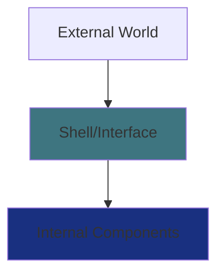

# 📚 Lesson 5 – OOP Pillars: Encapsulation

---

## 🎯 Lesson Goals

* Understand the concept of encapsulation in OOP
* Distinguish between the pillars of OOP
* Learn the benefits of encapsulation
* Implement encapsulation in Java code
* Understand the relationship between interfaces and encapsulation

---

## 🏛️ The Pillars of Object-Oriented Programming

Object-Oriented Programming has **three main pillars** (in the modern reduced model):

1. **Encapsulation**
2. **Inheritance**
3. **Polymorphism**

> You might wonder: “But in the material I studied, there were four pillars, including abstraction…”

Yes! Some textbooks use **four pillars**:

* Abstraction
* Encapsulation
* Inheritance
* Polymorphism

> In our study, we consider **abstraction as part of encapsulation**, because when we encapsulate, we naturally abstract internal details.

---

## 💊 What Is Encapsulation?

### 📦 Analogy: The Battery (AA Cell)

Think of an **AA battery**:

* It contains **chemical components** inside
* These components may be dangerous
* So it needs to be **encapsulated**
* You **use** the battery without accessing the internal content
* Batteries of the same type follow a **standard external shape**
* The internal design can differ completely between brands

👉 **The user only sees the interface — not the internal mechanism.**



### Encapsulation in OOP works exactly the same:

An encapsulated software:

✔ Uses the same external pattern
✔ Protects the user from the code and the code from the user
✔ Provides a stable interface
✔ Hides internal details
✔ Allows internal changes without breaking the code that depends on it

---

## 🔐 What Does It Mean to Encapsulate?

Encapsulating means:

**➡️ Hiding internal implementation
➡️ Exposing only what is necessary
➡️ Ensuring security, consistency, and flexibility**

Just like you don’t open a battery to see how it works,
a programmer should not directly access an object’s attributes.

---

## 🎮 Real-World Example: A Remote Control

### Without Encapsulation:

```
[ Exposed wiring ]
[ Visible circuits ]
[ Unprotected battery ]
↑ User has direct access to internal components
```

### With Encapsulation:

```
┌─────────────────────┐
│     📺 REMOTE       │
├─────────────────────┤
│ [Power] [Menu] [Mute]│
│ [Vol+] [Vol-] [CH+] │
│ [Play] [Pause] [OK] │
└─────────────────────┘
↑ Simplified interface, hidden internal functionality
```

### Remote Control Interface:

* `turnOn()` / `turnOff()`
* `openMenu()` / `closeMenu()`
* `volumeUp()` / `volumeDown()`
* `mute()` / `unmute()`
* `play()` / `pause()`

---

## 🛡️ Benefits of Encapsulation

### 1. **Data Protection**

```java
// WITHOUT ENCAPSULATION (Dangerous!)
public class BankAccount {
    public double balance;  // ❌ Anyone can modify it!
}

// WITH ENCAPSULATION (Safe!)
public class BankAccount {
    private double balance;  // ✅ Access only through controlled methods
    
    public void deposit(double value) {
        if (value > 0) {
            balance += value;
        }
    }
}
```

### 2. **Flexibility for Internal Changes**

```java
public class Calculator {
    private double result;
    
    // Internal logic may change, but the interface stays the same
    public double sum(double a, double b) {
        // Version 1.0: result = a + b
        // Version 2.0: result = advancedProcessor.sum(a, b)
        return result;
    }
}
```

### 3. **Code Reuse**

```java
// A well-encapsulated class can be reused in multiple projects
public class EmailValidator {
    private boolean checkDomain(String email) { /* internal code */ }
    
    public boolean isValid(String email) {
        return checkDomain(email) && /* more checks */;
    }
}
```

---

## 💬 Messages and Interfaces

In OOP, we never interact directly with the object’s internal state.
We send **messages** → method calls.

An **interface** is the set of services that the object provides to the outside world.

Real-world examples of interfaces:

* **Battery** → only two poles
* **Car** → steering wheel, accelerator, brake
* **Remote control** → buttons

You don’t need to know how each action works internally.
The interface protects you from the internal details.

---

## 🧱 Why Encapsulate?

### 1. 🔄 Internal changes become invisible

You can rewrite all internal logic as long as public methods remain the same.

### 2. ♻ Reusability

Encapsulated classes behave like reusable “black boxes.”

### 3. 🛡 Fewer side effects

External code does not improperly alter internal code — and vice-versa.

---

## 💻 Practical Implementation: Controller Interface

We will now represent this using:

* An interface (UML + code)
* A class that implements the interface
* Encapsulation with private attributes

### UML Diagram of the Interface:

```
    ╔══════════════════╗
    ║  «interface»     ║
    ║    Controller    ║
    ╠══════════════════╣
    ║ + turnOn(): void ║
    ║ + turnOff(): void║
    ║ + openMenu(): void║
    ║ + closeMenu(): void║
    ║ + volumeUp(): void║
    ║ + volumeDown(): void║
    ║ + mute(): void   ║
    ║ + unmute(): void ║
    ║ + play(): void   ║
    ║ + pause(): void  ║
    ╚══════════════════╝
```

To learn more about this exercise,
[Click here.](https://github.com/ThayronyVonHeld/Introduction-JAVA/tree/main/src-projects/oop/Lesson5)

---

## 📊 Table: Encapsulation Levels

| Level            | Attributes | Getters/Setters | Interface  | Usage        |
| ---------------- | ---------- | --------------- | ---------- | ------------ |
| **Basic**        | `private`  | `public`        | Simple     | Common       |
| **Intermediate** | `private`  | `protected`     | Controlled | Libraries    |
| **Advanced**     | `private`  | `private`       | Strict     | Complex APIs |

---

## 🚀 Practical Exercises

### Exercise 1: Encapsulated Bank Account

```java
// Create an encapsulated BankAccount class with:
// - balance (private)
// - accountNumber (private)
// - Methods: deposit(), withdraw(), checkBalance()
// - Rule: do not allow withdrawals greater than the balance
```

### Exercise 2: Shopping Cart

```java
// Implement an encapsulated shopping cart:
// - List of products (private)
// - Total value (private)
// - Methods: addItem(), removeItem(), calculateTotal(), checkout()
```

### Exercise 3: Login System

```java
// Create a login system using encapsulation:
// - username and password (private)
// - Methods: authenticate(), changePassword(), checkPasswordStrength()
// - Rule: password must have at least 8 characters
```

---

> 💡 **Tip:** “Think of encapsulation as creating a *black box*: you know what goes in (parameters), what comes out (return value), and what it can do (public methods), but you don’t need to know how it works internally. This makes your code safer, more flexible, and more professional!”

---