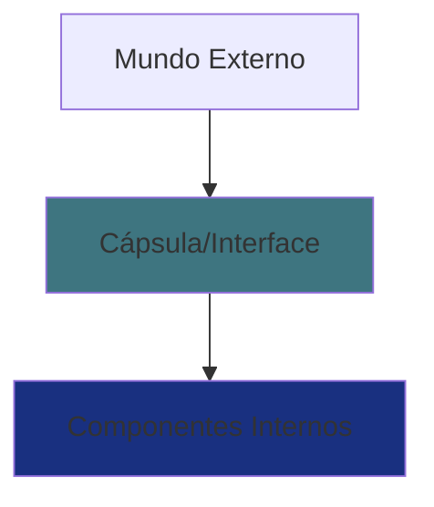

# 📚 Aula 5 - Pilares da POO: Encapsulamento

---

## 🎯 Objetivos da Aula
- Compreender o conceito de encapsulamento na POO
- Diferenciar entre os pilares da POO
- Aprender os benefícios do encapsulamento
- Implementar encapsulamento em código Java
- Entender a relação entre interfaces e encapsulamento

---

## 🏛️ Os Pilares da Programação Orientada a Objetos

A Programação Orientada a Objetos possui **três pilares principais** (no modelo reduzido mais moderno):

1. **Encapsulamento**
2. **Herança**
3. **Polimorfismo**

> Você pode se perguntar “Mas no material no qual estudei são quatro pilares, incluindo abstração…”

Sim! Algumas bibliografias usam **quatro pilares**:

* Abstração
* Encapsulamento
* Herança
* Polimorfismo

> Em nosso estudo, consideramos **abstração como parte do encapsulamento**, pois ao encapsular, naturalmente abstraímos os detalhes internos.

---

## 💊 O que é Encapsulamento?

### 📦 Analogia: A Pilha (Bateria)

Pense em uma **pilha AA**:

* Ela possui **componentes químicos internos**
* Esses componentes poderiam ser perigosos
* Por isso ela precisa ser **encapsulada**
* Você **usa** a pilha sem ter acesso ao conteúdo interno
* Pilhas do mesmo tipo seguem um **padrão externo**
* O funcionamento interno pode ser totalmente diferente entre marcas

👉 **O usuário vê apenas a interface — não o funcionamento interno.**



### Encapsulamento em POO funciona da mesma maneira:

Um software encapsulado:

✔ Usa o mesmo padrão externo
✔ Protege o usuário do código e o código do usuário
✔ Fornece uma interface estável
✔ Esconde detalhes internos
✔ Permite mudança interna sem quebrar quem usa

## 🔐 O que significa encapsular?

Encapsular significa:

**➡️ Ocultar partes internas da implementação
➡️ Expor apenas o necessário
➡️ Garantir segurança, padronização e flexibilidade**

Assim como você não abre uma pilha para ver como ela funciona,
um programador não deve acessar diretamente os atributos de um objeto.

## 🎮 Exemplo do Mundo Real: Controle Remoto

### Sem Encapsulamento:
```
[ Fios expostos ]
[ Circuitos visíveis ]
[ Bateria desprotegida ]
↑ Usuário tem acesso direto aos componentes internos
```

### Com Encapsulamento:
```
┌─────────────────────┐
│    📺 CONTROLE      │
├─────────────────────┤
│ [Power] [Menu] [Mute]│
│ [Vol+] [Vol-] [CH+] │
│ [Play] [Pause] [OK] │
└─────────────────────┘
↑ Interface simplificada, funcionamento interno oculto
```

### Interface do Controle Remoto:
- `ligar()` / `desligar()`
- `abrirMenu()` / `fecharMenu()`
- `maisVolume()` / `menosVolume()`
- `ligarMudo()` / `desligarMudo()`
- `play()` / `pause()`

---

## 🛡️ Benefícios do Encapsulamento

### 1. **Proteção de Dados**
```java
// SEM ENCAPSULAMENTO (Perigoso!)
public class ContaBancaria {
    public double saldo;  // ❌ Qualquer um pode modificar!
}

// COM ENCAPSULAMENTO (Seguro!)
public class ContaBancaria {
    private double saldo;  // ✅ Apenas métodos controlados acessam
    
    public void depositar(double valor) {
        if (valor > 0) {
            saldo += valor;
        }
    }
}
```

### 2. **Flexibilidade para Mudanças Internas**
```java
public class Calculadora {
    private double resultado;
    
    // Internamente pode mudar, mas a interface permanece
    public double somar(double a, double b) {
        // Versão 1.0: resultado = a + b
        // Versão 2.0: resultado = processadorAvancado.somar(a, b)
        return resultado;
    }
}
```

### 3. **Reutilização de Código**
```java
// Uma classe encapsulada pode ser usada em múltiplos projetos
public class ValidadorEmail {
    private boolean verificarDominio(String email) { /* código interno */ }
    
    public boolean isValid(String email) {
        return verificarDominio(email) && /* mais verificações */;
    }
}
```

---

## 💬 Mensagens e Interfaces

Em POO, não interagimos diretamente com o objeto.
Nós enviamos **mensagens** → chamadas de métodos.

A **interface** é o conjunto de serviços que o objeto oferece ao mundo externo.

Exemplos de interfaces no mundo real:

* **Pilha** → apenas dois polos
* **Carro** → volante, acelerador, freio
* **Controle remoto** → botões

Você não precisa saber como internamente cada ação é executada.
A interface te protege dos detalhes internos.

---

## 🧱 Por que encapsular?

### 1. 🔄 Mudanças internas invisíveis

Você pode reescrever toda a lógica interna, desde que os métodos públicos permaneçam iguais.

### 2. ♻ Reutilização

Classes encapsuladas funcionam como “caixas pretas” reutilizáveis.

### 3. 🛡 Menos efeitos colaterais

O código externo não altera indevidamente o interno — e vice-versa.

---

## 💻 Implementação Prática: Interface Controlador

Vamos agora representar isso usando:

* Interface (UML e código)
* Classe que implementa a interface
* Encapsulamento com atributos privados


### Diagrama UML da Interface:

```
    ╔══════════════════╗
    ║  «interface»     ║
    ║   Controlador    ║
    ╠══════════════════╣
    ║ + ligar(): void  ║
    ║ + desligar(): void║
    ║ + abrirMenu(): void║
    ║ + fecharMenu(): void║
    ║ + maisVolume(): void║
    ║ + menosVolume(): void║
    ║ + ligarMudo(): void║
    ║ + desligarMudo(): void║
    ║ + play(): void   ║
    ║ + pause(): void  ║
    ╚══════════════════╝
```

Para saber mais sobre este exercício [Clique aqui.](https://github.com/ThayronyVonHeld/Introduction-JAVA/tree/main/src-projects/oop/Lesson5)

---
## 📊 Tabela: Níveis de Encapsulamento

| Nível | Atributos | Getters/Setters | Interface | Uso |
|-------|-----------|----------------|-----------|-----|
| **Básico** | `private` | `public` | Simples | Comum |
| **Intermediário** | `private` | `protected` | Controlada | Bibliotecas |
| **Avançado** | `private` | `private` | Estrita | APIs complexas |

---

## 🚀 Exercícios Práticos

### Exercício 1: Conta Bancária Encapsulada
```java
// Crie uma classe ContaBancaria encapsulada com:
// - saldo (private)
// - número da conta (private)
// - Métodos: depositar(), sacar(), consultarSaldo()
// - Validações: não permitir saque maior que saldo
```

### Exercício 2: Carrinho de Compras
```java
// Implemente um carrinho de compras encapsulado:
// - Lista de produtos (private)
// - Valor total (private)
// - Métodos: adicionarItem(), removerItem(), calcularTotal(), finalizarCompra()
```

### Exercício 3: Sistema de Login
```java
// Crie um sistema de login com encapsulamento:
// - usuário e senha (private)
// - Métodos: autenticar(), alterarSenha(), verificarForçaSenha()
// - Regras: senha deve ter mínimo 8 caracteres
```
---

> 💡 **Dica**: "Pense no encapsulamento como criar uma 'caixa preta': você sabe o que entra (parâmetros), o que sai (retorno)
> e o que pode fazer (métodos públicos), mas não precisa saber como funciona internamente. Isso torna seu código mais seguro, flexível e profissional!"