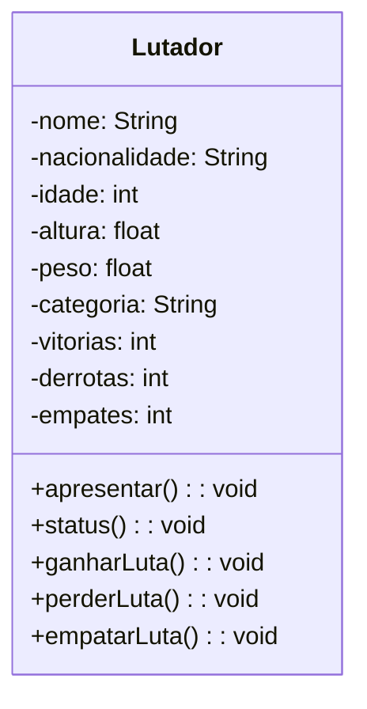

# 📚 Aula 6 – Relacionamento entre Classes

---

## 🎯 Objetivos da Aula

* Introduzir o conceito de **relacionamento entre classes**
* Compreender a necessidade de trabalhar com **múltiplas classes**
* Aplicar **abstração e encapsulamento** em um cenário real
* Criar a classe **Lutador** como base para relacionamentos futuros
* Preparar o terreno para agregação entre classes (Aula 7)

---

## 🧭 Introdução

Até agora, trabalhamos sempre com **uma classe por vez**.
A partir desta aula, damos um passo muito importante: **fazer classes conversarem entre si**.

Isso é essencial para:

* Modelar sistemas reais
* Representar objetos mais complexos
* Compreender a estrutura da Programação Orientada a Objetos

⚠️ **Atenção:**
Relacionamento entre classes **não será visto em uma única aula**.
Esta aula introduz o conceito e prepara a base.
As próximas aulas aprofundam o relacionamento propriamente dito.

---

## 🧩 O Exercício: Ultra Emoji Combat

Para estudar relacionamento entre classes, utilizaremos um projeto contínuo:

🎮 **Ultra Emoji Combat**

A ideia é simples:
👉 Emojis que representam **lutadores** participam de combates.

Nesta aula, **não teremos luta ainda**.
Vamos começar criando **o perfil de um lutador**.

---

## 🥊 O que define um Lutador?

Para participar do Ultra Emoji Combat, um lutador precisa ter:

### 📌 Atributos:

* Nome
* Nacionalidade
* Idade
* Altura
* Peso
* Categoria
* Número de vitórias
* Número de derrotas
* Número de empates

Todos esses dados fazem parte do **estado do objeto**.

> Lembre-se:
> **Tudo que define um objeto são seus atributos.**

---

## 🧠 Abstração em Ação

Você pode pensar:

> “Mas um lutador também treina, corre, toma suplementos...”

Sim.
Mas **não precisamos disso agora**.

👉 Isso é **abstração**:
Selecionar **apenas o que importa para o problema atual**.

Neste exercício, o foco é:

* Cadastro
* Categoria
* Resultados de luta

---

## 🧱 Diagrama de Classes – Classe Lutador

Teremos uma única classe nesta aula:



### 📦 Classe: `Lutador`

#### 🔐 Atributos (todos privados):

* nome
* nacionalidade
* idade
* altura
* peso
* categoria
* vitorias
* derrotas
* empates

> Todos privados por causa do **encapsulamento** (Aula 5).

#### 🔓 Métodos (públicos):

* apresentar()
* status()
* ganharLuta()
* perderLuta()
* empatarLuta()

⚠️
Getters, setters e construtor **existem**, mas não aparecem no diagrama para evitar poluição visual.

---

## 🏷️ Categorias de Peso

Para o exercício, utilizaremos **três categorias**:

* Peso leve
* Peso médio
* Peso pesado

A categoria **não será informada manualmente**.
Ela será **calculada automaticamente** com base no peso.

---

## 👥 Lutadores do Exercício

Teremos **seis lutadores**, dois por categoria:

### 🟢 Peso Leve

1. **Pretty Boy**

    * França
    * 31 anos
    * 1,75 m
    * 68,9 kg
    * 11 vitórias, 2 derrotas, 1 empate

2. **Script**

    * Brasil
    * 29 anos
    * 1,68 m
    * 57,8 kg
    * 14 vitórias, 2 derrotas, 3 empates

---

### 🟡 Peso Médio

3. **Snap Shadow**

    * EUA
    * 35 anos
    * 1,65 m
    * 80,9 kg
    * 12 vitórias, 2 derrotas, 1 empate

4. **Dead Cold**

    * Austrália
    * 28 anos
    * 1,93 m
    * 81,6 kg
    * 13 vitórias, 0 derrotas, 2 empates

---

### 🔴 Peso Pesado

5. **Uf Cobol**

    * Brasil
    * 37 anos
    * 1,70 m
    * 99,3 kg
    * 5 vitórias, 4 derrotas, 3 empates

6. **Ner Dart**

    * EUA
    * 30 anos
    * 1,81 m
    * 105,7 kg
    * 12 vitórias, 2 derrotas, 4 empates

---

## 🏗️ Construção da Classe Lutador (Resumo Lógico)

1. Criar a classe `Lutador`
2. Declarar **atributos privados**
3. Criar métodos públicos:

    * apresentar
    * status
    * ganharLuta
    * perderLuta
    * empatarLuta
4. Criar **construtor**
5. Criar **getters e setters**
6. Categoria calculada automaticamente no `setPeso()`

---

## ⚙️ Lógica da Categoria

O método `setCategoria()` será:

* **Privado**
* Chamado automaticamente dentro de `setPeso()`

Categorias:

* Peso inválido
* Peso leve
* Peso médio
* Peso pesado

---

## 🧠 Métodos Importantes

### apresentar()

Mostra:

* Nome
* Nacionalidade
* Idade
* Altura
* Peso
* Histórico de lutas

### status()

Mostra:

* Nome
* Categoria
* Vitórias
* Derrotas
* Empates

### ganharLuta(), perderLuta(), empatarLuta()

Apenas incrementam os valores correspondentes.

---
## 📦 Criando os Objetos

Ao invés de criar:

```java
Lutador l1, l2, l3...
```

Utilizamos:

```java
Lutador[] lutadores = new Lutador[6];
```

Cada posição recebe um novo objeto `Lutador`.

Isso facilita:

* Organização
* Escalabilidade
* Manipulação em laços
---

## 🧠 Para conhecer melhor o exercício proposto
[Clique aqui para acessar o exercício completo](https://github.com/ThayronyVonHeld/Introduction-JAVA/tree/main/src-projects/oop/Lesson6)

---

## 🚧 Onde está o Relacionamento?

Ainda **não apareceu**  e isso é proposital.

👉 Nesta aula criamos a **base**.
👉 Na próxima aula, entra a classe **Luta**.

A relação será de **agregação**:

* Uma luta depende de lutadores
* Lutadores existem sem luta

---

> 💡**Dica**: Sem uma boa modelagem das classes, o relacionamento se torna confuso ou frágil.