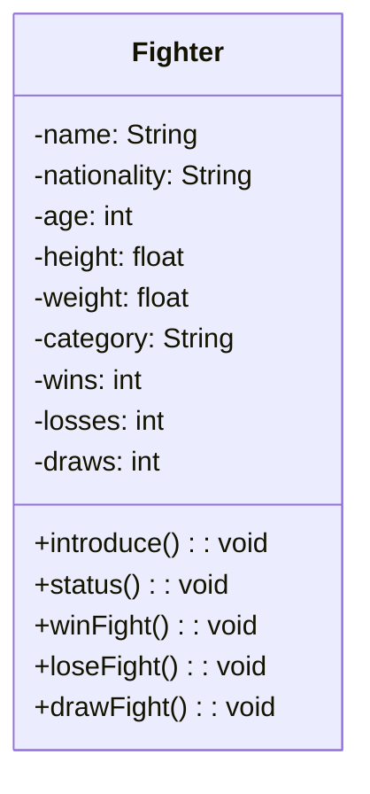

# 📚 Lesson 6 – Relationships Between Classes

---

## 🎯 Lesson Objectives

* Introduce the concept of **relationships between classes**
* Understand the need to work with **multiple classes**
* Apply **abstraction and encapsulation** in a real-world scenario
* Create the **Fighter** class as a foundation for future relationships
* Prepare the ground for class aggregation (Lesson 7)

---

## 🧭 Introduction

So far, we have always worked with **one class at a time**.
From this lesson onward, we take a very important step: **preparing classes to communicate with each other**.

This is essential to:

* Model real-world systems
* Represent more complex objects
* Understand the structure of Object-Oriented Programming

⚠️ **Attention:**
Relationships between classes **will not be covered in a single lesson**.
This lesson introduces the concept and builds the foundation.
The next lessons will explore the relationships in depth.

---

## 🧩 The Exercise: Ultra Emoji Combat

To study relationships between classes, we will use a continuous project:

🎮 **Ultra Emoji Combat**

The idea is simple:
👉 Emojis that represent **fighters** take part in combats.

In this lesson, **there will be no fights yet**.
We will start by creating **a fighter profile**.

---

## 🥊 What Defines a Fighter?

To participate in Ultra Emoji Combat, a fighter must have:

### 📌 Attributes:

* Name
* Nationality
* Age
* Height
* Weight
* Category
* Number of wins
* Number of losses
* Number of draws

All of this data is part of the **object’s state**.

> Remember:
> **Everything that defines an object is represented by its attributes.**

---

## 🧠 Abstraction in Action

You might think:

> “But a fighter also trains, runs, and takes supplements...”

Yes.
But **we don’t need that right now**.

👉 This is **abstraction**:
Selecting **only what matters for the current problem**.

In this exercise, the focus is on:

* Registration
* Category
* Fight results

---

## 🧱 Class Diagram – Fighter Class

We will have a single class in this lesson:



### 📦 Class: `Fighter`

#### 🔐 Attributes (all private):

* name
* nationality
* age
* height
* weight
* category
* wins
* losses
* draws

> All private due to **encapsulation** (Lesson 5).

#### 🔓 Methods (public):

* introduce()
* status()
* winFight()
* loseFight()
* drawFight()

⚠️
Getters, setters, and the constructor **exist**, but are not shown in the diagram to avoid visual clutter.

---

## 🏷️ Weight Categories

For this exercise, we will use **three categories**:

* Lightweight
* Middleweight
* Heavyweight

The category **will not be set manually**.
It will be **automatically calculated** based on the fighter’s weight.

---

## 👥 Fighters in the Exercise

We will have **six fighters**, two per category:

### 🟢 Lightweight

1. **Pretty Boy**

    * France
    * 31 years old
    * 1.75 m
    * 68.9 kg
    * 11 wins, 2 losses, 1 draw

2. **Script**

    * Brazil
    * 29 years old
    * 1.68 m
    * 57.8 kg
    * 14 wins, 2 losses, 3 draws

---

### 🟡 Middleweight

3. **Snap Shadow**

    * USA
    * 35 years old
    * 1.65 m
    * 80.9 kg
    * 12 wins, 2 losses, 1 draw

4. **Dead Cold**

    * Australia
    * 28 years old
    * 1.93 m
    * 81.6 kg
    * 13 wins, 0 losses, 2 draws

---

### 🔴 Heavyweight

5. **Uf Cobol**

    * Brazil
    * 37 years old
    * 1.70 m
    * 99.3 kg
    * 5 wins, 4 losses, 3 draws

6. **Ner Dart**

    * USA
    * 30 years old
    * 1.81 m
    * 105.7 kg
    * 12 wins, 2 losses, 4 draws

---

## 🏗️ Building the Fighter Class (Logical Summary)

1. Create the `Fighter` class
2. Declare **private attributes**
3. Create public methods:

    * introduce
    * status
    * winFight
    * loseFight
    * drawFight
4. Create a **constructor**
5. Create **getters and setters**
6. Automatically calculate the category in `setWeight()`

---

## ⚙️ Category Logic

The `setCategory()` method will be:

* **Private**
* Automatically called inside `setWeight()`

Categories:

* Invalid weight
* Lightweight
* Middleweight
* Heavyweight

---

## 🧠 Important Methods

### introduce()

Displays:

* Name
* Nationality
* Age
* Height
* Weight
* Fight record

### status()

Displays:

* Name
* Category
* Wins
* Losses
* Draws

### winFight(), loseFight(), drawFight()

Simply increment the corresponding values.

---

## 📦 Creating the Objects

Instead of creating:

```java
Fighter f1, f2, f3...
```

We use:

```java
Fighter[] fighters = new Fighter[6];
```

Each position receives a new `Fighter` object.

This makes it easier to:

* Organize data
* Scale the system
* Manipulate objects using loops

---

## 🧠 To Learn More About the Proposed Exercise

[Click here to access the complete exercise](https://github.com/ThayronyVonHeld/Introduction-JAVA/tree/main/src-projects/oop/Lesson6)

---

## 🚧 Where Is the Relationship?

It **has not appeared yet**, and this is intentional.

👉 In this lesson, we built the **foundation**.
👉 In the next lesson, we introduce the **Fight** class.

The relationship will be **aggregation**:

* A fight depends on fighters
* Fighters exist independently of a fight

---

> 💡 **Tip:** Without proper class modeling, relationships quickly become confusing or fragile.

---