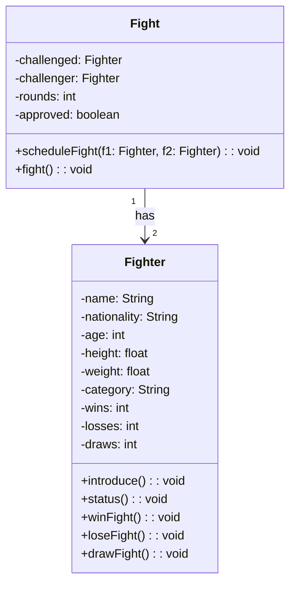

# 📚 Lesson 6 – Class Relationships: Aggregation

## 🎯 Lesson Objectives

* Understand the concept of **aggregation** between classes
* Implement class relationships in the **Ultra Emoji Combat** project
* Create the **Fight** class that relates to the **Fighter** class
* Apply **multiplicity** in class relationships
* Implement combat logic between objects

---

## 🧠 Review: Where We Are

In the previous lesson, we created the `Fighter` class with:

### 📋 Attributes:

* Name, nationality, age, height, weight
* Category (automatically calculated)
* Wins, losses, draws

### 🛠️ Methods:

* `introduce()` and `status()`
* `winFight()`, `loseFight()`, `drawFight()`
* Encapsulated getters and setters

Now it’s time to create **relationships** between classes!

---

## 🔗 What Is Aggregation?

**Aggregation** is a type of relationship where:

* One class **has** objects of another class
* The objects can exist independently
* It represents a **whole–part** relationship

In our case:

* A **Fight** *has* **Fighters**
* Fighters exist without a fight
* A fight depends on fighters to exist

---

## 🥊 Class Diagram – Relationship



### 📝 Notation:

* **White diamond**: Aggregation
* **Multiplicity**: “1” to “2” (one fight has two fighters)

---

## 🏗️ Fight Class – Structure

### 📦 Attributes:

1. **challenged** (type: `Fighter`)
2. **challenger** (type: `Fighter`)
3. **rounds** (type: `int`)
4. **approved** (type: `boolean`)

### 🎯 Methods:

1. **scheduleFight()** – Validates and sets up the fight
2. **fight()** – Executes the combat
3. Getters and setters

---

## ⚖️ Rules to Schedule a Fight

For a fight to be **approved**:

1. ✅ Fighters must be **different**
2. ✅ Fighters must be in the **same category**
3. ❌ The same fighter cannot fight themselves
4. ❌ Different categories invalidate the fight

---

## 🎲 Logic of the `fight()` Method

### Flow:

1. Check if the fight is **approved**
2. **Introduce** both fighters
3. **Generate a random result**:

    * 0 → Draw
    * 1 → Challenged fighter wins
    * 2 → Challenger wins
4. **Update fighters’ records**

### Algorithm:

```
IF fight is approved THEN
    challenged.introduce()
    challenger.introduce()
    
    result = random(0, 2)
    
    SWITCH result
        CASE 0:  // Draw
            challenged.drawFight()
            challenger.drawFight()
        CASE 1:  // Challenged wins
            challenged.winFight()
            challenger.loseFight()
        CASE 2:  // Challenger wins
            challenger.winFight()
            challenged.loseFight()
    END SWITCH
ELSE
    SHOW "Fight cannot happen"
END IF
```

---

## 🔄 Multiplicity in the Relationship

### Concept:

* A **fighter** can participate in **multiple** fights
* A **fight** has **exactly two** fighters

### Representation:

* Fighter 1 → N Fights
* Fight 1 → 2 Fighters

This means we can:

* Create multiple fights with the same fighters
* Maintain each fighter’s history
* Reuse fighter objects safely

---

## 🧪 Test Scenarios

### Scenario 1: Valid Fight

```
Fighter A (Lightweight) vs Fighter B (Lightweight)
→ Fight APPROVED
```

### Scenario 2: Invalid Fight

```
Fighter A (Lightweight) vs Fighter B (Heavyweight)
→ Fight DENIED
```

### Scenario 3: Same Fighter

```
Fighter A vs Fighter A
→ Fight DENIED
```

---

## 💡 Best Practices in the Implementation

### 1. **Encapsulation Preserved**

* Private attributes in both classes
* Public methods control access
* Business logic protected

### 2. **High Cohesion**

* Each class has a single responsibility
* `Fighter` manages fighter data
* `Fight` manages combat rules

### 3. **Controlled Coupling**

* `Fight` knows `Fighter`
* `Fighter` does NOT know `Fight`
* One-way relationship

---

## 🚀 Possible Enhancements

You can expand this project:

### 1. **Ranking System**

* Points based on wins
* Category-based rankings
* Opponent history

### 2. **Advanced Rules**

* Weight influencing results
* Experience affecting chances
* Injuries or special conditions

### 3. **Visual Interface**

* Graphical fighter representation
* Fight animations
* Tournament system

### 4. **Data Persistence**

* Save fighters to files
* Full fight history
* Advanced statistics

---

## 📚 Lesson Summary

### ✅ What we learned:

1. **Aggregation** as a “has-a” relationship
2. **Multiplicity** between classes
3. **Practical implementation** of relationships
4. **Combat logic** between objects

### 🔧 Skills developed:

* Creating related classes
* Implementing business rules
* Using objects as attributes
* Controlling flow between multiple objects

### 🧭 Next Steps:

This is the **foundation** for:

* Composition (stronger relationship)
* Inheritance (“is-a” relationship)
* Polymorphism (multiple behaviors)

---

## 💪 Practical Challenge

**Improve the combat system:**

1. Add **experience level** to fighters
2. Implement a **luck factor** based on experience
3. Create **different win types** (Knockout, Decision)
4. Add a **health system** during fights

**Example improvement:**

```java
// Instead of a fully random result:
int chance = (f1.getExperience() * 10) + random.nextInt(50);
// Fighter with more experience has an advantage
```

Access the full exercise at:
[GitHub](https://github.com/ThayronyVonHeld/Introduction-JAVA/tree/main/src-projects/Module02/Exercicies/Lesson7)

---

> 💡 **Tip:** **Don’t skip steps!**
> Each lesson builds on the previous one.
> Practice, test, modify, and learn by doing! 🚀
