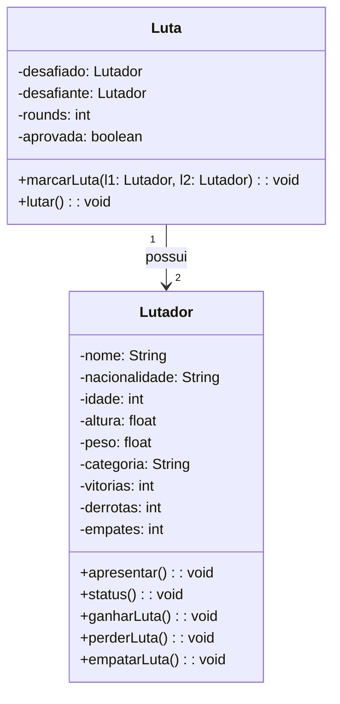

# 📚 Aula 6 – Relacionamento entre Classes: Agregação

## 🎯 Objetivos da Aula

* Compreender o conceito de **agregação** entre classes
* Implementar relacionamento entre classes no projeto Ultra Emoji Combat
* Criar a classe **Luta** que se relaciona com a classe **Lutador**
* Aplicar **multiplicidade** em relacionamentos
* Implementar lógica de combate entre objetos

---

## 🧠 Revisão: Onde Estamos

Na aula anterior, criamos a classe `Lutador` com:

### 📋 Atributos:
* Nome, nacionalidade, idade, altura, peso
* Categoria (calculada automaticamente)
* Vitórias, derrotas, empates

### 🛠️ Métodos:
* `apresentar()` e `status()`
* `ganharLuta()`, `perderLuta()`, `empatarLuta()`
* Getters e setters encapsulados

Agora vamos criar **relacionamentos** entre classes!

---

## 🔗 O que é Agregação?

**Agregação** é um tipo de relacionamento onde:
* Uma classe "tem" objetos de outra classe
* Os objetos podem existir independentemente
* Representa um relacionamento "todo-parte"

No nosso caso:
* Uma **Luta** "tem" **Lutadores**
* Lutadores existem sem luta
* Luta depende de lutadores para existir

---

## 🥊 Diagrama de Classes - Relacionamento



### 📝 Notações:
* **Losango branco**: Agregação
* **Multiplicidade**: "1" para "2" (uma luta tem dois lutadores)

---

## 🏗️ Classe Luta - Estrutura

### 📦 Atributos:
1. **desafiado** (tipo: `Lutador`)
2. **desafiante** (tipo: `Lutador`)
3. **rounds** (tipo: `int`)
4. **aprovada** (tipo: `boolean`)

### 🎯 Métodos:
1. **marcarLuta()** - Valida e configura a luta
2. **lutar()** - Executa o combate
3. Getters e setters

---

## ⚖️ Regras para Marcar uma Luta

Para uma luta ser **aprovada**:

1. ✅ Lutadores devem ser **diferentes**
2. ✅ Deve ser da **mesma categoria**
3. ❌ Não pode ser o mesmo lutador
4. ❌ Categorias diferentes impedem a luta

---

## 🎲 Lógica do Método `lutar()`

### Fluxo:
1. Verifica se a luta está **aprovada**
2. **Apresenta** os lutadores
3. **Gera resultado aleatório**:
    * 0 → Empate
    * 1 → Vitória do desafiado
    * 2 → Vitória do desafiante
4. **Atualiza cartel** dos lutadores

### Algoritmo:
```
SE luta aprovada ENTÃO
    desafiado.apresentar()
    desafiante.apresentar()
    
    resultado = aleatório(0, 2)
    
    SWITCH resultado
        CASO 0:  // Empate
            desafiado.empatarLuta()
            desafiante.empatarLuta()
        CASO 1:  // Desafiado vence
            desafiado.ganharLuta()
            desafiante.perderLuta()
        CASO 2:  // Desafiante vence
            desafiante.ganharLuta()
            desafiado.perderLuta()
    FIM SWITCH
SENÃO
    MOSTRAR "Luta não pode acontecer"
FIM SE
```

---

## 🔄 Multiplicidade no Relacionamento

### Conceito:
* Um **lutador** pode participar de **várias** lutas
* Uma **luta** tem **exatamente dois** lutadores

### Representação:
* Lutador 1 → N Lutas
* Luta 1 → 2 Lutadores

Isso significa que podemos:
* Criar múltiplas lutas com os mesmos lutadores
* Manter o histórico de cada lutador
* Reutilizar objetos de lutador

---

## 🧪 Cenários de Teste

### Cenário 1: Luta Válida
```
Lutador A (Leve) vs Lutador B (Leve)
→ Luta APROVADA
```

### Cenário 2: Luta Inválida
```
Lutador A (Leve) vs Lutador B (Pesado)
→ Luta NEGADA
```

### Cenário 3: Mesmo Lutador
```
Lutador A vs Lutador A
→ Luta NEGADA
```

---

## 💡 Boas Práticas na Implementação

### 1. **Encapsulamento Mantido**
* Atributos privados em ambas classes
* Métodos públicos controlam o acesso
* Lógica de negócio protegida

### 2. **Coesão Alta**
* Cada classe tem responsabilidade única
* `Lutador` gerencia dados do lutador
* `Luta` gerencia regras do combate

### 3. **Acoplamento Controlado**
* `Luta` conhece `Lutador`
* `Lutador` NÃO conhece `Luta`
* Direção única do relacionamento

---

## 🚀 Aprimoramentos Possíveis

Você pode expandir este projeto:

### 1. **Sistema de Ranking**
* Pontuação baseada em vitórias
* Posicionamento por categoria
* Histórico de adversários

### 2. **Regras Avançadas**
* Peso como fator no resultado
* Experiência influenciando chance
* Lesões ou condições especiais

### 3. **Interface Visual**
* Representação gráfica dos lutadores
* Animações de golpes
* Sistema de torneios

### 4. **Persistência de Dados**
* Salvar lutadores em arquivo
* Histórico completo de lutas
* Estatísticas avançadas

---

## 📚 Resumo da Aula

### ✅ O que aprendemos:
1. **Agregação** como relacionamento "tem um"
2. **Multiplicidade** entre classes
3. **Implementação prática** de relacionamentos
4. **Lógica de combate** entre objetos

### 🔧 Habilidades desenvolvidas:
* Criar classes que se relacionam
* Implementar regras de negócio
* Trabalhar com objetos como atributos
* Controlar fluxo entre múltiplos objetos

### 🧭 Próximos Passos:
Este é o **fundamento** para:
* Composição (relacionamento mais forte)
* Herança (relacionamento "é um")
* Polimorfismo (múltiplas formas)

---

## 💪 Desafio Prático

**Melhore o sistema de combate:**
1. Adicione **nível de experiência** aos lutadores
2. Implemente **fator sorte** baseado em experiência
3. Crie **diferentes tipos de vitória** (Nocaute, Decisão)
4. Adicione **sistema de saúde** durante a luta

**Exemplo de melhoria:**
```java
// Em vez de resultado totalmente aleatório:
int chance = (l1.getExperiencia() * 10) + random.nextInt(50);
// Lutador com mais experiência tem vantagem
```
Acesse o exercício completo em: [GitHub](https://github.com/ThayronyVonHeld/Introduction-JAVA/tree/main/src-projects/Module02/Exercicies/Lesson7)

---

> 💡**Dica**: **Não pule etapas!** Cada aula constrói sobre a anterior.
Pratique, teste, modifique e aprenda fazendo! 🚀