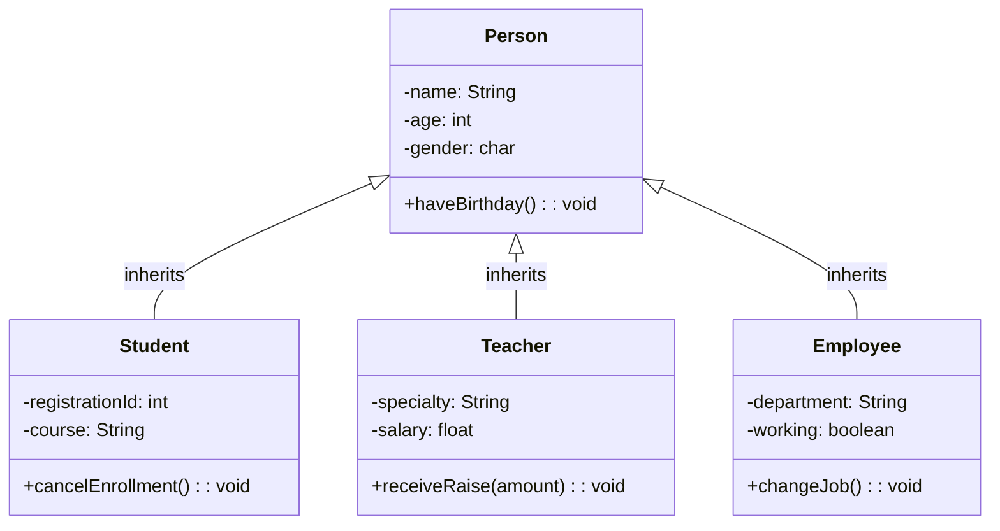

# 📚 Lesson 8 – Inheritance in OOP

## 🎯 Lesson Objectives

* Understand the concept of **inheritance** in OOP
* Understand the **“is a”** relationship between classes
* Apply inheritance in Java using the `extends` keyword
* Identify what **can and cannot** be accessed through inheritance
* Practice **abstraction** and **code reuse**

---

## 🧠 What Is Inheritance?

Inheritance is presented as the **second pillar of Object-Oriented Programming**, coming right after encapsulation and before polymorphism.

Its main goal is to **allow a new class to be based on an existing class**, reusing attributes and behaviors and avoiding duplicated code.

> Note: Inheritance and Encapsulation are independent pillars; however, **combining both** leads to more organized, secure, and reusable software.

---

### 👨‍👩‍👧 Analogy and Hierarchy

A classic analogy is the relationship between a **mother and a daughter**:

* The daughter inherits physical traits (eyes, mouth)
* She also inherits behaviors (way of speaking)
* But can develop her own unique characteristics

In OOP:

* The **parent class** is called the **superclass**
* The **child class** is called the **subclass**

---

### 🧩 Abstraction and Generalization

In a practical school example, we have the classes:

* **Student**
* **Teacher**
* **Employee**

All of them share common characteristics:

* `name`
* `age`
* `gender`

And a shared method:

* `haveBirthday()`

To avoid code repetition, these common elements are **generalized** into a more abstract class called **Person**.

---

### 🔗 The “Is a” Relationship

When we declare that:

* `Student` inherits from `Person`
* `Teacher` inherits from `Person`
* `Employee` inherits from `Person`

We are saying that:

> A Student **is a** Person
> A Teacher **is a** Person
> An Employee **is a** Person

This means that every subclass **automatically inherits everything the superclass has**.

Example:

* A `Student` has `registrationId` and `course`
* But also inherits `name` and `age` from the `Person` class

---

## 🏗️ Class Diagram



### 📝 Notation:

* **Arrow with empty triangle**: Inheritance
* **Direction**: From subclass to superclass

---

## 💻 Practice and Java Implementation

👉 Full implementation available at:
🔗 [https://github.com/ThayronyVonHeld/Introduction-JAVA/tree/main/src-projects/Module02/Exercicies/Lesson8](https://github.com/ThayronyVonHeld/Introduction-JAVA/tree/main/src-projects/Module02/Exercicies/Lesson8)

---

### 🧩 The `extends` Keyword

In Java, inheritance is implemented using the **`extends`** keyword:

```java
public class Student extends Person {
}
```

This declaration means that:

> The `Student` class inherits all attributes and methods from the `Person` class.

---

### 🏗️ Class Structure

#### 👤 Person (Superclass)

* Private attributes:

    * `name`
    * `age`
    * `gender`
* Method:

    * `haveBirthday()` → increments age by 1

---

#### 🎓 Student (Subclass)

* Inherits from `Person`
* Specific attributes:

    * `registrationId`
    * `course`
* Specific method:

    * `cancelEnrollment()`

---

#### 👨‍🏫 Teacher (Subclass)

* Inherits from `Person`
* Specific attributes:

    * `specialty`
    * `salary`
* Specific method:

    * `receiveRaise()`

---

#### 🧑‍💼 Employee (Subclass)

* Inherits from `Person`
* Specific attributes:

    * `department`
    * `working`
* Specific method:

    * `changeJob()`

---

## 🧪 Instantiation and Tests

In the main program, four objects are created:

* `p1` → Person
* `p2` → Student
* `p3` → Teacher
* `p4` → Employee

---

### ✅ What Works

All objects can access:

* Methods defined in `Person`
* Example: `setName()`, `getAge()`, `haveBirthday()`

This happens because **all subclasses inherited these methods from the superclass**.

---

### ❌ What Does NOT Work

Common beginner mistakes:

* An object of type `Person` **cannot** call `receiveRaise()`
  → This method belongs only to the `Teacher` class

* An object of type `Employee` **cannot** call `cancelEnrollment()`
  → This method belongs only to the `Student` class

➡️ The superclass **does not know the specific behaviors** of its subclasses.

---

## 🌳 Inheritance Metaphor

Inheritance can be understood as a **family tree**:

* You inherit a last name and biological traits
* But you have your own skills that your parents may not have

Likewise:

> A subclass inherits the entire structure of the superclass,
> but adds **its own attributes and behaviors**, making it unique.

---

## 🛡️ Encapsulation + Inheritance

### Best Practices:

1. **Private attributes** in the superclass
2. **Protected getters/setters** for controlled access
3. **Proper constructors** using `super()`
4. **Specific methods** only where they make sense

---

> 💡**Tip**: Use inheritance only when there is a clear **“is a”** relationship between classes.
> Avoid inheriting just to reuse code; prefer inheritance to represent real specialization and hierarchy.
