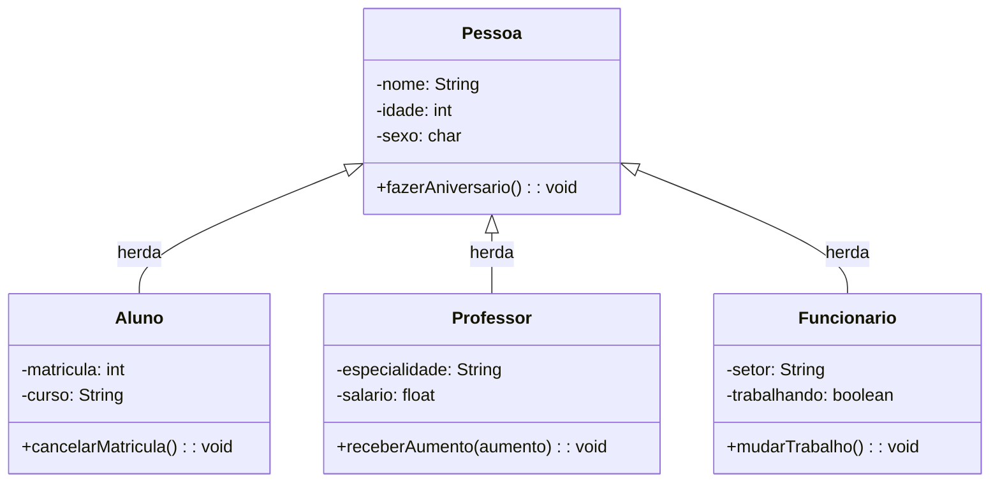

# 📚 Aula 8 – Herança na POO

## 🎯 Objetivos da Aula

* Compreender o conceito de **herança** na POO
* Entender o relacionamento **“é um”** entre classes
* Aplicar herança em Java utilizando a palavra-chave `extends`
* Identificar o que **pode e o que não pode** ser acessado através da herança
* Praticar **abstração** e **reaproveitamento de código**

---

## 🧠 O que é Herança?

A herança é apresentada como o **segundo pilar da Programação Orientada a Objetos**, vindo logo após o encapsulamento e antes do polimorfismo.

Seu principal objetivo é **permitir que uma nova classe seja baseada em uma classe já existente**, reaproveitando atributos e comportamentos, evitando a criação de código repetido.

> Observação: Herança e Encapsulamento são pilares independentes, entretanto a **combinação dos dois** resulta em um software mais organizado, seguro e reutilizável.

---
### 👨‍👩‍👧 Analogia e Hierarquia

Uma analogia clássica é a relação entre **mãe e filha**:

* A filha herda características físicas (olhos, boca)
* Também herda comportamentos (forma de falar)
* Mas pode desenvolver suas próprias características únicas

Na POO:

* A **classe mãe** é chamada de **superclasse**
* A **classe filha** é chamada de **subclasse**

---
### 🧩 Abstração e Generalização

Em um exemplo prático de um colégio, temos as classes:

* **Aluno**
* **Professor**
* **Funcionário**

Todas possuem características em comum:

* `nome`
* `idade`
* `sexo`

E um método compartilhado:

* `fazerAniversario()`

Para evitar repetição de código, esses elementos comuns são **generalizados** em uma classe mais abstrata chamada **Pessoa**.

---

### 🔗 Relacionamento “É um”

Quando declaramos que:

* `Aluno` herda de `Pessoa`
* `Professor` herda de `Pessoa`
* `Funcionário` herda de `Pessoa`

Estamos dizendo que:

> Um Aluno **é uma** Pessoa
> Um Professor **é uma** Pessoa
> Um Funcionário **é uma** Pessoa

Isso significa que toda subclasse **herda automaticamente tudo o que a superclasse possui**.

Exemplo:

* Um `Aluno` possui `matricula` e `curso`
* Mas também herda `nome` e `idade` da classe `Pessoa`

---

## 🏗️ Diagrama de Classes



### 📝 Notações:
* **Seta com triângulo vazio**: Herança
* **Direção**: Da subclasse para a superclasse

---

## 💻 Prática e Implementação em Java

👉 Implementação completa disponível em:
🔗 [https://github.com/ThayronyVonHeld/Introduction-JAVA/tree/main/src-projects/Module02/Exercicies/Lesson8](https://github.com/ThayronyVonHeld/Introduction-JAVA/tree/main/src-projects/Module02/Exercicies/Lesson8)

---
### 🧩 Palavra-chave `extends`

Em Java, a herança é implementada utilizando a palavra-chave **`extends`**:

```java
public class Aluno extends Pessoa {
}
```

Essa declaração significa que:

> A classe `Aluno` herda todos os atributos e métodos da classe `Pessoa`.

---
### 🏗️ Estrutura das Classes

#### 👤 Pessoa (Superclasse)

* Atributos privados:

  * `nome`
  * `idade`
  * `sexo`
* Método:

  * `fazerAniversario()` → incrementa a idade em 1

---

#### 🎓 Aluno (Subclasse)

* Herda de `Pessoa`
* Atributos específicos:

  * `matricula`
  * `curso`
* Método específico:

  * `cancelarMatricula()`

---

#### 👨‍🏫 Professor (Subclasse)

* Herda de `Pessoa`
* Atributos específicos:

  * `especialidade`
  * `salario`
* Método específico:

  * `receberAumento()`

---

#### 🧑‍💼 Funcionário (Subclasse)

* Herda de `Pessoa`
* Atributos específicos:

  * `setor`
  * `trabalhando`
* Método específico:

  * `mudarTrabalho()`

---

## 🧪 Instanciação e Testes

No programa principal, são criados quatro objetos:

* `p1` → Pessoa
* `p2` → Aluno
* `p3` → Professor
* `p4` → Funcionário

---

### ✅ O que Funciona

Todos os objetos podem acessar:

* Métodos definidos em `Pessoa`
* Exemplo: `setNome()`, `getIdade()`, `fazerAniversario()`

Isso ocorre porque **todas as subclasses herdaram esses métodos da superclasse**.

---

### ❌ O que NÃO Funciona

Erros comuns de iniciantes:

* Um objeto do tipo `Pessoa` **não pode** chamar `receberAumento()`
  → Esse método pertence apenas à classe `Professor`

* Um objeto do tipo `Funcionário` **não pode** chamar `cancelarMatricula()`
  → Esse método pertence apenas à classe `Aluno`

➡️ A superclasse **não conhece os comportamentos específicos** das subclasses.

---

## 🌳 Metáfora da Herança

A herança pode ser entendida como uma **árvore genealógica**:

* Você herda sobrenome e características biológicas
* Mas possui habilidades próprias que seus pais não têm

Da mesma forma:

> Uma subclasse herda toda a estrutura da superclasse,
> mas adiciona **atributos e comportamentos próprios**, tornando-se única.

---

## 🛡️ Encapsulamento + Herança

### Boas Práticas:
1. **Atributos privados** na superclasse
2. **Getters/setters protegidos** para acesso controlado
3. **Construtores adequados** com `super()`
4. **Métodos específicos** apenas onde fazem sentido

---

>💡**Dica**: Use herança apenas quando existir claramente um relacionamento “é um” entre as classes.
Evite herdar só para reutilizar código; prefira herança para representar especialização e hierarquia real.