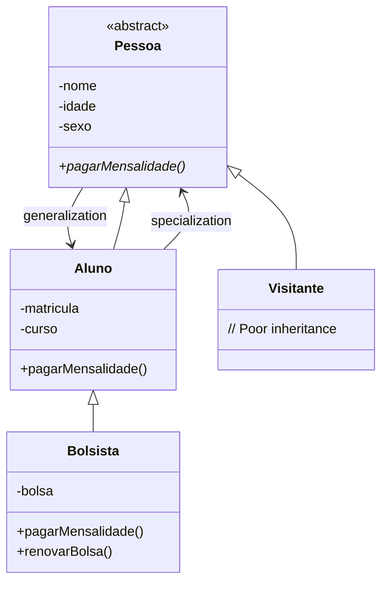

# 📚 Lesson 9 – Advanced Inheritance and Modifiers in Java

## 🎯 Lesson Objectives

* Understand **navigation through inheritance trees**
* Learn the **types of inheritance**
* Learn how to use **abstract classes and methods**
* Use the **`abstract`** and **`final`** modifiers
* Implement **method overriding** with `@Override`

---

## 🧠 Continuing Inheritance

In this lesson, we continue exploring **inheritance**, moving to an intermediate level of Object-Oriented Programming.
The focus is no longer just on inheriting, but on **understanding the hierarchy structure**, its rules, and its limitations.

---

## 🌳 Navigating the Inheritance Tree

A class hierarchy can be viewed as a **tree**:

### 🔝 Root

* A class that **has no superclass**
* Located at the top of the hierarchy
* Example: `Pessoa` (Person)

### 🍃 Leaf

* A class that **has no subclasses**
* Located at the bottom of the tree
* Example: `Bolsista` (ScholarshipStudent)

### 👵 Ancestors

* Classes above in the hierarchy
* Include parents, grandparents, etc.

### 👶 Descendants

* Classes below in the hierarchy
* Include children, grandchildren, etc.

### 📊 Hierarchy Terminology



---

## 🔄 Specialization vs. Generalization

* **Specialization**

    * Path **top-down**
    * Makes the class **more specific**
    * Example: `Pessoa → Aluno → Bolsista`

* **Generalization**

    * Path **bottom-up**
    * Makes the class **more generic**
    * Example: `Bolsista → Aluno → Pessoa`

---

## 🧬 Types of Inheritance

### 1️⃣ Implementation Inheritance (Poor Inheritance)

```java
public class Visitante extends Pessoa {
    // No new attributes or methods
    // Inherits EVERYTHING from Pessoa without adding anything
}
```

* The subclass **adds nothing new**
* Only reuses attributes and methods
* Used when the class only needs to “exist” in the system

---

### 2️⃣ Inheritance for Difference

```java
public class Aluno extends Pessoa {
    private int matricula;
    private String curso;
    
    public void pagarMensalidade() {
        System.out.println("Paying student's tuition");
    }
}
```

* The subclass **specializes** the superclass
* Adds **new attributes and behaviors**
* This is the most common and most useful type

---

## 🧩 Abstract Classes and Methods

### 🧱 Abstract Class

* Declared using the **`abstract`** keyword
* **Cannot be instantiated**
* Serves only as a **base model**

📌 Purpose: ensure a common structure for subclasses.

```java
public abstract class Pessoa {
}
```

### ❌ **COMMON ERROR**

```java
Pessoa p = new Pessoa();  // COMPILATION ERROR!
// Pessoa is abstract; cannot be instantiated
```

---

### 🧠 Abstract Method

* Declared but **not implemented** in the superclass
* **Must be implemented** by subclasses
* Forces specific behavior in each child class

📌 The superclass defines *what must exist*, not *how it works*.

```java
public abstract class Pessoa {
    // ABSTRACT METHOD - no implementation
    public abstract void pagarMensalidade();
}
```

---

## 🛑 `final` Classes and Methods

### 🔒 Final Class

* Cannot be inherited
* Is necessarily a **leaf class**
* Used when specialization makes no sense

```java
public final class Aluno extends Pessoa {
    // This class CANNOT have subclasses
    // Any attempt to "extends Aluno" causes an error
}
```

---

### 🔐 Final Method

* Cannot be overridden
* Behavior is inherited **exactly as is**
* Ensures consistency in important rules

```java
public class Pessoa {
    // Method that CANNOT be overridden
    public final void metodoQueNaoMuda() {
        System.out.println("Fixed implementation");
    }
}
```

---

## 🔄 Overriding with `@Override`

### **Method Overriding**

```java
public class Aluno extends Pessoa {
    @Override
    public void pagarMensalidade() {
        System.out.println("Paying STUDENT tuition");
    }
}

public class Bolsista extends Aluno {
    @Override
    public void pagarMensalidade() {
        System.out.println("Scholarship student PAYS WITH DISCOUNT!");
    }
}
```

### ✅ **Benefits of the `@Override` annotation**

1. **Safety**: the compiler checks if the method exists in the superclass
2. **Readability**: clearly indicates method overriding
3. **Maintainability**: makes overridden methods easier to find

### ❌ **ERROR with `@Override`**

```java
@Override
public void pagarMensalida() {  // TYPO ERROR!
    // Method does not exist in the superclass
    // Compiler error: method does not override
}
```

---

## 💻 Java Implementation (Applied Concepts)

👉 Full implementation available at:
🔗 [https://github.com/ThayronyVonHeld/Introduction-JAVA/tree/main/src-projects/Module02/Exercicies/Lesson9](https://github.com/ThayronyVonHeld/Introduction-JAVA/tree/main/src-projects/Module02/Exercicies/Lesson9)

---

### 👤 Abstract Class `Pessoa`

* Defined as `abstract`
* Contains common attributes such as:

    * name
    * age
    * gender
* Cannot generate objects directly

📌 Instantiation attempt causes a compilation error.

---

### 🛡️ Using the `protected` Modifier

* Allows direct access by subclasses
* Avoids public exposure of attributes
* Balances encapsulation and inheritance

---

## 🧩 Class Hierarchy

### 🚶 Visitante (Visitor)

* Implementation inheritance
* Adds no new behavior
* Only reuses the `Pessoa` structure

---

### 🎓 Aluno (Student)

* Inheritance for difference
* Adds:

    * registration number
    * course
* Has its own behavior

---

### 🎖️ Bolsista (Scholarship Student)

* Specialization of `Aluno`
* Inherits everything from `Aluno` and `Pessoa`
* Can **override methods**

---

## 💡 Best Practices

### ✅ **DO**

1. Use `abstract` for classes that are only models
2. Always use `@Override` when overriding methods
3. Use `protected` for attributes shared in the hierarchy
4. Use `final` for methods that must not change

### ❌ **DON’T**

1. Don’t force inheritance where there is no “is-a” relationship
2. Don’t use `protected` everywhere — keep encapsulation
3. Don’t make classes `final` unnecessarily
4. Don’t ignore compiler errors involving `@Override`

---

## 🚀 Implementation Challenge

**Extend the education system:**

1. **Create the `Professor` class** (inherits from `Pessoa`):

    * Attributes: `specialty`, `salary`
    * Abstract method: `receiveRaise()`
    * Final method: `getSalary()`

2. **Create `ResearchProfessor`** (inherits from `Professor`):

    * Attributes: `researchArea`, `productivityGrant`
    * Override `receiveRaise()` to include the grant

3. **Create a `Course` system**:

    * Relate it to `Aluno` (aggregation)
    * Each course has multiple students
    * Calculate the average age of students

4. **Implement `Validation`**:

    * Static method to validate CPF
    * Final method to validate minimum age

---

## 🍰 Final Metaphor: Cake Recipe

Think of inheritance as a **base recipe**:

* The base recipe (abstract class) **is not consumed**
* It is used to create variations:

    * Chocolate cake
    * Orange cake

Each cake:

* Inherits the base
* Adds its own flavor
* Maintains a common structure

---

> 💡 **Final Tip:**
> Use abstraction to define contracts, inheritance to specialize behavior, and `final` to protect important system rules.
