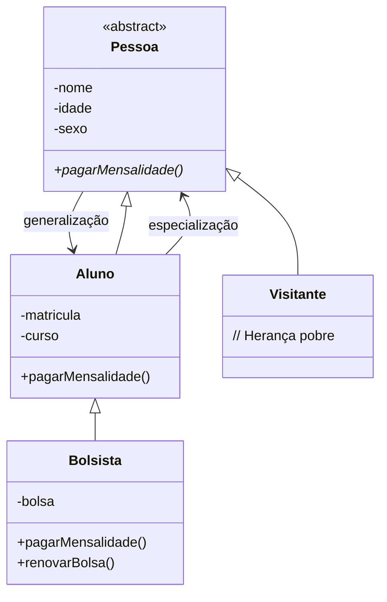

# 📚 Aula 9 – Herança Avançada e Modificadores em Java

## 🎯 Objetivos da Aula

* Compreender a **navegação em árvores de herança**
* Entender os **tipos de herança**
*  Aprender o uso de **classes e métodos abstratos**
* Utilizar modificadores **`abstract`** e **`final`**
* Implementar **sobreposição de métodos** com `@Override`

---

## 🧠 Continuação da Herança

Nesta aula, damos continuidade ao conceito de **herança**, avançando para um nível intermediário da Programação Orientada a Objetos.
O foco agora não é apenas herdar, mas **entender a estrutura da hierarquia**, suas regras e limitações.

---
## 🌳 Navegação na Árvore de Herança

Uma hierarquia de classes pode ser vista como uma **árvore**:

### 🔝 Raiz

* Classe que **não possui superclasse**
* Está no topo da hierarquia
* Exemplo: `Pessoa`

### 🍃 Folha

* Classe que **não possui subclasses**
* Está no final da árvore
* Exemplo: `Bolsista`

### 👵 Ancestrais

* Classes acima na hierarquia
* Incluem pais, avós, etc.

### 👶 Descendentes

* Classes abaixo na hierarquia
* Incluem filhos, netos, etc.

### 📊 Terminologia da Hierarquia:



---
### 🔄 Especialização x Generalização

* **Especialização**

  * Caminho **de cima para baixo**
  * Torna a classe **mais específica**
  * Exemplo: `Pessoa → Aluno → Bolsista`

* **Generalização**

  * Caminho **de baixo para cima**
  * Torna a classe **mais genérica**
  * Exemplo: `Bolsista → Aluno → Pessoa`

---

## 🧬 Tipos de Herança

### 1️⃣ Herança de Implementação (Herança Pobre)
```java
public class Visitante extends Pessoa {
    // Nenhum atributo ou método novo
    // Herda TUDO de Pessoa sem adicionar nada
}
```

* A subclasse **não adiciona nada novo**
* Apenas reutiliza atributos e métodos
* Usada quando a classe só precisa “existir” no sistema


### 2️⃣ Herança para Diferença

```java
public class Aluno extends Pessoa {
    private int matricula;
    private String curso;
    
    public void pagarMensalidade() {
        System.out.println("Pagando mensalidade do aluno");
    }
}
```

* A subclasse **especializa** a superclasse
* Adiciona **novos atributos e comportamentos**
* É o tipo mais comum e mais útil

---

## 🧩 Classes e Métodos Abstratos

### 🧱 Classe Abstrata

* Declarada com a palavra-chave **`abstract`**
* **Não pode ser instanciada**
* Serve apenas como **modelo base**

📌 Função: garantir estrutura comum para as subclasses.

```java
public abstract class Pessoa {
}
```
### ❌ **ERRO COMUM**:
```java
Pessoa p = new Pessoa();  // ERRO DE COMPILAÇÃO!
// Pessoa is abstract; cannot be instantiated
```
---

### 🧠 Método Abstrato

* Declarado, mas **não implementado** na superclasse
* **Obrigatoriamente implementado** nas subclasses
* Força comportamento específico em cada filho

📌 A superclasse define *o que deve existir*, não *como funciona*.

```java
public abstract class Pessoa {
    // MÉTODO ABSTRATO - sem implementação
    public abstract void pagarMensalidade();
}
```
---

## 🛑 Classes e Métodos `final`

### 🔒 Classe Final

* Não pode ser herdada
* É obrigatoriamente uma **classe folha**
* Usada quando não faz sentido permitir especializações

```java
public final class Aluno extends Pessoa {
    // Esta classe NÃO pode ter subclasses
    // Qualquer tentativa de "extends Aluno" gera erro
}
```
---

### 🔐 Método Final

* Não pode ser sobrescrito
* O comportamento é herdado **exatamente como está**
* Garante consistência em regras importantes

```java
public class Pessoa {
    // Método que NÃO pode ser sobrescrito
    public final void metodoQueNaoMuda() {
        System.out.println("Implementação fixa");
    }
}
```
---
## 🔄 Sobrescrita com `@Override`

### **Sobrescrita de Métodos**:
```java
public class Aluno extends Pessoa {
    @Override
    public void pagarMensalidade() {
        System.out.println("Pagando mensalidade do ALUNO");
    }
}

public class Bolsista extends Aluno {
    @Override
    public void pagarMensalidade() {
        System.out.println("Bolsista PAGA COM DESCONTO!");
    }
}
```

### ✅ **Benefícios da anotação `@Override`**:
1. **Segurança**: Compilador verifica se método existe na superclasse
2. **Legibilidade**: Indica claramente que é sobrescrita
3. **Manutenção**: Facilita encontrar métodos sobrescritos

### ❌ **ERRO COM `@Override`**:
```java
@Override
public void pagarMensalida() {  // ERRO DE DIGITAÇÃO!
    // Método não existe na superclasse
    // Compilador acusa erro: method does not override
}
```

---

## 💻 Implementação em Java (Conceitos Aplicados)

👉 Implementação completa disponível em:
🔗 [https://github.com/ThayronyVonHeld/Introduction-JAVA/tree/main/src-projects/Module02/Exercicies/Lesson9](https://github.com/ThayronyVonHeld/Introduction-JAVA/tree/main/src-projects/Module02/Exercicies/Lesson8)

### 👤 Classe Abstrata `Pessoa`

* Definida como `abstract`
* Contém atributos comuns como:

  * nome
  * idade
  * sexo
* Não pode gerar objetos diretamente

📌 Tentativa de instância gera erro de compilação.

---

### 🛡️ Uso do Modificador `protected`

* Permite acesso direto às subclasses
* Evita exposição pública dos atributos
* Equilíbrio entre encapsulamento e herança

---

## 🧩 Hierarquia de Classes

### 🚶 Visitante

* Herança de implementação
* Não adiciona novos comportamentos
* Apenas reutiliza a estrutura de `Pessoa`

---

### 🎓 Aluno

* Herança para diferença
* Adiciona:

  * matrícula
  * curso
* Possui comportamento próprio

---

### 🎖️ Bolsista

* Especialização de `Aluno`
* Herda tudo de `Aluno` e `Pessoa`
* Pode **sobrescrever métodos**

---

## 💡 Boas Práticas

### ✅ **FAÇA**:
1. Use `abstract` para classes que são apenas modelos
2. Use `@Override` sempre que sobrescrever métodos
3. Use `protected` para atributos compartilhados na hierarquia
4. Use `final` para métodos que não devem mudar

### ❌ **NÃO FAÇA**:
1. Não force herança onde não há relação "é um"
2. Não use `protected` para tudo - mantenha encapsulamento
3. Não torne classes `final` sem necessidade
4. Não ignore erros do compilador com `@Override`

---

## 🚀 Desafio de Implementação

**Amplie o sistema educacional:**

1. **Crie a classe `Professor`** (herda de `Pessoa`):
  * Atributos: `especialidade`, `salario`
  * Método abstrato: `receberAumento()`
  * Método final: `getSalario()`

2. **Crie `ProfessorPesquisador`** (herda de `Professor`):
  * Atributos: `areaPesquisa`, `bolsaProdutividade`
  * Sobrescreva `receberAumento()` para incluir bolsa

3. **Crie sistema de `Curso`**:
  * Relacione com `Aluno` (agregação)
  * Cada curso tem vários alunos
  * Calcule média das idades dos alunos

4. **Implemente `Validacao`**:
  * Método estático para validar CPF
  * Método final para validar idade mínima

---

## 🍰 Metáfora Final: Receita de Bolo

Pense na herança como uma **receita base**:

* A receita base (classe abstrata) **não é consumida**
* Ela serve para criar variações:

  * Bolo de chocolate
  * Bolo de laranja

Cada bolo:

* Herda a base
* Adiciona seu próprio sabor
* Mantém uma estrutura comum

---
> 💡 **Dica final:**
> Use abstração para definir contratos, herança para especializar comportamentos e `final` para proteger regras importantes do sistema.
