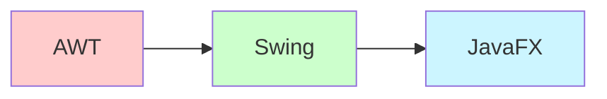
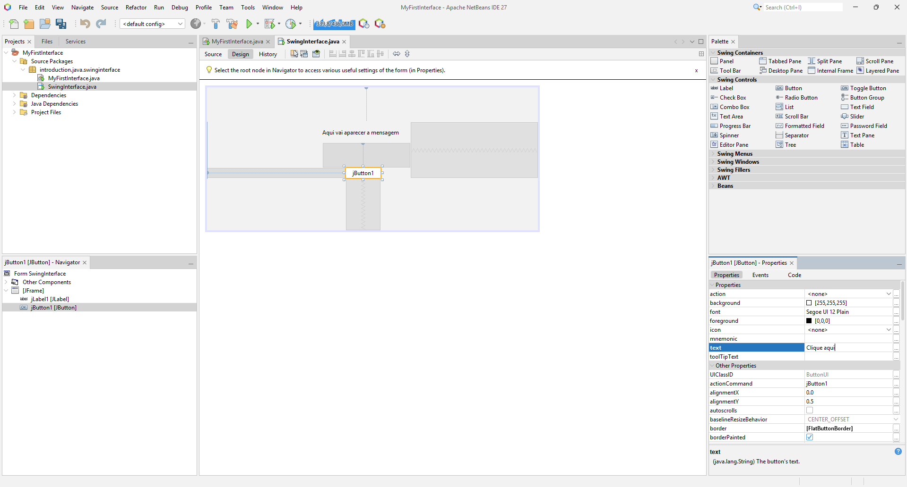

# 📚 Aula 5 – Introdução ao Swing e JavaFX

## Índice
1. [Introdução às Interfaces Gráficas Java](#1-introdução-às-interfaces-gráficas-java)
2. [Parte 1: Desenvolvendo com Swing](#2-parte-1-desenvolvendo-com-swing)
3. [Parte 2: Desenvolvendo com JavaFX](#3-parte-2-desenvolvendo-com-javafx)
4. [Comparação e Análise](#4-comparação-e-análise)
5. [Distribuição de Aplicações](#5-distribuição-de-aplicações)
6. [Conclusão](#6-conclusão)

---

## 1. Introdução às Interfaces Gráficas Java

### 📦 Antes de começar…

O Java funciona através de **pacotes**. Pense em um **carro popular**: ele vem com funções básicas, mas se quisermos adicionar algo como **vidro elétrico** ou **trava elétrica**, precisamos incluir esses itens separadamente.

Em Java, acontece o mesmo:

* Funções adicionais podem ser importadas como pacotes.
* Ex.: `import travaEletrica;` ou `import vidroEletrico;`.

Porém, assim como **faróis** já vêm de fábrica em qualquer carro, algumas bibliotecas em Java vêm incluídas por padrão, como o pacote **`java.lang`** (operações matemáticas, estruturas de repetição, etc.).

---

### 🔧 Algumas bibliotecas importantes do Java

* **`java.applet`** → criação de pequenos aplicativos/applets.
* **`java.util`** → utilitários (listas, coleções, datas).
* **`java.net`** → programação de rede (URLs, sockets).
* **`javax.sound`** → manipulação de áudio.
* **`javax.swing`** → interfaces gráficas.

---

### 📊 Evolução das Interfaces Gráficas em Java



* **AWT (Abstract Window Toolkit)** → Primeira biblioteca gráfica, dependente do sistema operacional
* **Swing** → Mais componentes, independente de plataforma
* **JavaFX** → Plataforma moderna para diversas plataformas (computadores, celulares, etc.)

---

## 2. Parte 1: Desenvolvendo com Swing

### 🎯 O que é o Swing?

O **Swing** é uma biblioteca do Java para criar **interfaces gráficas de usuário (GUIs)** que funcionam em Windows, Mac e Linux.

#### História

* Antes do Swing, havia o **AWT (Abstract Window Toolkit)**.
* O AWT dependia muito do sistema operacional → simples, mas limitado.
* O Swing trouxe **mais componentes visuais**, independência da plataforma e maior flexibilidade.

Para usá-lo:

```java
import javax.swing.*;
```

---

### ⚖️ NetBeans x IntelliJ IDEA

| Característica | NetBeans | IntelliJ IDEA |
|----------------|----------|---------------|
| GUI Builder | Nativo (Matisse) | Plugin opcional |
| Facilidade de uso | ⭐⭐⭐⭐⭐ | ⭐⭐⭐ |
| Código gerado | Mais verboso | Mais limpo |
| Adequação | Iniciantes | Projetos complexos |

🔹 **NetBeans**
* Possui um **GUI Builder (Matisse)** nativo.
* Permite arrastar e soltar botões, labels, painéis etc.
* Bom para começar, mas em grandes projetos o código gerado pode ficar **difícil de manter**.

🔹 **IntelliJ IDEA**
* Não tem GUI Builder nativo para Swing.
* Apostou no **Modulo04 + Scene Builder** para interfaces modernas.
* Possui um plugin opcional (*GUI Designer*), mas é menos prático.

👉 Nesta aula, usaremos o **NetBeans** para aprender Swing.

---

### 🛠️ Criando nossa primeira interface no NetBeans

**Pré-requisitos**: JDK + NetBeans instalados.

#### Passo 1: Criar o projeto

* `File` → `New Project` ou **Ctrl + Shift + N**
* `Categories` → **Java With Ant**
* `Project type` → **Java Application**
* `Project name` → `MyFirstInterface`

#### Passo 2: Criar o JFrame

* Clique com o botão direito no pacote.
* `New` → **JFrame Form...**
* `Categories` → **Swing GUI Forms**
* `File Types` → **JFrame Form**
* Nome da classe → `JavaBasic.SwingInterface`

#### Passo 3: Montando a interface

* Arraste um **Button** e um **Label** para a janela central.
* Configure o botão na aba de propriedades → altere o texto para **"Clique aqui"**.


*(Imagem: edição do botão no NetBeans)*

* Altere os nomes das variáveis (Right-click → **Change Variable Name**):

  * Label → `lblMensagem`
  * Button → `btnClick`

Agora execute o programa → a janela abrirá, mas nada acontecerá ao clicar no botão.

---

### ⚡ Adicionando ação ao botão

* Clique com o **botão direito** no botão.
* Vá em `Events` → `Action` → `ActionPerformed`.
* O código abrirá automaticamente em `Source`.

Adicione dentro do método:

```java
private void btnClickActionPerformed(java.awt.event.ActionEvent evt) {  
    lblMensagem.setText("Hello World JavaSwing");  
}
```


*(Imagem: código rodando com botão)*

---

### 📝 Estrutura do código gerado

Trecho simplificado:

```java
// Variables declaration
private javax.swing.JButton btnClick;
private javax.swing.JLabel lblMensagem;
// End of variables declaration

public class TelaSwing extends javax.swing.JFrame {

    private void btnClickActionPerformed(java.awt.event.ActionEvent evt) {
        lblMensagem.setText("Olá, Mundo!");
    }
}
```

---

### 🧠 Conceitos envolvidos

Mesmo sendo simples, o código já traz alguns conceitos de **POO (Programação Orientada a Objetos)**:

* **extends** → Herança (a classe `TelaSwing` herda `javax.swing.JFrame`).
* **private/public** → Encapsulamento (controle de visibilidade de atributos e métodos).
* **Eventos** → Programação orientada a eventos: ações são disparadas quando o usuário interage (ex.: clique no botão).

---

### ✅ Checklist de Aprendizagem - Swing

- [ ] Compreendi o conceito de componentes Swing
- [ ] Criei uma interface com botão e label
- [ ] Adicionei um evento ao botão
- [ ] Entendi os conceitos de POO aplicados
- [ ] Testei a aplicação funcionando

---

## 3. Parte 2: Desenvolvendo com Modulo04

### 🌟 Por que Modulo04 substituiu o Swing?

* **Melhor desempenho gráfico** - Aceleração por GPU
* **Estilização com CSS** - Separação entre design e lógica
* **API mais moderna e intuitiva** - Mais fácil de aprender e usar
* **Melhor suporte a dispositivos touch** - Interfaces touch-friendly
* **Layouts mais flexíveis** - Melhor responsividade

---

### 🛠️ Mini‑manual: Modulo04 + FXML no IntelliJ (Windows)

> **Objetivo:** criar um projeto Java simples que usa **Modulo04 + FXML** no IntelliJ IDEA, abrir o FXML no **Scene Builder** e rodar sem erros.

---

#### 1) Pré‑requisitos

* **JDK** instalado (recomendo LTS: 17 ou 21; funciona também no 24).
* **Modulo04 SDK** compatível com seu JDK (ex.: JDK 21 → Modulo04 21; JDK 24 → Modulo04 24). Descompacte em uma pasta, ex.: `C:\Users\seuUsuario\Documents\javafx-sdk-24.0.1`.
* **Scene Builder** instalado (Gluon).

> **Dica:** combine sempre versões compatíveis de JDK e Modulo04.

---

#### 2) Criar o projeto no IntelliJ

1. **New Project** → **Java**.
2. Escolha o **Project SDK** (seu JDK).
3. Crie o projeto vazio.

---

#### 3) Adicionar o Modulo04 ao projeto (Libraries)

1. **File → Project Structure… (Ctrl+Alt+Shift+S)**.
2. **Libraries** → clique **+** → **Java**.
3. Aponte para a pasta **`lib`** do Modulo04 (ex.: `…\javafx-sdk-24.0.1\lib`).
4. **Apply** e **OK**.

> Isso resolve os imports (`javafx.*`) na compilação.

---

#### 4) Configurar a execução (VM Options)

1. **Run → Edit Configurations…**.
2. Selecione sua configuração (classe `Main`).
3. Em **VM Options**, adicione (ajuste o caminho para sua pasta `lib`):

```
--module-path "C:\\Users\\seuUsuario\\Documents\\javafx-sdk-24.0.1\\lib" --add-modules javafx.controls,javafx.fxml
```

> Sem isso, ao rodar aparece: *"Modulo04 runtime components are missing..."*.

---

#### 5) Estrutura e código base

Crie um **package** (ex.: `JavaBasic.JavaFXInterface`) e dentro dele **três arquivos**:

**Main.java**

```java
package JavaBasic.JavaFXInterface;

import javafx.application.Application;
import javafx.fxml.FXMLLoader;
import javafx.scene.Scene;
import javafx.stage.Stage;

public class Main extends Application {
    @Override
    public void start(Stage stage) throws Exception {
        FXMLLoader fxmlLoader = new FXMLLoader(Main.class.getResource("hello-view.fxml"));
        Scene scene = new Scene(fxmlLoader.load(), 400, 300);
        stage.setTitle("Modulo04 com FXML!");
        stage.setScene(scene);
        stage.show();
    }

    public static void main(String[] args) {
        launch();
    }
}
```

**hello-view\.fxml**

```xml
<?xml version="1.0" encoding="UTF-8"?>

<?import javafx.scene.control.*?>
<?import javafx.scene.layout.*?>

<VBox xmlns="http://javfx.com/javfx" xmlns:fx="http://javafx.com/fxml"
      fx:controller="Module01.Exercicies.Lesson5.FXInterface.HelloController" spacing="10" alignment="CENTER">

    <Label fx:id="label" text="Olá, Modulo04 com FXML!"/>
    <Button text="Clique aqui" onAction="#onHelloButtonClick"/>
</VBox>
```

**HelloController.java**

```java
package JavaBasic.JavaFXInterface;

import javafx.fxml.FXML;
import javafx.scene.control.Label;

public class HelloController {
    @FXML
    private Label label;

    @FXML
    protected void onHelloButtonClick() {
        label.setText("Botão clicado!");
    }
}
```

---

#### 6) Onde salvar o FXML (classpath)

Duas opções válidas:

* **Mesma pasta do package** (como acima). O `FXMLLoader` usa `Main.class.getResource("hello-view.fxml")`.
* **Pasta de resources**: crie `resources/` e marque como **Resources Root**. Acesse com `Main.class.getResource("/hello-view.fxml")`.

> Use **um** desses padrões e mantenha consistência.

---

#### 7) Integrar com o Scene Builder

1. **Settings → Languages & Frameworks → Modulo04** → em **Path to Scene Builder**, aponte para o executável do Scene Builder.
2. Clique com o direito no `hello-view.fxml` → **Open in Scene Builder**.
3. No Scene Builder:

  * **Controller**: preencha **Controller class** com `JavaBasic.Lesson5.FXInterface.HelloController`.
  * Selecione o **Label** → **Code** → defina **fx:id = label**.
  * Selecione o **Button** → **Code** → defina **On Action = onHelloButtonClick**.
4. Salve e volte ao IntelliJ.

---

#### 8) Rodar

* Selecione a configuração que aponta para a classe **`JavaBasic.Lesson5.FXInterface.Main`**.
* Clique **Run**. A janela deve abrir e o botão atualizar o texto do Label.

---

#### 9) Avisos (JDK 24)

É normal ver avisos como "restricted method" e "terminally deprecated" com JDK 24. Eles **não impedem** a execução.

Para reduzir avisos do native access, você pode adicionar às **VM Options**:

```
--enable-native-access=javafx.graphics
```

> Alguns avisos de depreciação podem permanecer. Alternativa: usar JDK LTS (21) + Modulo04 correspondente.

---

#### 10) Problemas comuns (e correção rápida)

* **Erro:** `Modulo04 runtime components are missing…`

  * **Causa:** VM Options sem `--module-path`/`--add-modules`.
  * **Fix:** ver seção **4**.

* **Erro ao clicar no botão:** `NullPointerException` em `label.setText(...)`

  * **Causa:** faltou `fx:id="label"` no FXML ou o `Controller` errado.
  * **Fix:** ver seção **5/7**.

* **`java.lang.ClassNotFoundException` do Controller**

  * **Causa:** `fx:controller` com nome de pacote/classe errado.
  * **Fix:** conferir `fx:controller="seu.pacote.HelloController"`.

* **`Location is not set` ou `... not found` ao carregar FXML**

  * **Causa:** caminho do recurso incorreto.
  * **Fix:** se estiver no mesmo package, use `"hello-view.fxml"`; se estiver em `resources`, use `"/hello-view.fxml"`.

* **Scene Builder não abre pelo IntelliJ**

  * **Fix:** configure o caminho do executável do Scene Builder (seção 7.1).

---

#### 11) Checklist final (funciona sempre)

* [ ] Modulo04 adicionado em **Libraries**.
* [ ] VM Options com `--module-path …\lib` e `--add-modules javafx.controls,javafx.fxml`.
* [ ] `fx:controller` correto no FXML.
* [ ] `fx:id` definidos para os nós usados no controller.
* [ ] `onAction` mapeado para métodos `@FXML` públicos ou protegidos.
* [ ] `Main` certo na Run Configuration.

Pronto! Este é o fluxo mínimo e confiável para rodar **Modulo04 + FXML + Scene Builder** no IntelliJ.

---

### 🔍 Vantagens do FXML

O FXML oferece várias vantagens em relação ao código puro:

1. **Separação de concerns** - Lógica e interface em arquivos diferentes
2. **Design visual** - Interface criada visualmente no Scene Builder
3. **Manutenibilidade** - Mais fácil modificar o layout sem alterar código Java
4. **Reusabilidade** - Componentes de interface podem ser reutilizados
5. **Trabalho em equipe** - Designers e desenvolvedores podem trabalhar simultaneamente

---

### ✅ Checklist de Aprendizagem - Modulo04

- [ ] Compreendi a arquitetura do Modulo04
- [ ] Configurei corretamente o projeto no IntelliJ
- [ ] Criei os arquivos FXML, Controller e Main
- [ ] Utilizei o Scene Builder para designer a interface
- [ ] Conectei os eventos entre FXML e Controller
- [ ] Testei a aplicação funcionando

---

## 4. Comparação e Análise

### ⚖️ Diferenças entre Swing e Modulo04

**Swing:**
```java
package cursoemvideo.introduction_java;
public class MyFirstInterface extends javax.swing.JFrame {

    private static final java.util.logging.Logger logger = java.util.logging.Logger.getLogger(MyFirstInterface.class.getName());

    public MyFirstInterface() {
        initComponents();
    }
    
    private void btnClickActionPerformed(java.awt.event.ActionEvent evt) {
        lblMensagem.setText("Hello Wold JavaSwing");
    }   

    public static void main(String args[]) {
        java.awt.EventQueue.invokeLater(() -> new MyFirstInterface().setVisible(true));
    }

    private javax.swing.JButton btnClick;
    private javax.swing.JLabel lblMensagem;
}
```

**Modulo04:**

```java
package JavaBasic.JavaFXInterface;

import javafx.application.Application;
import javafx.fxml.FXMLLoader;
import javafx.scene.Scene;
import javafx.stage.Stage;

public class Main extends Application {
    @Override
    public void start(Stage stage) throws Exception {
        FXMLLoader fxmlLoader = new FXMLLoader(Main.class.getResource("hello-view.fxml"));
        Scene scene = new Scene(fxmlLoader.load(), 400, 300);
        stage.setTitle("Modulo04 com FXML!");
        stage.setScene(scene);
        stage.show();
    }

    public static void main(String[] args) {
        launch();
    }
}
```

---

### 📊 Comparativo Técnico

| Característica | Swing | Modulo04 |
|----------------|-------|--------|
| **Arquitetura** | Baseado em AWT | Motor gráfico próprio |
| **Desempenho** | Bom | Superior (GPU acceleration) |
| **Estilização** | Look and Feel | CSS |
| **Layout** | Layout managers | Layout managers + CSS |
| **FXML** | Não suporta | Suporte nativo |
| **Cena Builder** | Não | Sim |
| **3D** | Limitado | Suporte robusto |
| **Multi-touch** | Limitado | Suporte completo |

---

### 🎯 Quando usar cada tecnologia

#### Use Swing quando:
- Trabalhar com sistemas legados
- Desenvolver aplicações corporativas simples
- Precisar de compatibilidade com JDKs muito antigos
- Ter equipe familiarizada apenas com Swing

#### Use Modulo04 quando:
- Desenvolver novos projetos
- Precisar de interfaces modernas e ricas
- Requerer animações complexas ou gráficos 3D
- Desejar estilização com CSS
- Precisar de suporte a touch/multitouch

---

## 5. Distribuição de Aplicações

Agora, já temos nossa aplicação, mas para executar precisaríamos de IDE. "Mas eu quero enviar o executável para alguém ver meu projeto!"

Ou seja, iremos gerar o **Bytecode** para as pessoas executarem!

> ⚠️ A pessoa precisa da JRE para a JVM executar o bytecode!

No NetBeans, vamos gerar um JAR para executar um Swing:

---

## 📝 Mini Guia: Criar e Executar `.jar` no NetBeans

### 1. Criar o Projeto

* **File > New Project > Java with Ant > Java Application**
* Nome do projeto: `TesteJar`
* ❌ Desmarque *Create Main Class* (vamos criar na mão).

---

### 2. Criar a Classe Principal

```java
import javax.swing.JButton;
import javax.swing.JFrame;
import javax.swing.JOptionPane;

public class Main {
    public static void main(String[] args) {
        JFrame frame = new JFrame("Teste JAR");
        JButton button = new JButton("Clique aqui");

        button.addActionListener(e ->
            JOptionPane.showMessageDialog(frame, "Funcionou! 🎉")
        );

        frame.add(button);
        frame.setSize(300, 200);
        frame.setDefaultCloseOperation(JFrame.EXIT_ON_CLOSE);
        frame.setLocationRelativeTo(null);
        frame.setVisible(true);
    }
}
```

---

### 3. Configurar a Classe Principal no NetBeans

* Clique com o botão direito no projeto → **Properties**
* Vá em **Run**
* Em **Main Class**, coloque:

  ```
  Main
  ```

  (ou `pacote.Main` se estiver dentro de um pacote).

---

### 4. Gerar o `.jar`

* No menu: **Run > Clean and Build Project**
* O NetBeans cria o `.jar` em:

  ```
  dist/TesteJar.jar
  ```

---

### 5. Executar o `.jar` no Windows

1. Abra o **Prompt de Comando** (`Win + R`, digite `cmd`, Enter).
2. Navegue até a pasta `dist`:

   ```bat
   cd C:\Users\SEU_USUARIO\Documents\NetBeansProjects\TesteJar\dist
   ```
3. Rode o `.jar`:

   ```bat
   java -jar TesteJar.jar
   ```

💡 Se aparecer erro de **"java não é reconhecido"**, use o caminho completo do seu JDK, exemplo:

```bat
"C:\Users\thayr\.jdks\openjdk-24.0.1\bin\java.exe" -jar TesteJar.jar
```

---

### ✅ Resultado

* Abre uma janela com um botão.
* Ao clicar, aparece a mensagem **"Funcionou! 🎉"**.

---

### 📦 Distribuindo aplicações Modulo04

Para distribuir aplicações Modulo04, existem várias abordagens:

1. **JAR tradicional** - Similar ao Swing, mas requer Modulo04 no classpath
2. **jlink** - Cria uma JRE customizada com apenas os módulos necessários
3. **jpackage** (JDK 14+) - Cria instaladores nativos (EXE, MSI, DMG, DEB)
4. **Java Web Start** - Distribuição via web (em desuso)

Exemplo com jpackage:
```bash
jpackage --input target/ --name MyApp --main-jar myapp.jar --main-class com.myapp.Main
```

---

## 6. Conclusão

### 🎓 O que aprendemos hoje

1. **Introdução às interfaces gráficas** Java e sua evolução
2. **Swing** - Criação de interfaces com NetBeans GUI Builder
3. **Modulo04** - Configuração, FXML, Scene Builder e arquitetura MVC
4. **Comparação** entre as duas tecnologias e quando usar cada uma
5. **Distribuição** - Como criar e executar arquivos JAR

---

### 📋 Exercícios Práticos

1. Crie a mesma interface simples (botão + label) nas duas tecnologias
2. Adicione um campo de texto e um botão que concatena o texto com uma saudação
3. Modifique o estilo da interface Modulo04 usando CSS
4. Crie um JAR funcional de cada aplicação e teste em outra máquina

---

### 🔍 Recursos Adicionais

- [Documentação Oficial Modulo04](https://openjfx.io/)
- [Modulo04 Tutorials by CodeMakery](https://code.makery.ch/library/javafx-tutorial/)
- [Scene Builder Documentation](https://gluonhq.com/products/scene-builder/)
- [Java Swing Tutorial](https://docs.oracle.com/javase/tutorial/uiswing/)

Parabéns por completar esta aula! Você deu um grande passo no desenvolvimento de interfaces gráficas com Java. 🎉

