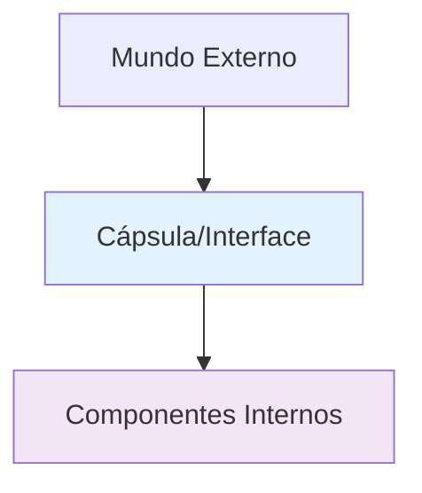

# 📚 Aula 5 - Pilares da POO: Encapsulamento - sek

---

## 🎯 Objetivos da Aula
- Compreender o conceito de encapsulamento na POO
- Diferenciar entre os pilares da POO
- Aprender os benefícios do encapsulamento
- Implementar encapsulamento em código Java
- Entender a relação entre interfaces e encapsulamento

---

## 🏛️ Os Pilares da Programação Orientada a Objetos

### Quantos Pilares Existem?
Existem diferentes abordagens na literatura:

#### **Modelo de 3 Pilares** (nossa abordagem):
1. **Encapsulamento**
2. **Herança**
3. **Polimorfismo**

#### **Modelo de 4 Pilares** (outras abordagens):
1. **Abstração**
2. **Encapsulamento**
3. **Herança**
4. **Polimorfismo**

> 💡 **Nota**: Em nosso estudo, consideramos **abstração como parte do encapsulamento**, pois ao encapsular, naturalmente abstraímos os detalhes internos.

---

## 💊 O que é Encapsulamento?

### Analogia da Pilha (Bateria):



**Características da pilha encapsulada:**
1. ✅ **Proteção mútua** → Protege você dos componentes químicos e protege a pilha de danos externos
2. ✅ **Padronização** → Formato padrão que funciona em vários aparelhos
3. ✅ **Interface simplificada** → Apenas polos positivo e negativo para interação
4. ✅ **Funcionamento interno invisível** → Não importa se é alcalina, recarregável ou comum

### Definição de Encapsulamento:
> **Encapsulamento é a técnica de ocultar detalhes de implementação, expondo apenas uma interface controlada para interação com o objeto.**

---

## 🎮 Exemplo do Mundo Real: Controle Remoto

### Sem Encapsulamento:
```
[ Fios expostos ]
[ Circuitos visíveis ]
[ Bateria desprotegida ]
↑ Usuário tem acesso direto aos componentes internos
```

### Com Encapsulamento:
```
┌─────────────────────┐
│    📺 CONTROLE      │
├─────────────────────┤
│ [Power] [Menu] [Mute]│
│ [Vol+] [Vol-] [CH+] │
│ [Play] [Pause] [OK] │
└─────────────────────┘
↑ Interface simplificada, funcionamento interno oculto
```

### Interface do Controle Remoto:
- `ligar()` / `desligar()`
- `abrirMenu()` / `fecharMenu()`
- `maisVolume()` / `menosVolume()`
- `ligarMudo()` / `desligarMudo()`
- `play()` / `pause()`

---

## 🛡️ Benefícios do Encapsulamento

### 1. **Proteção de Dados**
```java
// SEM ENCAPSULAMENTO (Perigoso!)
public class ContaBancaria {
    public double saldo;  // ❌ Qualquer um pode modificar!
}

// COM ENCAPSULAMENTO (Seguro!)
public class ContaBancaria {
    private double saldo;  // ✅ Apenas métodos controlados acessam
    
    public void depositar(double valor) {
        if (valor > 0) {
            saldo += valor;
        }
    }
}
```

### 2. **Flexibilidade para Mudanças Internas**
```java
public class Calculadora {
    private double resultado;
    
    // Internamente pode mudar, mas a interface permanece
    public double somar(double a, double b) {
        // Versão 1.0: resultado = a + b
        // Versão 2.0: resultado = processadorAvancado.somar(a, b)
        return resultado;
    }
}
```

### 3. **Reutilização de Código**
```java
// Uma classe encapsulada pode ser usada em múltiplos projetos
public class ValidadorEmail {
    private boolean verificarDominio(String email) { /* código interno */ }
    
    public boolean isValid(String email) {
        return verificarDominio(email) && /* mais verificações */;
    }
}
```

---

## 💻 Implementação Prática: Interface Controlador

### Diagrama UML da Interface:

```
    ╔══════════════════╗
    ║  «interface»     ║
    ║   Controlador    ║
    ╠══════════════════╣
    ║ + ligar(): void  ║
    ║ + desligar(): void║
    ║ + abrirMenu(): void║
    ║ + fecharMenu(): void║
    ║ + maisVolume(): void║
    ║ + menosVolume(): void║
    ║ + ligarMudo(): void║
    ║ + desligarMudo(): void║
    ║ + play(): void   ║
    ║ + pause(): void  ║
    ╚══════════════════╝
```

### Código da Interface:
```java
// Arquivo: Controlador.java
public interface Controlador {
    // Métodos abstratos (sem implementação)
    void ligar();
    void desligar();
    void abrirMenu();
    void fecharMenu();
    void maisVolume();
    void menosVolume();
    void ligarMudo();
    void desligarMudo();
    void play();
    void pause();
}
```

---

## 🎛️ Implementação da Classe ControleRemoto

### Estrutura da Classe:

```java
// Arquivo: ControleRemoto.java
public class ControleRemoto implements Controlador {
    // ATRIBUTOS PRIVADOS (encapsulados)
    private int volume;
    private boolean ligado;
    private boolean tocando;
    
    // CONSTRUTOR
    public ControleRemoto() {
        this.volume = 50;
        this.ligado = false;
        this.tocando = false;
    }
    
    // MÉTODOS GETTERS (acessores)
    private int getVolume() {
        return volume;
    }
    
    private boolean isLigado() {
        return ligado;
    }
    
    private boolean isTocando() {
        return tocando;
    }
    
    // MÉTODOS SETTERS (modificadores)
    private void setVolume(int volume) {
        this.volume = volume;
    }
    
    private void setLigado(boolean ligado) {
        this.ligado = ligado;
    }
    
    private void setTocando(boolean tocando) {
        this.tocando = tocando;
    }
    
    // IMPLEMENTAÇÃO DOS MÉTODOS DA INTERFACE
    @Override
    public void ligar() {
        this.setLigado(true);
    }
    
    @Override
    public void desligar() {
        this.setLigado(false);
    }
    
    @Override
    public void abrirMenu() {
        if (this.isLigado()) {
            System.out.println("----- MENU -----");
            System.out.println("Está ligado? " + this.isLigado());
            System.out.println("Está tocando? " + this.isTocando());
            System.out.print("Volume: " + this.getVolume());
            
            // Mostrar barras de volume
            for (int i = 0; i < this.getVolume(); i += 10) {
                System.out.print(" |");
            }
            System.out.println();
        } else {
            System.out.println("Impossível abrir menu - Controle desligado!");
        }
    }
    
    @Override
    public void fecharMenu() {
        if (this.isLigado()) {
            System.out.println("Fechando menu...");
        }
    }
    
    @Override
    public void maisVolume() {
        if (this.isLigado()) {
            this.setVolume(this.getVolume() + 5);
            System.out.println("Volume: " + this.getVolume());
        } else {
            System.out.println("Impossível aumentar volume - Controle desligado!");
        }
    }
    
    @Override
    public void menosVolume() {
        if (this.isLigado()) {
            this.setVolume(this.getVolume() - 5);
            System.out.println("Volume: " + this.getVolume());
        } else {
            System.out.println("Impossível diminuir volume - Controle desligado!");
        }
    }
    
    @Override
    public void ligarMudo() {
        if (this.isLigado() && this.getVolume() > 0) {
            this.setVolume(0);
            System.out.println("Mudo ativado!");
        }
    }
    
    @Override
    public void desligarMudo() {
        if (this.isLigado() && this.getVolume() == 0) {
            this.setVolume(50);
            System.out.println("Mudo desativado! Volume: " + this.getVolume());
        }
    }
    
    @Override
    public void play() {
        if (this.isLigado() && !this.isTocando()) {
            this.setTocando(true);
            System.out.println("Play! Reproduzindo...");
        }
    }
    
    @Override
    public void pause() {
        if (this.isLigado() && this.isTocando()) {
            this.setTocando(false);
            System.out.println("Pause! Reprodução pausada.");
        }
    }
}
```

---

## 🎯 Classe Principal para Testar

```java
// Arquivo: Main.java
public class Main {
    public static void main(String[] args) {
        // Criando objeto encapsulado
        Controlador c = new ControleRemoto();
        
        System.out.println("=== TESTANDO CONTROLE REMOTO ENCAPSULADO ===");
        
        // Testando funcionalidades
        c.ligar();
        c.abrirMenu();
        
        System.out.println("\n--- Ajustando volume ---");
        c.maisVolume();
        c.maisVolume();
        c.menosVolume();
        
        System.out.println("\n--- Testando mudo ---");
        c.ligarMudo();
        c.abrirMenu();
        c.desligarMudo();
        
        System.out.println("\n--- Testando play/pause ---");
        c.play();
        c.pause();
        
        System.out.println("\n--- Finalizando ---");
        c.abrirMenu();
        c.fecharMenu();
        c.desligar();
        
        // Tentando acessar menu desligado
        c.abrirMenu();
    }
}
```

---

## 🔐 Por que Getters e Setters Privados?

### Encapsulamento Nível Máximo:
```java
public class ControleRemoto implements Controlador {
    private int volume;
    
    // Getter PRIVADO - só a própria classe acessa
    private int getVolume() {
        return volume;
    }
    
    // Setter PRIVADO - só a própria classe modifica
    private void setVolume(int volume) {
        if (volume >= 0 && volume <= 100) {
            this.volume = volume;
        }
    }
    
    // Método PÚBLICO da interface
    public void maisVolume() {
        // Usa o setter privado internamente
        this.setVolume(this.getVolume() + 5);
    }
}
```

### Benefícios desta Abordagem:
1. **Controle total** sobre como atributos são modificados
2. **Validações centralizadas** nos setters
3. **Impede acesso direto** de outras classes
4. **Manutenção facilitada** - mudanças apenas em um lugar

---

## 📊 Tabela: Níveis de Encapsulamento

| Nível | Atributos | Getters/Setters | Interface | Uso |
|-------|-----------|----------------|-----------|-----|
| **Básico** | `private` | `public` | Simples | Comum |
| **Intermediário** | `private` | `protected` | Controlada | Bibliotecas |
| **Avançado** | `private` | `private` | Estrita | APIs complexas |

---

## ✅ Checklist de Aprendizagem

- [ ] Compreendo o conceito de encapsulamento na POO
- [ ] Sei diferenciar entre os modelos de pilares da POO
- [ ] Entendo os benefícios do encapsulamento
- [ ] Consigo implementar uma interface em Java
- [ ] Domino o uso de atributos privados
- [ ] Sei criar getters e setters apropriados
- [ ] Compreendo a relação interface/classe
- [ ] Consigo aplicar encapsulamento em projetos reais

---

## 🚀 Exercícios Práticos

### Exercício 1: Conta Bancária Encapsulada
```java
// Crie uma classe ContaBancaria encapsulada com:
// - saldo (private)
// - número da conta (private)
// - Métodos: depositar(), sacar(), consultarSaldo()
// - Validações: não permitir saque maior que saldo
```

### Exercício 2: Carrinho de Compras
```java
// Implemente um carrinho de compras encapsulado:
// - Lista de produtos (private)
// - Valor total (private)
// - Métodos: adicionarItem(), removerItem(), calcularTotal(), finalizarCompra()
```

### Exercício 3: Sistema de Login
```java
// Crie um sistema de login com encapsulamento:
// - usuário e senha (private)
// - Métodos: autenticar(), alterarSenha(), verificarForçaSenha()
// - Regras: senha deve ter mínimo 8 caracteres
```

---

## 🎉 Conclusão

Nesta aula aprendemos:
- ✅ **Definição de encapsulamento** e sua importância
- ✅ **Analogias práticas** (pilha, controle remoto, carro)
- ✅ **Benefícios**: proteção, flexibilidade, reutilização
- ✅ **Implementação** com interfaces e classes
- ✅ **Getters e setters** para controle de acesso
- ✅ **Encapsulamento avançado** com métodos privados

**Próxima aula: Herança - Segundo Pilar da POO!**

---

> 💡 **Dica do Professor**: "Pense no encapsulamento como criar uma 'caixa preta': você sabe o que entra (parâmetros), o que sai (retorno) e o que pode fazer (métodos públicos), mas não precisa saber como funciona internamente. Isso torna seu código mais seguro, flexível e profissional!"