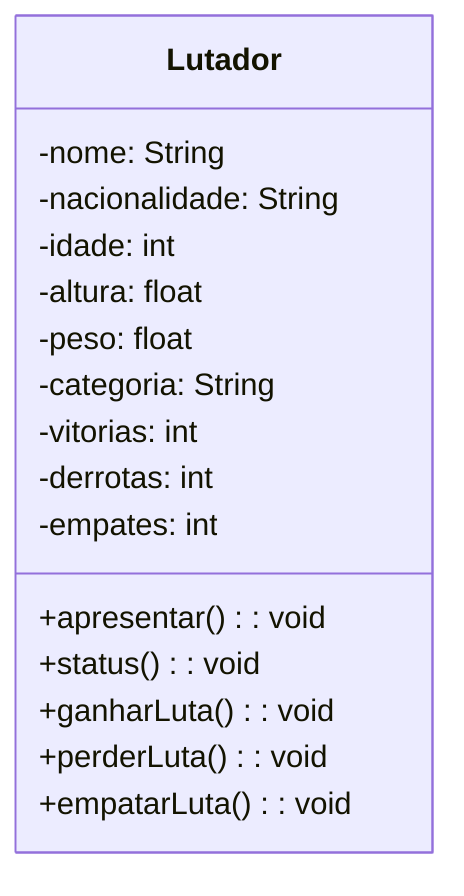

Continuando o exercicio da aula passada,Ultra Emoji combate, relacionamento entre classes. 

Recapitulando, criamos a classe lutador: 

Todos os atributos privados pois estamos começando a utilizar o encapsulamento, na aula anterior também fizemos o objeto Lutador. E podemos utilizar varios objetos. Relembrando Objetos são instancias de classes, eu preciso ter uma classe para que eu consigo instanciar objetos, não conseguimos definir objetos sem ter uma classe definindo a estrutura dele

Nessa aula, vamos aprender como relacionar uma classe com outra. Uma classe já é poderosa porque ela encapsula dados e funcionalidades. Ela é ainda mais poderosa porque pode ser relacionada com outras classes. Existem vários tipos de relacionamentos, e o que vamos ver hoje é um tipo específico, chamado **agregação**.

explicar melhor: você está vendo dois objetos “Lutador” do lado. Ambos são instâncias da mesma classe e têm estados diferentes, mas compartilham os mesmos atributos e métodos. Agora, vou criar uma classe para fazer com que eles possam lutar entre si. Vou criar a classe “Luta”. Vou representar a classe “Luta” com dois quadrados: um para os atributos e outro para os métodos. Os atributos dessa classe serão: desafiado, desafiante, quantidade de rounds e se a luta está aprovada ou não.

Os atributos desafiado e desafiante não são caracteres, mas são instâncias da classe “Lutador”. Isso é o que chamamos de tipo abstrato de dados. Ou seja, os dois são objetos de outra classe. Além disso, a classe “Luta” terá dois métodos principais: “marcarLuta” e “lutar”. Esses métodos vão fazer a luta acontecer. Claro que você pode criar uma classe de luta mais avançada, com mais funcionalidades, mas aqui estamos simplificando para dar foco à aprendizagem.

A agregação é um tipo de relacionamento que representa algo como "tem um". Então, se uma classe A tem um atributo que é da classe B, esse relacionamento é uma agregação. Vamos usar esse conceito na prática e criar o diagrama de classes. A linha sólida com um losango branco na ponta é a representação de agregação. Nesse caso, a relação é: "um lutador disputa uma luta", o que se chama de **multiplicidade**. Cada lutador pode participar de várias lutas, e cada luta pode ser disputada por vários lutadores.

