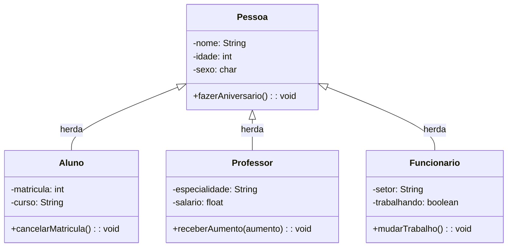
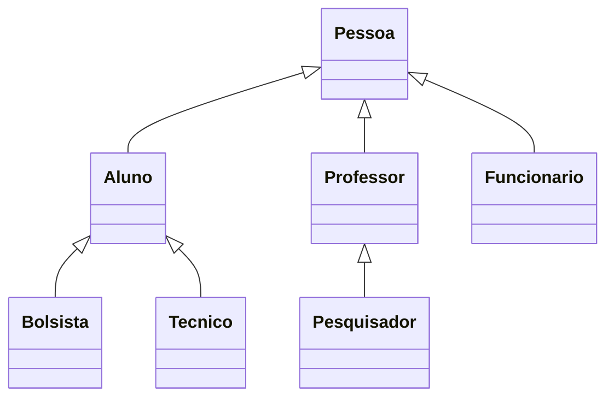

# 📚 Aula 8 – Herança em Java - Dp

## 🎯 Objetivos da Aula

* Compreender a **herança** como segundo pilar da POO
* Implementar relacionamentos "é um" entre classes
* Utilizar a palavra-chave `extends` em Java
* Diferenciar **superclasse** e **subclasse**
* Aplicar herança em cenários práticos

---

## 🧠 O que é Herança?

**Herança** é o mecanismo que permite criar uma nova classe baseada em uma classe existente.

### 📋 Analogia Biológica:
* **Superclasse (Pessoa)**: Mãe
* **Subclasse (Aluno)**: Filha
* A filha **herda** características da mãe
* Mas também tem **características próprias**

### 🎯 Benefícios:
1. **Reutilização de código**
2. **Organização hierárquica**
3. **Extensibilidade**
4. **Manutenção facilitada**

---

## 🔗 Relacionamento "É UM"

A herança estabelece que uma subclasse **"é um"** tipo da superclasse:

* Um **Aluno** "é uma" **Pessoa**
* Um **Professor** "é uma" **Pessoa**
* Um **Funcionário** "é uma" **Pessoa**

---

## 🏗️ Diagrama de Classes



### 📝 Notações:
* **Seta com triângulo vazio**: Herança
* **Direção**: Da subclasse para a superclasse

---

## 💻 Implementação em Java

### 1. **Superclasse Pessoa**

```java
public class Pessoa {
    // Atributos privados - Encapsulamento
    private String nome;
    private int idade;
    private char sexo;
    
    // Construtor
    public Pessoa(String nome, int idade, char sexo) {
        this.nome = nome;
        this.idade = idade;
        this.sexo = sexo;
    }
    
    // Método específico
    public void fazerAniversario() {
        this.idade++;
        System.out.println(this.nome + " fez aniversário! Agora tem " + this.idade + " anos.");
    }
    
    // Getters e Setters
    public String getNome() {
        return nome;
    }
    
    public void setNome(String nome) {
        this.nome = nome;
    }
    
    public int getIdade() {
        return idade;
    }
    
    public void setIdade(int idade) {
        this.idade = idade;
    }
    
    public char getSexo() {
        return sexo;
    }
    
    public void setSexo(char sexo) {
        this.sexo = sexo;
    }
}
```

### 2. **Subclasse Aluno (usa `extends`)**

```java
public class Aluno extends Pessoa {
    // Atributos específicos
    private int matricula;
    private String curso;
    
    // Construtor - chama super() primeiro
    public Aluno(String nome, int idade, char sexo, int matricula, String curso) {
        super(nome, idade, sexo);  // Chama construtor da superclasse
        this.matricula = matricula;
        this.curso = curso;
    }
    
    // Método específico
    public void cancelarMatricula() {
        System.out.println("Matrícula número " + this.matricula + " cancelada!");
        this.matricula = 0;
        this.curso = null;
    }
    
    // Getters e Setters específicos
    public int getMatricula() {
        return matricula;
    }
    
    public void setMatricula(int matricula) {
        this.matricula = matricula;
    }
    
    public String getCurso() {
        return curso;
    }
    
    public void setCurso(String curso) {
        this.curso = curso;
    }
}
```

### 3. **Subclasse Professor**

```java
public class Professor extends Pessoa {
    // Atributos específicos
    private String especialidade;
    private float salario;
    
    // Construtor
    public Professor(String nome, int idade, char sexo, String especialidade, float salario) {
        super(nome, idade, sexo);
        this.especialidade = especialidade;
        this.salario = salario;
    }
    
    // Método específico
    public void receberAumento(float aumento) {
        this.salario += aumento;
        System.out.println(this.getNome() + " recebeu aumento! Novo salário: R$" + this.salario);
    }
    
    // Getters e Setters
    public String getEspecialidade() {
        return especialidade;
    }
    
    public void setEspecialidade(String especialidade) {
        this.especialidade = especialidade;
    }
    
    public float getSalario() {
        return salario;
    }
    
    public void setSalario(float salario) {
        this.salario = salario;
    }
}
```

### 4. **Subclasse Funcionario**

```java
public class Funcionario extends Pessoa {
    // Atributos específicos
    private String setor;
    private boolean trabalhando;
    
    // Construtor
    public Funcionario(String nome, int idade, char sexo, String setor) {
        super(nome, idade, sexo);
        this.setor = setor;
        this.trabalhando = true;
    }
    
    // Método específico
    public void mudarTrabalho() {
        this.trabalhando = !this.trabalhando;
        String status = this.trabalhando ? "voltou a trabalhar" : "parou de trabalhar";
        System.out.println(this.getNome() + " " + status + " no setor " + this.setor);
    }
    
    // Getters e Setters
    public String getSetor() {
        return setor;
    }
    
    public void setSetor(String setor) {
        this.setor = setor;
    }
    
    public boolean isTrabalhando() {
        return trabalhando;
    }
    
    public void setTrabalhando(boolean trabalhando) {
        this.trabalhando = trabalhando;
    }
}
```

---

## 🧪 Classe Principal de Teste

```java
public class TesteHeranca {
    public static void main(String[] args) {
        System.out.println("=== TESTANDO HERANÇA ===\n");
        
        // 1. Criando objetos de cada tipo
        Pessoa p1 = new Pessoa("Maria", 30, 'F');
        Aluno p2 = new Aluno("João", 20, 'M', 12345, "Ciência da Computação");
        Professor p3 = new Professor("Carlos", 45, 'M', "Matemática", 5000.00f);
        Funcionario p4 = new Funcionario("Ana", 35, 'F', "Administração");
        
        // 2. Testando métodos HERDADOS (funcionam para todos)
        System.out.println("--- Métodos Herdados (funcionam para todos) ---");
        p1.setNome("Maria Silva");
        p2.setNome("João Santos");
        p3.setNome("Carlos Pereira");
        p4.setNome("Ana Costa");
        
        p1.fazerAniversario();  // Funciona
        p2.fazerAniversario();  // Funciona - herança!
        p3.fazerAniversario();  // Funciona - herança!
        p4.fazerAniversario();  // Funciona - herança!
        
        // 3. Testando métodos ESPECÍFICOS
        System.out.println("\n--- Métodos Específicos ---");
        
        // Aluno pode cancelar matrícula
        p2.cancelarMatricula();  // Funciona - método próprio
        
        // Professor pode receber aumento
        p3.receberAumento(1000.00f);  // Funciona - método próprio
        
        // Funcionário pode mudar trabalho
        p4.mudarTrabalho();  // Funciona - método próprio
        
        // 4. O que NÃO funciona - ERROS COMUNS
        System.out.println("\n--- O que NÃO funciona ---");
        
        // ERRO 1: Pessoa não pode cancelar matrícula
        // p1.cancelarMatricula();  // ERRO DE COMPILAÇÃO!
        System.out.println("p1.cancelarMatricula() → ERRO: Pessoa não tem esse método");
        
        // ERRO 2: Funcionário não pode receber aumento
        // p4.receberAumento(500);  // ERRO DE COMPILAÇÃO!
        System.out.println("p4.receberAumento() → ERRO: Funcionário não tem esse método");
        
        // ERRO 3: Professor não pode mudar trabalho
        // p3.mudarTrabalho();  // ERRO DE COMPILAÇÃO!
        System.out.println("p3.mudarTrabalho() → ERRO: Professor não tem esse método");
        
        // 5. Verificando estado dos objetos
        System.out.println("\n--- Estado Final dos Objetos ---");
        System.out.println("Aluno " + p2.getNome() + ": Matrícula = " + p2.getMatricula());
        System.out.println("Professor " + p3.getNome() + ": Salário = R$" + p3.getSalario());
        System.out.println("Funcionário " + p4.getNome() + ": Trabalhando = " + p4.isTrabalhando());
    }
}
```

---

## 🔍 Análise dos Resultados

### ✅ O que **FUNCIONA**:
1. **Métodos herdados** disponíveis em todas as subclasses
2. **Atributos protegidos** acessíveis via getters/setters
3. **Hierarquia preservada** - Aluno é uma Pessoa

### ❌ O que **NÃO FUNCIONA**:
1. **Acesso direto a métodos específicos** de outras hierarquias
2. **Conversão implícita** entre tipos não relacionados
3. **Herança múltipla** (Java não permite diretamente)

### 🎯 **Regra de Ouro**:
> "Um Aluno pode fazer tudo que uma Pessoa faz,
> mas uma Pessoa não pode fazer tudo que um Aluno faz."

---

## 🛡️ Encapsulamento + Herança

### Boas Práticas:
1. **Atributos privados** na superclasse
2. **Getters/setters protegidos** para acesso controlado
3. **Construtores adequados** com `super()`
4. **Métodos específicos** apenas onde fazem sentido

### Exemplo de Proteção:
```java
// Na superclasse Pessoa:
private int idade;  // Privado - encapsulado

// Na subclasse Aluno:
public void metodoAluno() {
    // this.idade = 20;  // ERRO - privado!
    this.setIdade(20);   // OK - usa setter público
}
```

---

## 🎲 Teste de Compreensão

**Qual o resultado deste código?**
```java
Pessoa p = new Aluno("Pedro", 22, 'M', 999, "Engenharia");
p.fazerAniversario();  // Funciona? ✓
// p.cancelarMatricula();  // Funciona? ✗
```

**Resposta:**
* ✓ `fazerAniversario()` funciona - método herdado
* ✗ `cancelarMatricula()` NÃO funciona - referência é do tipo Pessoa

---

## 💡 Expandindo o Projeto

### Adicione estas funcionalidades:

1. **Classe Bolsista** (herda de Aluno):
```java
public class Bolsista extends Aluno {
    private float bolsa;
    public void renovarBolsa() { ... }
    public void pagarMensalidade() { ... }
}
```

2. **Classe Tecnico** (herda de Aluno):
```java
public class Tecnico extends Aluno {
    private String registroProfissional;
    public void praticar() { ... }
}
```

3. **Classe Pesquisador** (herda de Professor):
```java
public class Pesquisador extends Professor {
    private String areaPesquisa;
    public void publicarArtigo() { ... }
}
```

### Nova Hierarquia:


---

## 📚 Resumo da Aula

### ✅ O que aprendemos:
1. **Herança** como relação "é um"
2. **Palavra-chave `extends`** em Java
3. **Diferença** superclasse × subclasse
4. **Construtores** com `super()`
5. **Limitações** do polimorfismo

### 🔧 Habilidades desenvolvidas:
* Criar hierarquias de classes
* Reutilizar código eficientemente
* Organizar sistemas complexos
* Prevenir erros de design

### 🧭 Próximos Passos:
* **Polimorfismo** (3º pilar da POO)
* **Classes abstratas**
* **Interfaces**
* **Sobrescrita de métodos**

---

## 🚀 Desafio Prático

**Implemente o sistema completo:**
1. Crie as classes `Bolsista`, `Tecnico`, `Pesquisador`
2. Adicione **validações** nos construtores
3. Implemente **métodos abstratos** na superclasse
4. Crie um **sistema de cadastro** que armazene todas as pessoas
5. Adicione **persistência em arquivo**

**Dica:** Use arrays ou ArrayList para armazenar objetos:
```java
ArrayList<Pessoa> pessoas = new ArrayList<>();
pessoas.add(new Aluno(...));
pessoas.add(new Professor(...));
// Todos são Pessoa!
```

---

Acesse o exercício completo em: https://github.com/ThayronyVonHeld/Introduction-JAVA/tree/main/src-projects/Module02/Exercicies/Lesson8

Lembre-se: **Herança é poderosa, mas use com sabedoria!**
Não force herança onde não há relação "é um" genuína. 🎓