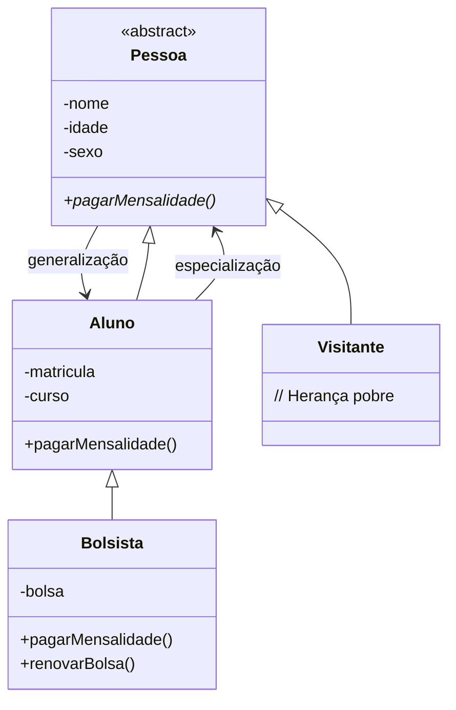

# 📚 Aula 9 – Herança Avançada e Modificadores em Java

## 🎯 Objetivos da Aula

* Compreender a **navegação em árvores de herança**
* Diferenciar **herança de implementação** vs **herança para diferença**
* Trabalhar com **classes e métodos abstratos**
* Utilizar modificadores **`abstract`**, **`final`** e **`protected`**
* Implementar **sobreposição de métodos** com `@Override`

---

## 🌳 Navegação na Árvore de Herança

### 📊 Terminologia da Hierarquia:



### 📍 Posições na Árvore:

| Termo | Definição | Exemplo |
|-------|-----------|---------|
| **Raiz** | Classe sem superclasse | `Pessoa` |
| **Folha** | Classe sem subclasses | `Bolsista` |
| **Ancestrais** | Classes acima na hierarquia | `Pessoa` para `Bolsista` |
| **Descendentes** | Classes abaixo na hierarquia | `Bolsista` para `Pessoa` |

### 🔄 Direções de Navegação:

1. **Especialização** (↑→↓):
    * Da superclasse para subclasse
    * Ex: `Pessoa` → `Aluno` → `Bolsista`
    * **Adiciona** características específicas

2. **Generalização** (↓→↑):
    * Da subclasse para superclasse
    * Ex: `Bolsista` → `Aluno` → `Pessoa`
    * **Remove** características específicas

---

## 🔧 Tipos de Herança

### 1. **Herança de Implementação (Herança Pobre)**
```java
public class Visitante extends Pessoa {
    // Nenhum atributo ou método novo
    // Herda TUDO de Pessoa sem adicionar nada
}
```
* **Característica**: "Herda mas não inova"
* **Uso**: Quando precisa reutilizar código sem especializar
* **Exemplo**: `Visitante` é uma `Pessoa` genérica

### 2. **Herança para Diferença**
```java
public class Aluno extends Pessoa {
    private int matricula;
    private String curso;
    
    public void pagarMensalidade() {
        System.out.println("Pagando mensalidade do aluno");
    }
}
```
* **Característica**: "Herda e especializa"
* **Uso**: Quando precisa estender funcionalidades
* **Exemplo**: `Aluno` é uma `Pessoa` com características específicas

---

## 🚫 Modificador `abstract`

### **Classe Abstrata**:
```java
public abstract class Pessoa {
    protected String nome;
    protected int idade;
    protected char sexo;
    
    // MÉTODO ABSTRATO - sem implementação
    public abstract void pagarMensalidade();
    
    // MÉTODO CONCRETO - com implementação
    public void fazerAniversario() {
        this.idade++;
    }
}
```

### 📋 Regras das Classes Abstratas:

| Regra | Explicação | Consequência |
|-------|-----------|--------------|
| **Não pode ser instanciada** | `new Pessoa()` gera erro | Só serve como base |
| **Pode ter métodos abstratos** | Declarados sem corpo `{}` | Subclasses devem implementar |
| **Pode ter métodos concretos** | Com implementação normal | Herdados normalmente |
| **Pode ter construtor** | Sim, para inicializar atributos | Chamado via `super()` |

### ❌ **ERRO COMUM**:
```java
Pessoa p = new Pessoa();  // ERRO DE COMPILAÇÃO!
// Pessoa is abstract; cannot be instantiated
```

---

## 🛡️ Modificador `protected`

### **Visibilidade Controlada**:
```java
public abstract class Pessoa {
    // PROTECTED - visível para a classe e subclasses
    protected String nome;
    protected int idade;
    protected char sexo;
    
    // PRIVATE - visível apenas nesta classe
    private String cpf;
}
```

### 📊 Tabela de Modificadores:

| Modificador | Classe | Pacote | Subclasse | Mundo |
|------------|--------|--------|-----------|-------|
| **private** | ✓ | ✗ | ✗ | ✗ |
| **protected** | ✓ | ✓ | ✓ | ✗ |
| **public** | ✓ | ✓ | ✓ | ✓ |

### 💡 Quando usar `protected`:
* Quando atributos precisam ser acessados por subclasses
* Alternativa a getters/setters para acesso direto controlado
* Mantém encapsulamento dentro da hierarquia

---

## 🔒 Modificador `final`

### 1. **Classe Final**:
```java
public final class Aluno extends Pessoa {
    // Esta classe NÃO pode ter subclasses
    // Qualquer tentativa de "extends Aluno" gera erro
}
```

### 2. **Método Final**:
```java
public class Pessoa {
    // Método que NÃO pode ser sobrescrito
    public final void metodoQueNaoMuda() {
        System.out.println("Implementação fixa");
    }
}
```

### 3. **Atributo Final** (constante):
```java
public class Pessoa {
    // Constante - valor não pode mudar
    public static final int IDADE_MINIMA = 0;
    private final String codigo = "PESSOA001";
}
```

### 📋 Regras do `final`:

| Elemento | Com `final` | Sem `final` |
|----------|------------|-------------|
| **Classe** | Não pode ter subclasses | Pode ter subclasses |
| **Método** | Não pode ser sobrescrito | Pode ser sobrescrito |
| **Atributo** | Não pode mudar valor | Pode mudar valor |

---

## 🔄 Sobrescrita com `@Override`

### **Sobrescrita de Métodos**:
```java
public class Aluno extends Pessoa {
    @Override
    public void pagarMensalidade() {
        System.out.println("Pagando mensalidade do ALUNO");
    }
}

public class Bolsista extends Aluno {
    @Override
    public void pagarMensalidade() {
        System.out.println("Bolsista PAGA COM DESCONTO!");
    }
}
```

### ✅ **Benefícios da anotação `@Override`**:
1. **Segurança**: Compilador verifica se método existe na superclasse
2. **Legibilidade**: Indica claramente que é sobrescrita
3. **Manutenção**: Facilita encontrar métodos sobrescritos

### ❌ **ERRO COM `@Override`**:
```java
@Override
public void pagarMensalida() {  // ERRO DE DIGITAÇÃO!
    // Método não existe na superclasse
    // Compilador acusa erro: method does not override
}
```

---

## 💻 Implementação Completa

### 1. **Classe Abstrata Base**:
```java
public abstract class Pessoa {
    // Atributos protected - acessíveis por subclasses
    protected String nome;
    protected int idade;
    protected char sexo;
    
    // Construtor
    public Pessoa(String nome, int idade, char sexo) {
        this.nome = nome;
        this.idade = idade;
        this.sexo = sexo;
    }
    
    // MÉTODO ABSTRATO - deve ser implementado pelas subclasses
    public abstract void pagarMensalidade();
    
    // Método concreto - implementado aqui
    public final void fazerAniversario() {
        this.idade++;
        System.out.println(nome + " agora tem " + idade + " anos!");
    }
    
    // Getters
    public String getNome() { return nome; }
    public int getIdade() { return idade; }
    public char getSexo() { return sexo; }
}
```

### 2. **Herança de Implementação (Pobre)**:
```java
public class Visitante extends Pessoa {
    // Herança pobre - não adiciona nada novo
    
    public Visitante(String nome, int idade, char sexo) {
        super(nome, idade, sexo);
    }
    
    // DEVE implementar método abstrato
    @Override
    public void pagarMensalidade() {
        System.out.println("Visitante não paga mensalidade!");
    }
}
```

### 3. **Herança para Diferença**:
```java
public class Aluno extends Pessoa {
    // Atributos específicos
    private int matricula;
    private String curso;
    
    public Aluno(String nome, int idade, char sexo, 
                 int matricula, String curso) {
        super(nome, idade, sexo);
        this.matricula = matricula;
        this.curso = curso;
    }
    
    @Override
    public void pagarMensalidade() {
        System.out.println("Pagando mensalidade do aluno " + this.nome);
    }
    
    // Métodos específicos
    public void cancelarMatricula() {
        System.out.println("Matrícula " + matricula + " cancelada!");
    }
}
```

### 4. **Especialização (Bolsista)**:
```java
public class Bolsista extends Aluno {
    private float bolsa;
    
    public Bolsista(String nome, int idade, char sexo,
                    int matricula, String curso, float bolsa) {
        super(nome, idade, sexo, matricula, curso);
        this.bolsa = bolsa;
    }
    
    // SOBRESCRITA com comportamento diferente
    @Override
    public void pagarMensalidade() {
        System.out.println(this.nome + " é bolsista! Pagamento com desconto.");
    }
    
    // Método específico
    public void renovarBolsa() {
        System.out.println("Renovando bolsa de " + this.nome);
    }
}
```

### 5. **Classe Final**:
```java
// CLASSE FINAL - não pode ter subclasses
public final class Tecnico extends Aluno {
    private String registroProfissional;
    
    public Tecnico(String nome, int idade, char sexo,
                   int matricula, String curso, String registro) {
        super(nome, idade, sexo, matricula, curso);
        this.registroProfissional = registro;
    }
    
    // Método FINAL - não pode ser sobrescrito
    public final void praticar() {
        System.out.println(this.nome + " está praticando...");
    }
    
    // ERRO se tentar sobrescrever método final da superclasse
    // @Override
    // public void fazerAniversario() { } // ERRO!
}
```

---

## 🧪 Programa de Teste

```java
public class TesteHerancaAvancada {
    public static void main(String[] args) {
        System.out.println("=== TESTE DE HERANÇA AVANÇADA ===\n");
        
        // 1. Testando classes abstratas (ERRO)
        // Pessoa p = new Pessoa(); // ERRO: Pessoa é abstrata!
        
        // 2. Herança de implementação
        Visitante v1 = new Visitante("Carlos", 40, 'M');
        v1.pagarMensalidade();  // Método implementado
        v1.fazerAniversario();  // Método herdado
        
        // 3. Herança para diferença
        Aluno a1 = new Aluno("Maria", 20, 'F', 123, "Computação");
        a1.pagarMensalidade();  // Comportamento específico
        a1.cancelarMatricula(); // Método próprio
        
        // 4. Especialização com polimorfismo
        Pessoa p1 = new Bolsista("João", 22, 'M', 456, "Engenharia", 500.00f);
        p1.pagarMensalidade();  // Chama versão do Bolsista!
        p1.fazerAniversario();  // Chama versão da Pessoa (final)
        
        // 5. Downcasting seguro
        if (p1 instanceof Bolsista) {
            Bolsista b = (Bolsista) p1;
            b.renovarBolsa();  // Agora pode acessar métodos específicos
        }
        
        // 6. Testando classe final
        Tecnico t1 = new Tecnico("Ana", 25, 'F', 789, "Redes", "TEC001");
        t1.praticar();  // Método final funciona
        
        // ERRO: Não pode criar subclasse de Tecnico
        // class Especializacao extends Tecnico { } // ERRO!
        
        System.out.println("\n=== FIM DOS TESTES ===");
    }
}
```

---

## 🔍 Análise de Comportamento

### **Polimorfismo em Ação**:
```java
Pessoa[] pessoas = new Pessoa[3];
pessoas[0] = new Visitante("V1", 30, 'M');
pessoas[1] = new Aluno("A1", 20, 'F', 111, "Curso");
pessoas[2] = new Bolsista("B1", 22, 'M', 222, "Outro", 300);

for (Pessoa p : pessoas) {
    p.pagarMensalidade();  // COMPORTAMENTO DIFERENTE PARA CADA!
}
```
**Saída**:
```
Visitante não paga mensalidade!
Pagando mensalidade do aluno A1
B1 é bolsista! Pagamento com desconto.
```

---

## 💡 Boas Práticas

### ✅ **FAÇA**:
1. Use `abstract` para classes que são apenas modelos
2. Use `@Override` sempre que sobrescrever métodos
3. Use `protected` para atributos compartilhados na hierarquia
4. Use `final` para métodos que não devem mudar

### ❌ **NÃO FAÇA**:
1. Não force herança onde não há relação "é um"
2. Não use `protected` para tudo - mantenha encapsulamento
3. Não torne classes `final` sem necessidade
4. Não ignore erros do compilador com `@Override`

---

## 🚀 Desafio de Implementação

**Amplie o sistema educacional:**

1. **Crie a classe `Professor`** (herda de `Pessoa`):
    * Atributos: `especialidade`, `salario`
    * Método abstrato: `receberAumento()`
    * Método final: `getSalario()`

2. **Crie `ProfessorPesquisador`** (herda de `Professor`):
    * Atributos: `areaPesquisa`, `bolsaProdutividade`
    * Sobrescreva `receberAumento()` para incluir bolsa

3. **Crie sistema de `Curso`**:
    * Relacione com `Aluno` (agregação)
    * Cada curso tem vários alunos
    * Calcule média das idades dos alunos

4. **Implemente `Validacao`**:
    * Método estático para validar CPF
    * Método final para validar idade mínima

---

## 📚 Resumo da Aula

### ✅ **Conceitos Dominados**:
1. **Árvore de herança** e navegação
2. **Herança pobre** vs **herança para diferença**
3. **Classes e métodos abstratos**
4. **Modificadores** `abstract`, `final`, `protected`
5. **Sobrescrita** com `@Override`

### 🛠️ **Ferramentas Aprendidas**:
* Como projetar hierarquias eficientes
* Quando usar cada tipo de modificador
* Como implementar polimorfismo básico
* Boas práticas de design orientado a objetos

### 🎯 **Próximos Passos**:
* **Polimorfismo avançado**
* **Interfaces** em Java
* **Classes internas e anônimas**
* **Generics** (tipos genéricos)

---

## 🎓 Metáfora Final: A Receita de Bolo

Pense na programação com herança como fazer bolos:

* **Classe abstrata `ReceitaBolo`** = A receita base 📄
    * Não come a receita, mas precisa dela
    * Métodos abstratos: `adicionarSabor()`, `assar()`

* **`BoloChocolate extends ReceitaBolo`** = Bolo específica 🍫
    * Implementa `adicionarSabor()` com cacau
    * Herda método `assar()` da receita base

* **`BoloLaranja extends ReceitaBolo`** = Outro bolo específico 🍊
    * Implementa `adicionarSabor()` com laranja
    * Pode sobrescrever `assar()` se precisar temperatura diferente

* **`final void preaquecerForno()`** = Passo que nunca muda 🔥
    * Todo bolo precisa preaquecer do mesmo jeito
    * Método final - não pode ser alterado

**Resultado**: Múltiplos bolos (objetos) a partir de uma receita base (classe abstrata), cada um com seu sabor único (implementação específica)! 🎂

---

Acesse o exercício completo em: [Link do repositório GitHub]

**Lembrete**: Herança é como herdar características familiares - você recebe traços dos seus pais, mas desenvolve sua própria personalidade! 🧬