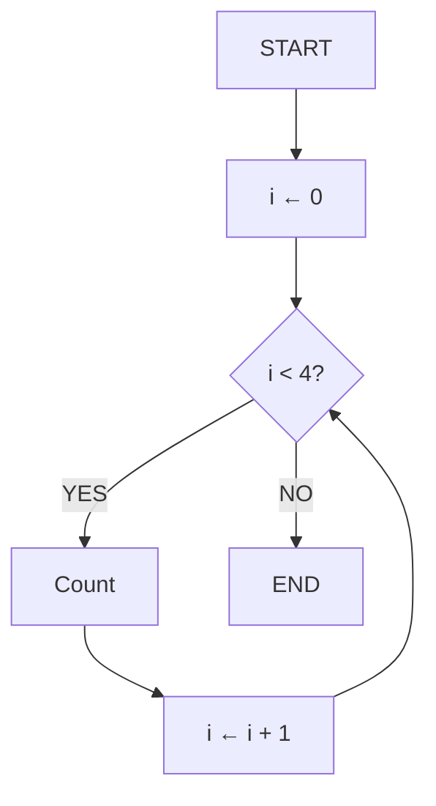

Here’s the English version of your lesson, keeping the same structure, tone, and didactic clarity 👇

---

# 📚 Lesson 11 – Repetition Structures (Part 1): While

---

## 🎯 Lesson Objectives

* Understand the concept of repetition structures
* Master the `while` loop in Java
* Learn to use counters and stop conditions
* Understand the `break` and `continue` commands
* Develop programs with controlled loops

---

## 🔄 Introduction to Repetition Structures

### Why use repetition structures?

Imagine we need to count from 1 to 4. Without loops, we would write:

```java
System.out.println("Count 1");
System.out.println("Count 2"); 
System.out.println("Count 3");
System.out.println("Count 4");
```

Notice that the counting process **repeats four times**.

**Problem:** What if we had to count to 100? That would be a lot of repetitive code!

Instead of writing the same command over and over, we can **simplify it using a repetition structure**.

---

## 🏗️ Flowchart – Repetition Structure

### Flowchart: Counter with While



### Flow Explanation:

1. **Initialization:** `i = 0`
2. **Condition:** `i < 4` (true while i is less than 4)
3. **Execution:** “Count” block runs
4. **Increment:** `i = i + 1` (increases the counter)
5. **Repeats** until the condition becomes false

---

## 💡 Pseudocode Representation

```portugol
algorithm "Counter"
var
    i: integer
begin
    i <- 0
    
    while (i < 4) do
        write("Count ", i)
        i <- i + 1
    endwhile
endalgorithm
```

---

## 💻 Java Implementation: Basic While

### Basic While Example

```java
public class BasicCounter {
    public static void main(String[] args) {
        int i = 0;
        
        while (i < 4) {
            System.out.println("Count " + i);
            i++; // increment
        }
    }
}
```

### 🧩 Step-by-Step Explanation:

* `int i = 0;` → **Initialization** of the counter
* `while (i < 4)` → **Condition** for repetition
* `System.out.println("Count " + i);` → **Action** to repeat
* `i++;` → **Increment** of the counter (`i = i + 1`)

---

## 🔍 Execution Flow

1. Variable **`i` starts at 0**
2. `while` checks if `i < 4`
3. If **true**, the block executes
4. At the end, `i++` adds +1
5. The loop continues until `i` becomes 4
6. When `i = 4`, the condition is false, and the loop ends

> In short: `while` **repeats as long as the condition is true**.

---

## ⚙️ General Structure of `while`

| Part               | Purpose                                        |
| ------------------ | ---------------------------------------------- |
| **Initialization** | Defines the starting point (e.g. `int i = 0;`) |
| **Condition**      | Logical expression to test (`i < 4`)           |
| **Body**           | What is repeated                               |
| **Increment**      | Updates the control variable (`i++`)           |

---

## ⚡ Special Commands: Break and Continue

### Example with Break and Continue

```java
public class AdvancedCounter {
    public static void main(String[] args) {
        int i = 0;
        
        while (i < 15) {
            i++;
            
            // Continue - skips specific iterations
            if (i == 2 || i == 3 || i == 4) {
                continue; // Skips to next iteration
            }
            
            // Break - stops the loop entirely
            if (i == 7) {
                break; // Ends the loop
            }
            
            System.out.println("Count " + i);
        }
    }
}
```

### 🔍 Program Output:

```
Count 1
Count 5
Count 6
```

---

## 🧩 Understanding `continue` and `break`

### 🔹 `continue`

When the `if` condition is true, the command **skips** the rest of the block and **returns to the loop start**.
In the example above, numbers 2, 3, and 4 are ignored.

➡️ Partial Output:

```
Count 1
Count 5
Count 6
```

*(2, 3, and 4 were skipped)*

---

### 🔹 `break`

The command **completely stops** the loop, ending its execution.

➡️ Final Output:

```
Count 1
Count 5
Count 6
```

*(When `i` reaches 7, the program stops)*

---

## ⚠️ Common Mistakes with While

### 1. **Infinite Loop**

```java
// ❌ DANGER - infinite loop
int i = 0;
while (i < 5) {
    System.out.println("Stuck here!");
    // Forgot i++
}
```

### 2. **Condition Always True**

```java
// ❌ WARNING - condition always true
while (true) {
    System.out.println("Running forever...");
    // Needs a break to stop
}
```

### 3. **Correct Solution**

```java
// ✅ CORRECT - controlled counter
int i = 0;
while (i < 5) {
    System.out.println("Iteration: " + i);
    i++; // Always update the counter
}
```

---

## 🔧 Common While Loop Patterns

### Pattern 1: Increasing Counter

```java
int i = 0;
while (i < 10) {
    // Processing
    i++;
}
```

### Pattern 2: Decreasing Counter

```java
int i = 10;
while (i > 0) {
    // Processing
    i--;
}
```

### Pattern 3: Loop with Exit Condition

```java
while (condition) {
    // Processing
    if (exitCondition) {
        break;
    }
}
```

---

## 🚀 Practice Exercises

* **Exercise 1: Countdown**

```java
// Use while to count from 10 down to 0
```

* **Exercise 2: Sum of Numbers**

```java
// Use while to add up counted numbers
```

* **Exercise 3: Multiplication Table**

```java
// Use while to display the multiplication table of 5 (1 to 10)
```

* **Exercise 4: Even Numbers**

```java
// Use while to show even numbers from 0 to 20
// Use continue to skip odd numbers
```

---

## ✅ Learning Checklist

* [ ] I understand the concept of repetition structures
* [ ] I can implement loops with `while`
* [ ] I know how to use counters and increments
* [ ] I understand the difference between `break` and `continue`
* [ ] I can avoid infinite loops
* [ ] I’ve built controlled repetition programs
* [ ] I’ve applied `while` in practical cases

---

> 💡 **Tip:** Always test your loops with small values first.
> Use `System.out.println()` to check how your variables change at each iteration.
> Practice is key to mastering repetition structures!

---

Would you like me to format this version in Markdown (same as your saved lessons) so it’s ready to store as **Lesson 11 (English version)** in your reference set?
