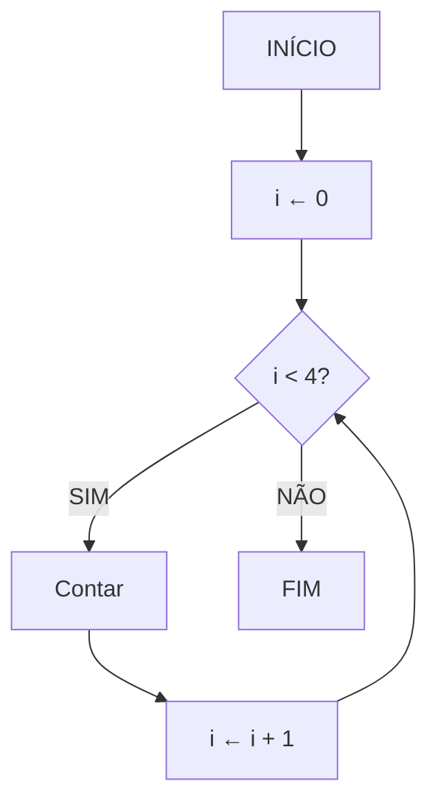
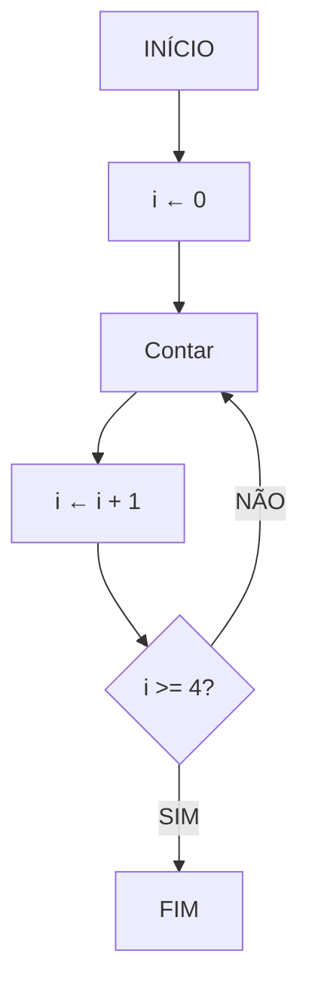

# 📚 Aula 12 - Estruturas de Repetição (Parte 2): Do While

---

## 🎯 Objetivos da Aula

* Entender o funcionamento da estrutura `do while`
* Comparar o comportamento entre `while` e `do while`
* Implementar repetições com teste lógico **no final**
* Utilizar loops com entrada de dados e condição de parada

---

## 🔄 Relembrando o While

Na aula anterior vimos o comando **`while`**, cuja **condição lógica é testada no início** do bloco.

### 📊 Fluxograma - Teste no Início (`while`)



🔹 **Explicação:**
O `while` **verifica a condição antes de executar** o bloco.
Se a condição for **falsa logo no início**, o bloco **não é executado nenhuma vez**.

---

## 🧩 Introdução ao `do while`

Agora, veremos o **`do while`**, cuja principal diferença é que o **teste lógico é feito no final**.

Isso significa que **o bloco será executado pelo menos uma vez**, mesmo que a condição seja falsa logo de início.

---

## 🏗️ Fluxograma - Teste no Final (`do while`)



🔹 **Perceba:**
No teste lógico do final, **a condição é invertida** em relação ao `while`.
Enquanto no `while` usamos `i < 4`,
no `do while` o teste de parada é `i >= 4`.

---

## 💡 Pseudocódigo (Portugol)

```portugol
algoritmo "DoWhile_Exemplo"
var
    i: inteiro
inicio
    i <- 0
    repita
        escreva("Contar ", i)
        i <- i + 1
    até (i >= 4)
fimalgoritmo
```

➡️ Aqui o teste ocorre **no final**.
Mesmo que `i` comece com um valor maior ou igual a 4, o bloco **será executado pelo menos uma vez**.

---

## 💻 Implementação em Java: Estrutura Do While

```java
public class ExemploDoWhile {
    public static void main(String[] args) {
        int i = 0;
        
        do {
            System.out.println("Contar " + i);
            i++; // incremento
        } while (i < 4);
    }
}
```

---

## 🧩 Explicação Detalhada

1. A variável `i` é inicializada com 0
2. O bloco dentro do `do { ... }` é executado **sem verificar a condição**
3. Ao final, a condição `i < 4` é testada
4. Se for verdadeira, o bloco **repete**
5. Quando `i` for 4, o teste se torna falso e o loop termina

🔹 **Conclusão:** o `do while` **executa sempre ao menos uma vez**, independentemente da condição.

---

## ⚙️ Estrutura Geral do `do while`

| Parte              | Função                                      |
| ------------------ | ------------------------------------------- |
| **Inicialização**  | Define o ponto de partida (`int i = 0;`)    |
| **Bloco**          | Ações que serão executadas                  |
| **Condição Final** | Verifica se o loop deve continuar (`i < 4`) |

---

## 💬 Exemplo Prático com Entrada de Dados

```java
import java.util.Scanner;

public class Numeros {
    public static void main(String[] args) {
        int i;
        int soma = 0;
        String resposta;
        Scanner teclado = new Scanner(System.in);
        
        do {
            System.out.print("Digite um número: ");
            i = teclado.nextInt();
            
            soma += i; // soma = soma + i;
            
            System.out.print("Deseja continuar [S/N]? ");
            resposta = teclado.next();
            
        } while (resposta.equals("S"));
        
        System.out.println("A soma de todos os valores é: " + soma);
    }
}
```

---

### 🧠 Entendendo o Código

* O bloco dentro do `do { ... }` **executa primeiro**
* O programa pergunta ao usuário se ele deseja continuar
* Se o usuário responder `"S"`, o loop **repete**
* Se responder `"N"`, o loop **encerra**
* Ao final, o programa mostra o total somado

---

## 🔍 Diferença entre While e Do While

| Estrutura    | Teste Lógico | Executa Pelo Menos Uma Vez? | Posição do Teste |
| ------------ | ------------ | --------------------------- | ---------------- |
| **while**    | No início    | ❌ Não                       | Antes do bloco   |
| **do while** | No final     | ✅ Sim                       | Depois do bloco  |

---

## ⚠️ Cuidados Importantes

1. **Evite loops infinitos**

   ```java
   do {
       // cuidado se a condição nunca mudar!
   } while (true);
   ```

2. **Garanta que a condição de saída seja alcançada**

    * Atualize as variáveis dentro do bloco
    * Use `break` se necessário

---

## 🚀 Exercícios Práticos

1. **Exercício 1:**
   Faça um programa que leia números até o usuário digitar `0`, e mostre a soma total.

2. **Exercício 2:**
   Leia idades até o usuário digitar um número negativo, e mostre a média das idades.

3. **Exercício 3:**
   Simule um menu de opções (1-Consultar, 2-Adicionar, 0-Sair) usando `do while`.

---

## ✅ Checklist de Aprendizagem

* [ ] Entendo o conceito do `do while`
* [ ] Sei diferenciar `while` e `do while`
* [ ] Sei implementar loops com teste no final
* [ ] Sei usar `Scanner` para controlar repetições
* [ ] Evito loops infinitos
* [ ] Criei exemplos práticos com entrada de dados

---

> 💡 **Dica:** Use o `do while` sempre que for necessário **executar o bloco pelo menos uma vez**, como em menus interativos ou leituras de entrada do usuário.

---
