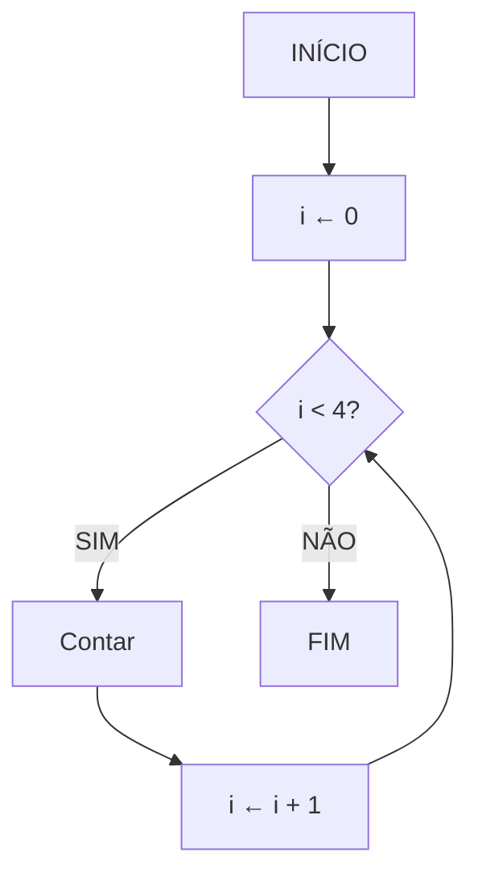
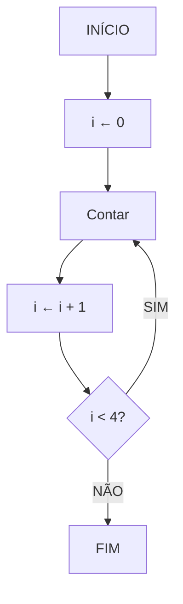

# 📚 Aula 12 - Estruturas de Repetição (Parte 2): Do-While

---

## 🎯 Objetivos da Aula
- Compreender a diferença entre `while` e `do-while`
- Dominar a estrutura `do-while` em Java
- Aprender quando usar cada tipo de loop
- Desenvolver programas com teste no final
- Criar programas interativos com entrada do usuário

---

## 🔄 While vs Do-While: A Diferença Fundamental

### Teste no Início: While


### Teste no Final: Do-While


---

## 🧩 Entendendo a Lógica

### Pseudocódigo: Do-While
```
algoritmo "ContadorDoWhile"
var
    i: inteiro
inicio
    i <- 0
    
    repita
        escreva("Contar ", i)
        i <- i + 1
    até (i >= 4)
fimalgoritmo
```

> **Observação importante**: No Java, usamos `enquanto` (while) no lugar do `até`, mas a lógica se mantém!

---

## 💻 Implementação em Java: Do-While

### Código Básico do Do-While
```java
public class ContadorDoWhile {
    public static void main(String[] args) {
        int i = 0;
        
        do {
            System.out.println("Contar " + i);
            i++;
        }
        while (i < 4);
    }
}
```

### 🔍 Execução Passo a Passo:
| Iteração | i antes | Ação | i depois | Condição |
|----------|---------|------|----------|----------|
| 1 | 0 | "Contar 0" | 1 | 1 < 4 ✓ |
| 2 | 1 | "Contar 1" | 2 | 2 < 4 ✓ |
| 3 | 2 | "Contar 2" | 3 | 3 < 4 ✓ |
| 4 | 3 | "Contar 3" | 4 | 4 < 4 ✗ |

---

## ⚡ Diferenças Cruciais

### Características do Do-While:
- ✅ **Executa pelo menos uma vez** (teste no final)
- ✅ **Ideal para menus** e interações com usuário
- ✅ **Garante execução mínima** do bloco

### Quando o While não executa:
```java
int i = 5;
while (i < 4) {  // Condição falsa desde o início
    System.out.println("Isso NUNCA será executado!");
}
```

### Quando o Do-While executa:
```java
int i = 5;
do {  // Executa PELO MENOS UMA VEZ
    System.out.println("Isso será executado UMA VEZ!");
    i++;
}
while (i < 4);  // Condição testada apenas no final
```

---

## 🎯 Exemplo Prático: Calculadora Interativa

```java
import java.util.Scanner;

public class CalculadoraInterativa {
    public static void main(String[] args) {
        Scanner teclado = new Scanner(System.in);
        String continuar;
        double resultado = 0;
        
        System.out.println("=== CALCULADORA INTERATIVA ===");
        
        do {
            System.out.print("Digite o primeiro número: ");
            double num1 = teclado.nextDouble();
            
            System.out.print("Digite o segundo número: ");
            double num2 = teclado.nextDouble();
            
            System.out.print("Operação (+, -, *, /): ");
            char operacao = teclado.next().charAt(0);
            
            switch (operacao) {
                case '+':
                    resultado = num1 + num2;
                    break;
                case '-':
                    resultado = num1 - num2;
                    break;
                case '*':
                    resultado = num1 * num2;
                    break;
                case '/':
                    if (num2 != 0) {
                        resultado = num1 / num2;
                    } else {
                        System.out.println("Erro: Divisão por zero!");
                        continue;
                    }
                    break;
                default:
                    System.out.println("Operação inválida!");
                    continue;
            }
            
            System.out.println("Resultado: " + resultado);
            System.out.print("Deseja continuar [S/N]? ");
            continuar = teclado.next();
            
        } while (continuar.equalsIgnoreCase("S"));
        
        System.out.println("Calculadora encerrada. Obrigado!");
        teclado.close();
    }
}
```

---

## 📊 Tabela Comparativa: While vs Do-While

| Característica | While | Do-While |
|----------------|-------|-----------|
| **Teste da condição** | No início | No final |
| **Execução mínima** | 0 vezes | 1 vez |
| **Uso ideal** | Quando pode não executar | Quando deve executar pelo menos uma vez |
| **Sintaxe** | `while(condição) { }` | `do { } while(condição);` |
| **Aplicação** | Processamentos condicionais | Menus interativos |

---

## 🔧 Padrões de Uso do Do-While

### Padrão 1: Menu Interativo
```java
import java.util.Scanner;

public class MenuInterativo {
    public static void main(String[] args) {
        Scanner teclado = new Scanner(System.in);
        int opcao;
        
        do {
            System.out.println("\n=== MENU PRINCIPAL ===");
            System.out.println("1 - Cadastrar");
            System.out.println("2 - Listar");
            System.out.println("3 - Excluir");
            System.out.println("0 - Sair");
            System.out.print("Escolha uma opção: ");
            
            opcao = teclado.nextInt();
            
            switch (opcao) {
                case 1:
                    System.out.println("Cadastrando...");
                    break;
                case 2:
                    System.out.println("Listando...");
                    break;
                case 3:
                    System.out.println("Excluindo...");
                    break;
                case 0:
                    System.out.println("Saindo...");
                    break;
                default:
                    System.out.println("Opção inválida!");
            }
            
        } while (opcao != 0);
        
        teclado.close();
    }
}
```

### Padrão 2: Validação de Entrada
```java
import java.util.Scanner;

public class ValidadorEntrada {
    public static void main(String[] args) {
        Scanner teclado = new Scanner(System.in);
        int numero;
        
        do {
            System.out.print("Digite um número entre 1 e 10: ");
            numero = teclado.nextInt();
            
            if (numero < 1 || numero > 10) {
                System.out.println("Número inválido! Tente novamente.");
            }
            
        } while (numero < 1 || numero > 10);
        
        System.out.println("Número válido: " + numero);
        teclado.close();
    }
}
```

---

## 🎮 Exemplo: Jogo de Adivinhação

```java
import java.util.Scanner;
import java.util.Random;

public class JogoAdivinhacao {
    public static void main(String[] args) {
        Scanner teclado = new Scanner(System.in);
        Random random = new Random();
        String jogarNovamente;
        
        do {
            int numeroSecreto = random.nextInt(100) + 1; // 1-100
            int tentativa;
            int tentativas = 0;
            
            System.out.println("\n=== JOGO DA ADIVINHAÇÃO ===");
            System.out.println("Tente adivinhar o número (1-100)");
            
            do {
                System.out.print("Sua tentativa: ");
                tentativa = teclado.nextInt();
                tentativas++;
                
                if (tentativa < numeroSecreto) {
                    System.out.println("MAIOR! Tente um número maior.");
                } else if (tentativa > numeroSecreto) {
                    System.out.println("MENOR! Tente um número menor.");
                } else {
                    System.out.println("PARABÉNS! Você acertou em " + 
                                     tentativas + " tentativas!");
                }
                
            } while (tentativa != numeroSecreto);
            
            System.out.print("Deseja jogar novamente [S/N]? ");
            jogarNovamente = teclado.next();
            
        } while (jogarNovamente.equalsIgnoreCase("S"));
        
        System.out.println("Obrigado por jogar!");
        teclado.close();
    }
}
```

---

## ⚠️ Cuidados Importantes

### 1. **Ponto e vírgula obrigatório**
```java
// ✅ CORRETO
do {
    // código
} while (condição);  // ← PONTO E VÍRGULA OBRIGATÓRIO!

// ❌ ERRADO
do {
    // código
} while (condição)   // ← FALTA PONTO E VÍRGULA!
```

### 2. **Variáveis de controle**
```java
// ✅ CORRETO - variável declarada fora
String resposta;
do {
    // código
    resposta = teclado.next();
} while (resposta.equals("S"));

// ❌ PROBLEMÁTICO - variável dentro do loop
do {
    String resposta = teclado.next();  // Redeclarada a cada loop
} while (resposta.equals("S"));        // ERRO: resposta não existe aqui
```

---

## ✅ Checklist de Aprendizagem

- [ ] Compreendo a diferença entre while e do-while
- [ ] Sei implementar loops com do-while
- [ ] Entendo quando usar cada tipo de loop
- [ ] Domino a sintaxe correta do do-while
- [ ] Consigo criar programas interativos
- [ ] Apliquei do-while em situações práticas
- [ ] Identifico situações onde do-while é mais adequado

---

## 🚀 Exercícios Práticos

### Exercício 1: Calculadora de Médias
```java
// Use do-while para calcular médias de vários alunos
// Pergunte se deseja continuar após cada cálculo
```

### Exercício 2: Validador de Senha
```java
// Use do-while para fazer o usuário digitar a senha correta
// Continue pedindo até acertar
```

### Exercício 3: Sistema de Banco
```java
// Use do-while para criar um menu bancário
// Opções: Saldo, Saque, Depósito, Sair
```

### Exercício 4: Contador Personalizado
```java
// Use do-while para contar de um número inicial até um final
// Pergunte se quer fazer outra contagem ao terminar
```

---

## 🎉 Conclusão

Nesta aula aprendemos:
- ✅ **Estrutura `do-while`** para testes no final
- ✅ **Diferenças fundamentais** entre while e do-while
- ✅ **Quando usar cada tipo** de loop
- ✅ **Padrões comuns** com menus interativos
- ✅ **Cuidados importantes** com a sintaxe

**Próxima aula:** Estrutura `for` para loops controlados!

---

> 💡 **Dica do Professor**: "Use do-while quando você precisa garantir que o bloco execute pelo menos uma vez. É perfeito para menus, validações e qualquer situação onde a primeira execução é obrigatória. Pratique criando pequenos programas interativos para solidificar o conhecimento!"