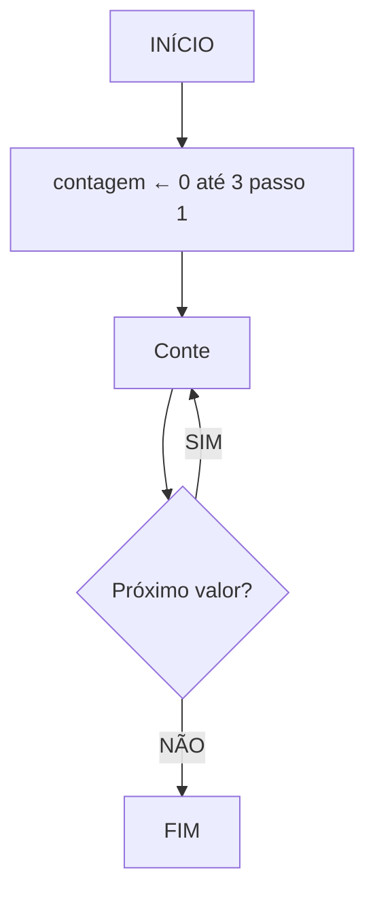

# 📚 Aula 13 - Estruturas de Repetição (Parte 3): For

---

## 🎯 Objetivos da Aula
- Dominar a estrutura `for` em Java
- Compreender a variável de controle automática
- Aprender sobre laços aninhados
- Desenvolver programas com loops controlados
- Criar matrizes e tabuadas usando for

---

## 🔄 Revisão das Estruturas de Repetição

### Já Aprendemos:
- **`while`** → teste lógico no início
- **`do-while`** → teste lógico no final

### Agora Veremos:
- **`for`** → variável de controle automática

---

## 🏗️ Fluxograma: Estrutura For



### Característica Principal:
A estrutura `for` já faz o **looping automaticamente** - não precisamos fazer `c = c + 1` manualmente!

---

## 💡 Representação em Pseudocódigo

```
algoritmo "ContadorFor"
var
    contagem: inteiro
inicio
    para contagem de 0 até 3 passo 1 faça
        escreva("Conte ", contagem)
    fimpara
fimalgoritmo
```

---

## 💻 Implementação em Java: For Básico

### Sintaxe do For
```java
for (inicialização; condição; incremento) {
    // bloco de código
}
```

### Código Básico
```java
public class ContadorFor {
    public static void main(String[] args) {
        for (int contagem = 0; contagem <= 3; contagem++) {
            System.out.println("Conte " + contagem);
        }
    }
}
```

### 🔍 Execução Passo a Passo:
| Iteração | contagem | Condição | Saída |
|----------|----------|----------|-------|
| 1 | 0 | 0 <= 3 ✓ | "Conte 0" |
| 2 | 1 | 1 <= 3 ✓ | "Conte 1" |
| 3 | 2 | 2 <= 3 ✓ | "Conte 2" |
| 4 | 3 | 3 <= 3 ✓ | "Conte 3" |
| 5 | 4 | 4 <= 3 ✗ | (para) |

---

## 🎯 Exemplo Prático: Tabuada

```java
import java.util.Scanner;

public class Tabuada {
    public static void main(String[] args) {
        Scanner teclado = new Scanner(System.in);

        System.out.print("Digite um número: ");
        int numero = teclado.nextInt();

        System.out.println("\n=== TABUADA DO " + numero + " ===");
        
        for (int contador = 0; contador <= 10; contador++) {
            int resultado = numero * contador;
            System.out.printf("%d x %d = %d\n", numero, contador, resultado);
        }
        
        teclado.close();
    }
}
```

### 🧩 Explicação:
- `int contador = 0` → Inicializa o contador em 0
- `contador <= 10` → Continua enquanto contador for ≤ 10
- `contador++` → Incrementa 1 a cada iteração
- `printf` → Formata a saída de forma organizada

---

## 🔄 Variações do For

### Contagem Regressiva
```java
public class ContagemRegressiva {
    public static void main(String[] args) {
        for (int i = 10; i >= 0; i--) {
            System.out.println(i + "...");
        }
        System.out.println("Fogo! 🚀");
    }
}
```

### Incremento Diferente
```java
public class IncrementoDiferente {
    public static void main(String[] args) {
        // Conta de 2 em 2
        for (int i = 0; i <= 10; i += 2) {
            System.out.println("Número: " + i);
        }
        
        // Conta de 5 em 5 (regressivo)
        for (int i = 50; i >= 0; i -= 5) {
            System.out.println("Valor: " + i);
        }
    }
}
```

---

## 🧩 Laços Aninhados (Nested Loops)

### Conceito:
Um loop dentro de outro loop. Muito útil para trabalhar com matrizes e tabelas.

### Fluxograma:
```
inicio
i ← 1 até 3 passo 1
  j ← 0 até 3 passo 2
fim
```

### Combinações Resultantes:
| i | j |
|---|---|
| 1 | 0 |
| 1 | 2 |
| 2 | 0 |
| 2 | 2 |
| 3 | 0 |
| 3 | 2 |

---

## 💻 Exemplo: Laços Aninhados

### Código Básico
```java
public class Matriz {
    public static void main(String[] args) {
        for (int i = 0; i < 3; i++) {
            for (int j = 0; j < 2; j++) {
                System.out.printf("%d %d\n", i + 1, j + 1);
            }
        }
    }
}
```

### 🔍 Saída Esperada:
```
1 1
1 2
2 1
2 2
3 1
3 2
```

### 🧩 Explicação:
- **Loop externo** (`i`) controla as linhas
- **Loop interno** (`j`) controla as colunas
- Para cada valor de `i`, todos os valores de `j` são executados

---

## 🎮 Exemplos Práticos com Laços Aninhados

### Exemplo 1: Tabuada Completa
```java
public class TabuadaCompleta {
    public static void main(String[] args) {
        System.out.println("=== TABUADA COMPLETA ===");
        
        for (int i = 1; i <= 10; i++) {          // Números de 1 a 10
            System.out.println("\nTabuada do " + i + ":");
            
            for (int j = 0; j <= 10; j++) {      // Multiplicadores de 0 a 10
                System.out.printf("%d x %d = %d\n", i, j, i * j);
            }
        }
    }
}
```

### Exemplo 2: Padrão de Asteriscos
```java
public class PadraoAsteriscos {
    public static void main(String[] args) {
        for (int linha = 1; linha <= 5; linha++) {
            for (int coluna = 1; coluna <= linha; coluna++) {
                System.out.print("* ");
            }
            System.out.println(); // Quebra de linha
        }
    }
}
```

### 🔍 Saída:
```
* 
* * 
* * * 
* * * * 
* * * * * 
```

### Exemplo 3: Matriz Numérica
```java
public class MatrizNumerica {
    public static void main(String[] args) {
        for (int i = 1; i <= 4; i++) {
            for (int j = 1; j <= 4; j++) {
                System.out.printf("(%d,%d) ", i, j);
            }
            System.out.println(); // Nova linha após cada linha da matriz
        }
    }
}
```

### 🔍 Saída:
```
(1,1) (1,2) (1,3) (1,4) 
(2,1) (2,2) (2,3) (2,4) 
(3,1) (3,2) (3,3) (3,4) 
(4,1) (4,2) (4,3) (4,4) 
```

---

## ⚡ Break e Continue no For

### Usando Break
```java
public class BreakNoFor {
    public static void main(String[] args) {
        for (int i = 1; i <= 10; i++) {
            if (i == 5) {
                break; // Para o loop quando i for 5
            }
            System.out.println("Número: " + i);
        }
        System.out.println("Loop interrompido!");
    }
}
```

### Usando Continue
```java
public class ContinueNoFor {
    public static void main(String[] args) {
        for (int i = 1; i <= 10; i++) {
            if (i % 2 == 0) { // Se for par
                continue; // Pula para próxima iteração
            }
            System.out.println("Número ímpar: " + i);
        }
    }
}
```

---

## 📊 Tabela Comparativa: While vs For

| Característica | While | For |
|----------------|-------|-----|
| **Inicialização** | Fora do loop | Dentro da declaração |
| **Condição** | Teste no início | Teste no início |
| **Incremento** | Manual (`i++`) | Automático (`i++`) |
| **Uso ideal** | Quando não sabemos quantas iterações | Quando sabemos quantas iterações |
| **Controle** | Mais flexível | Mais estruturado |

---

## 🔧 Padrões Comuns com For

### Padrão 1: Contagem Simples
```java
for (int i = 0; i < n; i++) {
    // Processamento
}
```

### Padrão 2: Iteração em Arrays (próximas aulas)
```java
for (int i = 0; i < array.length; i++) {
    // Processa cada elemento
}
```

### Padrão 3: Laços Aninhados para Matrizes
```java
for (int i = 0; i < linhas; i++) {
    for (int j = 0; j < colunas; j++) {
        // Processa elemento da matriz
    }
}
```

---

## ✅ Checklist de Aprendizagem

- [ ] Compreendo a estrutura `for` e sua sintaxe
- [ ] Sei usar variáveis de controle automáticas
- [ ] Domino laços aninhados e suas aplicações
- [ ] Consigo criar tabuadas e padrões com for
- [ ] Entendo a diferença entre break e continue
- [ ] Apliquei for em situações práticas
- [ ] Criei programas com múltiplos níveis de loops

---

## 🚀 Exercícios Práticos

### Exercício 1: Números Primos
```java
// Use for para encontrar números primos de 1 a 100
```

### Exercício 2: Pirâmide de Números
```java
// Use laços aninhados para criar:
// 1
// 1 2
// 1 2 3
// 1 2 3 4
```

### Exercício 3: Calculadora de Fatorial
```java
// Use for para calcular fatorial de um número
```

### Exercício 4: Tabuada Personalizada
```java
// Peça início e fim, mostre tabuada nesse intervalo
```

---

## 🎉 Conclusão da Trilogia de Repetição

### Resumo do que Aprendemos:
1. **Aula 11**: `while` → teste no início, flexível
2. **Aula 12**: `do-while` → teste no final, execução garantida
3. **Aula 13**: `for` → controle automático, estruturado

### Próximos Passos:
- Arrays e coleções
- Métodos e funções
- Programação orientada a objetos

---

> 💡 **Dica **: "O `for` é sua melhor escolha quando você sabe quantas vezes quer repetir. Use laços aninhados para trabalhar com dados bidimensionais. Pratique criando diferentes padrões e tabuadas - isso solidificará seu entendimento sobre controle de fluxo!"

**Parabéns por completar as estruturas de repetição! 🎊**