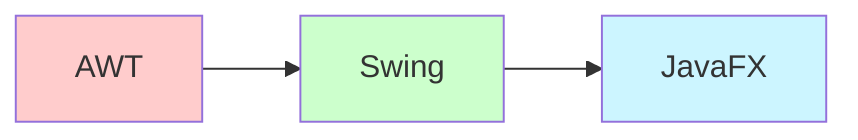
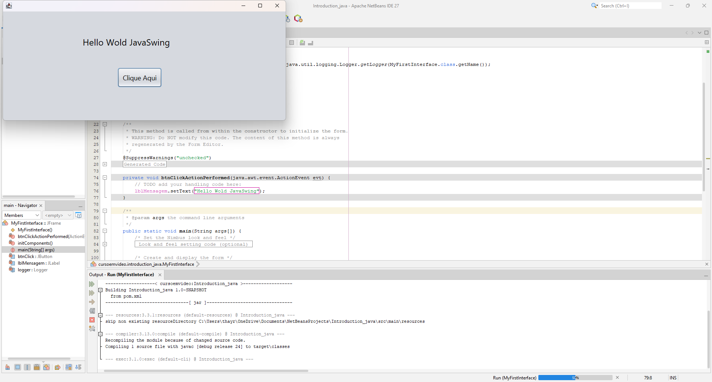

# 📚 Lesson 5 - Introduction to Swing and JavaFX

## Table of Contents
1. [Introduction to Java GUI](#1-introduction-to-java-gui)
2. [Part 1: Developing with Swing](#2-part-1-developing-with-swing)
3. [Part 2: Developing with JavaFX](#3-part-2-developing-with-javafx)
4. [Comparison and Analysis](#4-comparison-and-analysis)
5. [Application Distribution](#5-application-distribution)
6. [Conclusion](#6-conclusion)

---

## 1. Introduction to Java GUI

### 📦 Before We Start...

Java works through **packages**. Think of a **popular car**: it comes with basic functions, but if we want to add something like **power windows** or **power locks**, we need to include these items separately.

In Java, the same happens:

* Additional functions can be imported as packages.
* Ex.: `import powerLocks;` or `import powerWindows;`.

However, just like **headlights** come standard in any car, some libraries in Java are included by default, like the **`java.lang`** package (mathematical operations, loop structures, etc.).

---

### 🔧 Some Important Java Libraries

* **`java.applet`** → creation of small applications/applets.
* **`java.util`** → utilities (lists, collections, dates).
* **`java.net`** → network programming (URLs, sockets).
* **`javax.sound`** → audio manipulation.
* **`javax.swing`** → graphical interfaces.

---

### 📊 Evolution of Java Graphical Interfaces



* **AWT (Abstract Window Toolkit)** → First graphics library, OS-dependent
* **Swing** → More components, platform-independent
* **JavaFX** → Modern platform for various platforms (computers, mobile devices, etc.)

---

## 2. Part 1: Developing with Swing

### 🎯 What is Swing?

**Swing** is a Java library for creating **graphical user interfaces (GUIs)** that work on Windows, Mac, and Linux.

#### History

* Before Swing, there was **AWT (Abstract Window Toolkit)**.
* AWT was heavily OS-dependent → simple, but limited.
* Swing brought **more visual components**, platform independence, and greater flexibility.

To use it:

```java
import javax.swing.*;
```

---

### ⚖️ NetBeans vs IntelliJ IDEA

| Feature | NetBeans | IntelliJ IDEA |
|---------|----------|---------------|
| GUI Builder | Native (Matisse) | Optional plugin |
| Ease of Use | ⭐⭐⭐⭐⭐ | ⭐⭐⭐ |
| Generated Code | More verbose | Cleaner |
| Best For | Beginners | Complex projects |

🔹 **NetBeans**
* Has a **native GUI Builder (Matisse)**.
* Allows drag and drop of buttons, labels, panels, etc.
* Good for starting, but in large projects the generated code can be **hard to maintain**.

🔹 **IntelliJ IDEA**
* No native GUI Builder for Swing.
* Focused on **JavaFX + Scene Builder** for modern interfaces.
* Has an optional plugin (*GUI Designer*), but it's less practical.

👉 In this lesson, we'll use **NetBeans** to learn Swing.

---

### 🛠️ Creating Our First Interface in NetBeans

**Prerequisites**: JDK + NetBeans installed.

#### Step 1: Create the Project

* `File` → `New Project` or **Ctrl + Shift + N**
* `Categories` → **Java With Ant**
* `Project type` → **Java Application**
* `Project name` → `MyFirstInterface`

#### Step 2: Create the JFrame

* Right-click on the package.
* `New` → **JFrame Form...**
* `Categories` → **Swing GUI Forms**
* `File Types` → **JFrame Form**
* Class name → `fundamentals.SwingInterface`

#### Step 3: Building the Interface

* Drag a **Button** and a **Label** to the central window.
* Configure the button in properties tab → change text to **"Click here"**.


*(Image: button editing in NetBeans)*

* Change variable names (Right-click → **Change Variable Name**):

    * Label → `lblMessage`
    * Button → `btnClick`

Now run the program → the window will open, but nothing happens when clicking the button.

---

### ⚡ Adding Action to the Button

* Right-click on the button.
* Go to `Events` → `Action` → `ActionPerformed`.
* The code will automatically open in `Source`.

Add inside the method:

```java
private void btnClickActionPerformed(java.awt.event.ActionEvent evt) {  
    lblMessage.setText("Hello World JavaSwing");  
}
```


*(Image: code running with button)*

---

### 📝 Structure of the Generated Code

Simplified excerpt:

```java
// Variables declaration
private javax.swing.JButton btnClick;
private javax.swing.JLabel lblMessage;
// End of variables declaration

public class fundamentals.SwingInterface extends javax.swing.JFrame {

    private void btnClickActionPerformed(java.awt.event.ActionEvent evt) {
        lblMessage.setText("Hello, World!");
    }
}
```

---

### 🧠 Concepts Involved

Even though simple, the code already introduces some **OOP (Object-Oriented Programming)** concepts:

* **extends** → Inheritance (the `fundamentals.SwingInterface` class inherits from `javax.swing.JFrame`).
* **private/public** → Encapsulation (visibility control of attributes and methods).
* **Events** → Event-oriented programming: actions are triggered when user interacts (ex.: button click).

---

### ✅ Learning Checklist - Swing

- [ ] Understood the concept of Swing components
- [ ] Created an interface with button and label
- [ ] Added an event to the button
- [ ] Understood the applied OOP concepts
- [ ] Tested the working application

---

## 3. Part 2: Developing with JavaFX

### 🌟 Why JavaFX Replaced Swing?

* **Better graphic performance** - GPU acceleration
* **CSS styling** - Separation between design and logic
* **More modern and intuitive API** - Easier to learn and use
* **Better touch device support** - Touch-friendly interfaces
* **More flexible layouts** - Better responsiveness

---

### 🛠️ Mini-Guide: JavaFX + FXML in IntelliJ (Windows)

> **Objective:** create a simple Java project that uses **JavaFX + FXML** in IntelliJ IDEA, open FXML in **Scene Builder** and run without errors.

---

#### 1) Prerequisites

* **JDK** installed (recommend LTS: 17 or 21; also works with 24).
* **JavaFX SDK** compatible with your JDK (ex.: JDK 21 → JavaFX 21; JDK 24 → JavaFX 24). Extract to a folder, ex.: `C:\Users\yourUser\Documents\javafx-sdk-24.0.1`.
* **Scene Builder** installed (Gluon).

> **Tip:** always combine compatible versions of JDK and JavaFX.

---

#### 2) Create the Project in IntelliJ

1. **New Project** → **Java**.
2. Choose the **Project SDK** (your JDK).
3. Create empty project.

---

#### 3) Add JavaFX to the Project (Libraries)

1. **File → Project Structure… (Ctrl+Alt+Shift+S)**.
2. **Libraries** → click **+** → **Java**.
3. Point to the **`lib`** folder of JavaFX (ex.: `…\javafx-sdk-24.0.1\lib`).
4. **Apply** and **OK**.

> This resolves the imports (`javafx.*`) during compilation.

---

#### 4) Configure Execution (VM Options)

1. **Run → Edit Configurations…**.
2. Select your configuration (class `Main`).
3. In **VM Options**, add (adjust the path to your `lib` folder):

```
--module-path "C:\\Users\\yourUser\\Documents\\javafx-sdk-24.0.1\\lib" --add-modules javafx.controls,javafx.fxml
```

> Without this, when running appears: *"JavaFX runtime components are missing..."*.

---

#### 5) Structure and Base Code

Create a **package** (ex.: `fundamentals.JavaFXInterface`) and inside it **three files**:

**Main.java**

```java
package fundamentals.JavaFXInterface;

import javafx.application.Application;
import javafx.fxml.FXMLLoader;
import javafx.scene.Scene;
import javafx.stage.Stage;

public class Main extends Application {
    @Override
    public void start(Stage stage) throws Exception {
        FXMLLoader fxmlLoader = new FXMLLoader(Main.class.getResource("hello-view.fxml"));
        Scene scene = new Scene(fxmlLoader.load(), 400, 300);
        stage.setTitle("JavaFX with FXML!");
        stage.setScene(scene);
        stage.show();
    }

    public static void main(String[] args) {
        launch();
    }
}
```

**hello-view\.fxml**

```xml
<?xml version="1.0" encoding="UTF-8"?>

<?import javafx.scene.control.*?>
<?import javafx.scene.layout.*?>

<VBox xmlns="http://javafx.com/javafx" xmlns:fx="http://javafx.com/fxml"
      fx:controller="fundamentals.Lesson5.FXInterface.HelloController" spacing="10" alignment="CENTER">

    <Label fx:id="label" text="Hello, JavaFX with FXML!"/>
    <Button text="Click here" onAction="#onHelloButtonClick"/>
</VBox>
```

**HelloController.java**

```java
package fundamentals.JavaFXInterface;

import javafx.fxml.FXML;
import javafx.scene.control.Label;

public class HelloController {
    @FXML
    private Label label;

    @FXML
    protected void onHelloButtonClick() {
        label.setText("Button clicked!");
    }
}
```

---

#### 6) Where to Save FXML (classpath)

Two valid options:

* **Same package folder** (as above). The `FXMLLoader` uses `Main.class.getResource("hello-view.fxml")`.
* **Resources folder**: create `resources/` and mark as **Resources Root**. Access with `Main.class.getResource("/hello-view.fxml")`.

> Use **one** of these patterns and maintain consistency.

---

#### 7) Integrate with Scene Builder

1. **Settings → Languages & Frameworks → JavaFX** → in **Path to Scene Builder**, point to Scene Builder executable.
2. Right-click on `hello-view.fxml` → **Open in Scene Builder**.
3. In Scene Builder:

    * **Controller**: fill **Controller class** with `fundamentals.Lesson5.FXInterface.HelloController`.
    * Select the **Label** → **Code** → set **fx:id = label**.
    * Select the **Button** → **Code** → set **On Action = onHelloButtonClick**.
4. Save and return to IntelliJ.

---

#### 8) Run

* Select the configuration pointing to class **`fundamentals.Lesson5.FXInterface.Main`**.
* Click **Run**. The window should open and the button should update the label text.

---

#### 9) Warnings (JDK 24)

It's normal to see warnings like "restricted method" and "terminally deprecated" with JDK 24. They **do not prevent** execution.

To reduce native access warnings, you can add to **VM Options**:

```
--enable-native-access=javafx.graphics
```

> Some deprecation warnings may remain. Alternative: use JDK LTS (21) + corresponding JavaFX.

---

#### 10) Common Problems (and Quick Fix)

* **Error:** `JavaFX runtime components are missing…`

    * **Cause:** VM Options without `--module-path`/`--add-modules`.
    * **Fix:** see section **4**.

* **Error when clicking button:** `NullPointerException` in `label.setText(...)`

    * **Cause:** missing `fx:id="label"` in FXML or wrong `Controller`.
    * **Fix:** see section **5/7**.

* **`java.lang.ClassNotFoundException` of Controller**

    * **Cause:** `fx:controller` with wrong package/class name.
    * **Fix:** check `fx:controller="your.package.HelloController"`.

* **`Location is not set` or `... not found` when loading FXML**

    * **Cause:** incorrect resource path.
    * **Fix:** if in same package, use `"hello-view.fxml"`; if in `resources`, use `"/hello-view.fxml"`.

* **Scene Builder doesn't open from IntelliJ**

    * **Fix:** configure path to Scene Builder executable (section 7.1).

---

#### 11) Final Checklist (always works)

* [ ] JavaFX added in **Libraries**.
* [ ] VM Options with `--module-path …\lib` and `--add-modules javafx.controls,javafx.fxml`.
* [ ] `fx:controller` correct in FXML.
* [ ] `fx:id` defined for nodes used in controller.
* [ ] `onAction` mapped to `@FXML` public or protected methods.
* [ ] Correct `Main` in Run Configuration.

Ready! This is the minimal and reliable workflow to run **JavaFX + FXML + Scene Builder** in IntelliJ.

---

### 🔍 Advantages of FXML

FXML offers several advantages over pure code:

1. **Separation of concerns** - Logic and interface in different files
2. **Visual design** - Interface created visually in Scene Builder
3. **Maintainability** - Easier to modify layout without changing Java code
4. **Reusability** - Interface components can be reused
5. **Teamwork** - Designers and developers can work simultaneously

---

### ✅ Learning Checklist - JavaFX

- [ ] Understood JavaFX architecture
- [ ] Correctly configured the project in IntelliJ
- [ ] Created FXML, Controller and Main files
- [ ] Used Scene Builder to design the interface
- [ ] Connected events between FXML and Controller
- [ ] Tested the working application

---

## 4. Comparison and Analysis

### ⚖️ Differences Between Swing and JavaFX

**Swing:**
```java
package coursevideo.introduction_java;
public class MyFirstInterface extends javax.swing.JFrame {

    private static final java.util.logging.Logger logger = java.util.logging.Logger.getLogger(MyFirstInterface.class.getName());

    public MyFirstInterface() {
        initComponents();
    }
    
    private void btnClickActionPerformed(java.awt.event.ActionEvent evt) {
        lblMessage.setText("Hello World JavaSwing");
    }   

    public static void main(String args[]) {
        java.awt.EventQueue.invokeLater(() -> new MyFirstInterface().setVisible(true));
    }

    private javax.swing.JButton btnClick;
    private javax.swing.JLabel lblMessage;
}
```

**JavaFX:**

```java
package fundamentals.JavaFXInterface;

import javafx.application.Application;
import javafx.fxml.FXMLLoader;
import javafx.scene.Scene;
import javafx.stage.Stage;

public class Main extends Application {
    @Override
    public void start(Stage stage) throws Exception {
        FXMLLoader fxmlLoader = new FXMLLoader(Main.class.getResource("hello-view.fxml"));
        Scene scene = new Scene(fxmlLoader.load(), 400, 300);
        stage.setTitle("JavaFX with FXML!");
        stage.setScene(scene);
        stage.show();
    }

    public static void main(String[] args) {
        launch();
    }
}
```

---

### 📊 Technical Comparison

| Feature | Swing | JavaFX |
|---------|-------|--------|
| **Architecture** | Based on AWT | Own graphics engine |
| **Performance** | Good | Superior (GPU acceleration) |
| **Styling** | Look and Feel | CSS |
| **Layout** | Layout managers | Layout managers + CSS |
| **FXML** | Not supported | Native support |
| **Scene Builder** | No | Yes |
| **3D** | Limited | Robust support |
| **Multi-touch** | Limited | Full support |

---

### 🎯 When to Use Each Technology

#### Use Swing when:
- Working with legacy systems
- Developing simple corporate applications
- Needing compatibility with very old JDKs
- Having team only familiar with Swing

#### Use JavaFX when:
- Developing new projects
- Needing modern and rich interfaces
- Requiring complex animations or 3D graphics
- Wanting CSS styling
- Needing touch/multitouch support

---

## 5. Application Distribution

Now we have our application, but to run it we would need an IDE. "But I want to send the executable for someone to see my project!"

That is, we will generate the **Bytecode** for people to run!

> ⚠️ The person needs JRE for the JVM to execute the bytecode!

In NetBeans, let's generate a JAR to run a Swing application:

---

## 📝 Mini Guide: Create and Run `.jar` in NetBeans

### 1. Create the Project

* **File > New Project > Java with Ant > Java Application**
* Project name: `TestJar`
* ❌ Uncheck *Create Main Class* (we'll create it manually).

---

### 2. Create the Main Class

```java
import javax.swing.JButton;
import javax.swing.JFrame;
import javax.swing.JOptionPane;

public class Main {
    public static void main(String[] args) {
        JFrame frame = new JFrame("Test JAR");
        JButton button = new JButton("Click here");

        button.addActionListener(e ->
            JOptionPane.showMessageDialog(frame, "It worked! 🎉")
        );

        frame.add(button);
        frame.setSize(300, 200);
        frame.setDefaultCloseOperation(JFrame.EXIT_ON_CLOSE);
        frame.setLocationRelativeTo(null);
        frame.setVisible(true);
    }
}
```

---

### 3. Configure Main Class in NetBeans

* Right-click on project → **Properties**
* Go to **Run**
* In **Main Class**, put:

  ```
  Main
  ```

  (or `package.Main` if inside a package).

---

### 4. Generate the `.jar`

* In menu: **Run > Clean and Build Project**
* NetBeans creates the `.jar` in:

  ```
  dist/TestJar.jar
  ```

---

### 5. Run the `.jar` on Windows

1. Open **Command Prompt** (`Win + R`, type `cmd`, Enter).
2. Navigate to `dist` folder:

   ```bat
   cd C:\Users\YOUR_USER\Documents\NetBeansProjects\TestJar\dist
   ```
3. Run the `.jar`:

   ```bat
   java -jar TestJar.jar
   ```

💡 If you get error **"java is not recognized"**, use full path to your JDK, example:

```bat
"C:\Users\user\.jdks\openjdk-24.0.1\bin\java.exe" -jar TestJar.jar
```

---

### ✅ Result

* Opens a window with a button.
* When clicked, shows message **"It worked! 🎉"**.

---

### 📦 Distributing JavaFX Applications

To distribute JavaFX applications, there are several approaches:

1. **Traditional JAR** - Similar to Swing, but requires JavaFX in classpath
2. **jlink** - Creates custom JRE with only necessary modules
3. **jpackage** (JDK 14+) - Creates native installers (EXE, MSI, DMG, DEB)
4. **Java Web Start** - Web distribution (deprecated)

Example with jpackage:
```bash
jpackage --input target/ --name MyApp --main-jar myapp.jar --main-class com.myapp.Main
```

---

## 6. Conclusion

### 🎓 What We Learned Today

1. **Introduction to Java graphical interfaces** and their evolution
2. **Swing** - Creating interfaces with NetBeans GUI Builder
3. **JavaFX** - Configuration, FXML, Scene Builder and MVC architecture
4. **Comparison** between the two technologies and when to use each
5. **Distribution** - How to create and run JAR files

---

### 📋 Practical Exercises

1. Create the same simple interface (button + label) in both technologies
2. Add a text field and a button that concatenates text with a greeting
3. Modify the JavaFX interface style using CSS
4. Create a functional JAR of each application and test on another machine

---

### 🔍 Additional Resources

- [Official JavaFX Documentation](https://openjfx.io/)
- [JavaFX Tutorials by CodeMakery](https://code.makery.ch/library/javafx-tutorial/)
- [Scene Builder Documentation](https://gluonhq.com/products/scene-builder/)
- [Java Swing Tutorial](https://docs.oracle.com/javase/tutorial/uiswing/)

Congratulations on completing this lesson! You've taken a big step in Java graphical interface development. 🎉