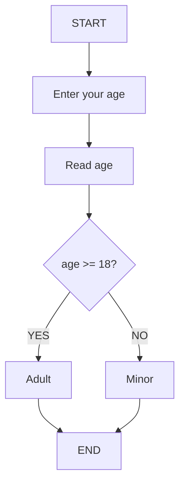
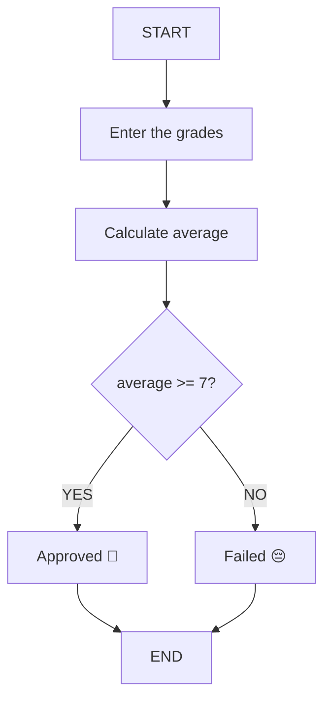

# 📚 Lesson 9 - Conditional Structures

---

## 🎯 Lesson Objectives

* Understand the logic behind **conditional structures**
* Visualize the **decision flow** using flowcharts
* Practice the structure with examples in **Pseudocode** and **Java**
* Develop small programs using **`if` and `else`**

---

## 🧠 1. Understanding Conditional Logic

**Conditional structures** are used when a program needs to **make decisions** based on a condition.

📘 **Analogy:**
Think of it like a traffic light:

> If the light is green → go.
> If it’s red → stop.

---

## 🗂️ 2. Visualizing with a Flowchart

Before coding, let's understand the **logical flow**.

### 🔽 Flowchart: Age Verification



This flowchart clearly shows **how the decision is made** before it’s turned into code.

---

## 💡 3. Representing the Logic in Pseudocode

```portugol
algorithm "CheckAge"
var
    age: integer
begin
    Write("Enter your age: ")
    Read(age)
    
    If age >= 18 then
        Write("You are an adult")
    Else
        Write("You are a minor")
    EndIf
end
```

This is the pure logic — independent of any programming language — great for **training reasoning**.

---

## 💻 4. Implementing in Java

Now, let’s apply this logic in **Java**.

### Example 1: Age Verification

```java
import java.util.Scanner;

public class Main {
    public static void main(String[] args) {

        Scanner input = new Scanner(System.in);

        System.out.print("Enter your age: ");
        int age = input.nextInt();

        System.out.println("Your age is: " + age);

        if (age >= 18) {
            System.out.println("You are an adult");
        } else {
            System.out.println("You are a minor");
        }

        input.close();
    }
}
```

### 🧩 Code Explanation:

* `Scanner` → used to capture user input.
* `if` → checks whether the condition is true.
* `else` → runs when the condition is false.
* Curly braces `{}` define the block of code to be executed.

---

## ⚙️ 5. Practical Example: Grade Checker

Now, let’s create a simple system that checks if a student is **approved or failed** based on their average grade.

### Flowchart: Grade System



### Java Code:

```java
import java.util.Scanner;

public class GradeChecker {
    public static void main(String[] args) {
        Scanner input = new Scanner(System.in);

        System.out.print("Enter the first grade: ");
        float grade1 = input.nextFloat();

        System.out.print("Enter the second grade: ");
        float grade2 = input.nextFloat();

        float average = (grade1 + grade2) / 2;

        System.out.printf("Your average is: %.1f\n", average);

        if (average >= 7.0) {
            System.out.println("Student approved! 🎉");
        } else {
            System.out.println("Student failed. 😔");
        }

        input.close();
    }
}
```

---

## 🔧 6. Best Practices

### ✅ **RECOMMENDED:**

```java
if (age >= 18) {
    System.out.println("Adult");
} else {
    System.out.println("Minor");
}
```

### ❌ **AVOID:**

```java
if (age >= 18) 
    System.out.println("Adult");
else 
    System.out.println("Minor");
```

**Always use curly braces `{}`** to avoid logic errors!

---

## 🎯 7. Practical Exercises

### Exercise 1: BMI Calculator

```java
// Calculate BMI = weight / (height * height)
// If BMI >= 25 → "Overweight", else → "Normal weight"
```

### Exercise 2: Bonus Checker

```java
// If sales > 10000 → 10% bonus, else → 5% bonus
```

### Exercise 3: Age Classifier

```java
// If age < 13 → "Child", 13–17 → "Teenager", 18+ → "Adult"
```

---

## ✅ Conclusion: Learning Checklist

* [ ] I understand the concept of conditional structures
* [ ] I can read and create flowcharts
* [ ] I understand the logic behind `if/else`
* [ ] I can convert pseudocode into Java
* [ ] I know the comparison operators
* [ ] I built simple decision-making programs
* [ ] I applied clean and safe coding practices

---
