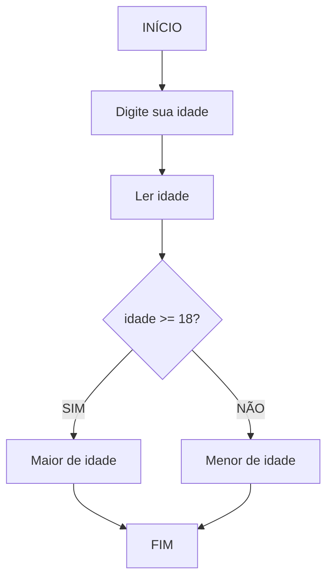
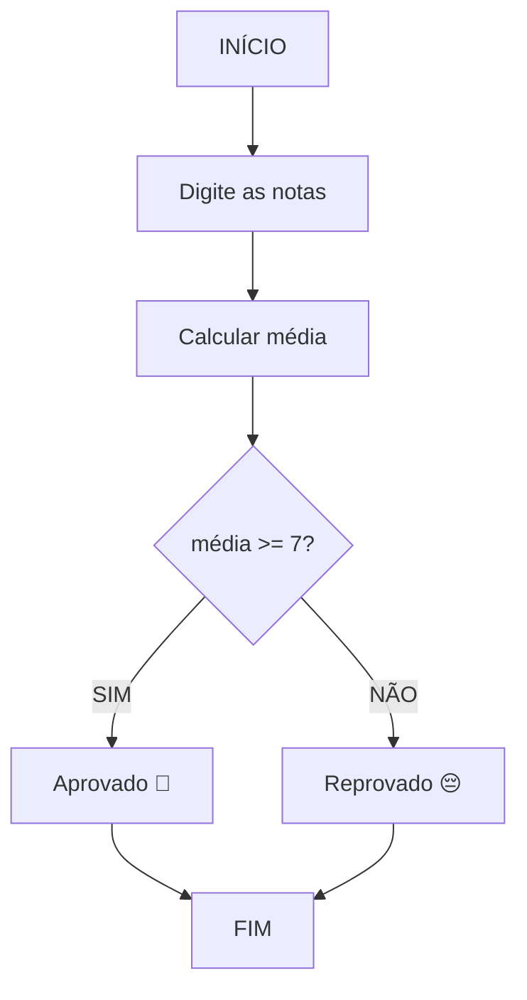

# 📚 Aula 9 - Estruturas Condicionais

---

## 🎯 Objetivos da Aula

* Entender a lógica por trás das **estruturas condicionais**
* Visualizar o **fluxo de decisão** com fluxogramas
* Praticar a estrutura com exemplos em **Portugol** e **Java**
* Desenvolver pequenos programas com **`if` e `else`**

---

## 🧠 1. Entendendo a Lógica Condicional

As **estruturas condicionais** são usadas quando precisamos que o programa **tome decisões** baseadas em uma condição.

📘 **Analogia:**
Pense como se fosse uma placa de trânsito:

> Se o sinal estiver verde → siga.
> Se estiver vermelho → pare.

---

## 🗂️ 2. Visualizando com um Fluxograma

Antes de codificar, vamos entender o **fluxo lógico**.

### 🔽 Fluxograma: Verificação de Maioridade



Esse fluxograma mostra claramente **como a decisão é tomada** antes de ser transformada em código.

---

## 💡 3. Representando a Lógica em Portugol

```portugol
algoritmo "VerificaMaioridade"
var
    idade: inteiro
inicio
    Escreva("Digite sua idade: ")
    Leia(idade)
    
    Se idade >= 18 então
        Escreva("Você é maior de idade")
    Senão
        Escreva("Você é menor de idade")
    FimSe
fimalgoritmo
```

Essa é a lógica pura, sem linguagem de programação específica — ótima para **treinar o raciocínio**.

---

## 💻 4. Implementando em Java

Agora, vamos aplicar essa lógica em **Java**:

### Exemplo 1: Verificação de Maioridade

```java
import java.util.Scanner;

public class Main {
    public static void main(String[] args) {

        Scanner teclado = new Scanner(System.in);

        System.out.print("Digite sua idade: ");
        int idade = teclado.nextInt();

        System.out.println("Sua idade é: " + idade);

        if (idade > 18) {
            System.out.println("Você é maior de idade");
        } else {
            System.out.println("Você é menor de idade");
        }
    }
}
```

### 🧩 Explicando o código:

* `Scanner` → usado para capturar dados digitados pelo usuário.
* `if` → verifica se a condição é verdadeira.
* `else` → executa caso a condição seja falsa.
* As **chaves `{}`** delimitam o bloco de código que será executado.

---

## ⚙️ 5. Exemplo Prático: Verificação de Média

Agora, vamos criar um sistema simples que verifica se o aluno foi **aprovado ou reprovado** com base na média.

### Fluxograma: Sistema de Notas



### Código Java:

```java
import java.util.Scanner;

public class VerificaMedia {
    public static void main(String[] args) {
        Scanner teclado = new Scanner(System.in);

        System.out.print("Digite a primeira nota: ");
        float nota1 = teclado.nextFloat();

        System.out.print("Digite a segunda nota: ");
        float nota2 = teclado.nextFloat();

        float media = (nota1 + nota2) / 2;

        System.out.printf("Sua média é: %.1f\n", media);

        if (media >= 7.0) {
            System.out.println("Aluno aprovado! 🎉");
        } else {
            System.out.println("Aluno reprovado. 😔");
        }
        
        teclado.close();
    }
}
```

---

## 🔧 6. Boas Práticas

### ✅ **RECOMENDADO:**
```java
if (idade >= 18) {
    System.out.println("Maior de idade");
} else {
    System.out.println("Menor de idade");
}
```

### ❌ **EVITAR:**
```java
if (idade >= 18) 
    System.out.println("Maior de idade");
else 
    System.out.println("Menor de idade");
```

**Sempre use chaves `{}`** para evitar erros!

---

## 🎯 7. Exercícios Práticos

### Exercício 1: Calculadora de IMC
```java
// Calcule o IMC = peso / (altura * altura)
// Se IMC >= 25 → "Sobrepeso", senão → "Peso normal"
```

### Exercício 2: Verificador de Bônus
```java
// Se vendas > 10000 → bônus de 10%, senão → bônus de 5%
```

### Exercício 3: Classificador de Idade
```java
// Se idade < 13 → "Criança", 13-17 → "Adolescente", 18+ → "Adulto"
```

---

## ✅ Conclusão: Checklist de Aprendizagem

- [ ] Compreendi o conceito de estruturas condicionais
- [ ] Sei interpretar e criar fluxogramas
- [ ] Entendo a lógica por trás do `if/else`
- [ ] Consigo converter Portugol para Java
- [ ] Domino os operadores de comparação
- [ ] Criei programas com decisões simples
- [ ] Apliquei boas práticas de programação

---

