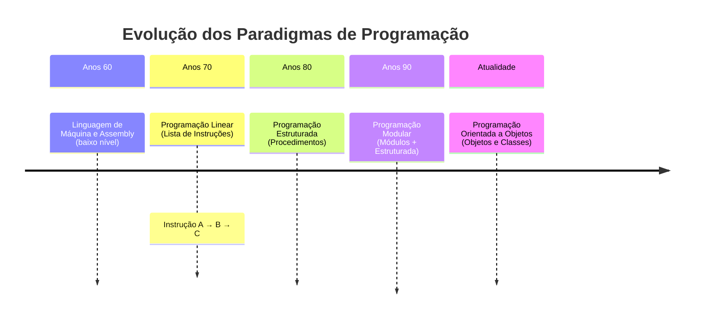
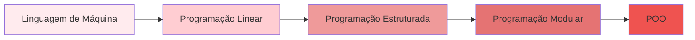
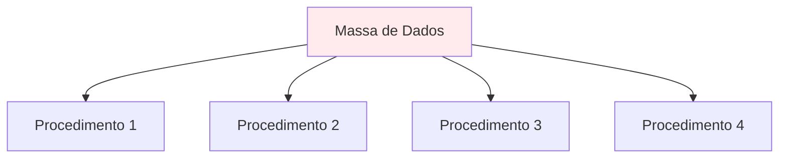
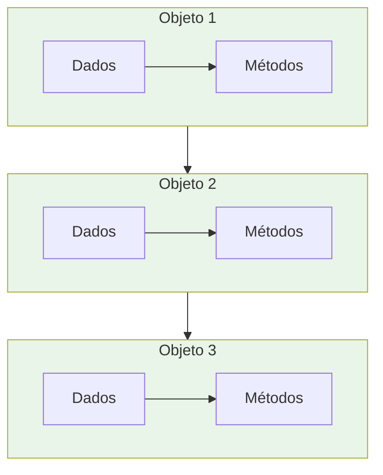

# 📚 Aula 1 - O que é Programação Orientada a Objetos?

---

## 🎯 Objetivos da Aula
- Compreender a origem e evolução da Programação Orientada a Objetos
- Entender os motivos que levaram ao desenvolvimento do paradigma POO
- Conhecer a contribuição de Alan Kay para a POO
- Identificar as principais vantagens da programação orientada a objetos
- Relacionar conceitos de POO com exemplos do mundo real

---

## 🕰️ A Evolução da Programação

### Linha do Tempo dos Paradigmas de Programação:



### A Jornada dos Paradigmas de Programação

**Anos 60**: A programação era feita em **linguagem de máquina ou Assembly**, onde cada computador tinha sua própria arquitetura e conjunto de instruções. Isso gerava grande dificuldade de portabilidade e exigia conhecimento profundo do hardware.

**Programação Linear**: Com o surgimento das linguagens de alto nível, a programação seguia uma abordagem sequencial simples — como uma lista de tarefas:
- Instrução A
- Instrução B
- Instrução C

Cada instrução era executada rigidamente em ordem, sem desvios ou estruturas complexas.

**Programação Estruturada**: Revolucionou ao introduzir o conceito de **procedimentos e funções**, permitindo dividir problemas complexos em partes menores e organizadas. Isso facilitou a criação de sistemas mais elaborados.

**Programação Modular**: Evoluiu a ideia anterior criando **módulos independentes** que agrupavam dados e funcionalidades relacionadas. Esta abordagem facilitava a manutenção e permitia construir sistemas maiores através da composição de módulos especializados.



Cada etapa nesta evolução representou um avanço significativo na capacidade de criar software mais complexo, mantenível e adaptável às necessidades crescentes da indústria de tecnologia.

---

## 🧠 O Nascimento da POO: A Visão de Alan Kay

### Quem foi Alan Kay?
- Cientista da computação com formação em matemática e biologia
- Trabalhou no Xerox PARC (Palo Alto Research Center)
- Desenvolveu os primeiros conceitos de Programação Orientada a Objetos
- Criador da linguagem Smalltalk (primeira linguagem POO)
- Visionário do conceito do Dynabook (que inspirou os notebooks modernos)

### A Inspiração Biológica:
Alan Kay propôs um postulado revolucionário:
> "O computador ideal deve funcionar como um organismo vivo, onde cada célula se relaciona com outras para alcançar um objetivo, mas cada uma funcionando de forma autônoma. As 'células' poderiam também agrupar-se para resolver outros problemas ou desempenhar outras funções."

### O Smalltalk:
A primeira linguagem verdadeiramente orientada a objetos já contava com:
- Classes e objetos
- Atributos e métodos
- Herança e polimorfismo
- Mensagens entre objetos

---

## 🔄 Mudança de Paradigma: Dados vs Objetos

### Programação Tradicional (Estruturada/Modular):


**Problema**: Todos os procedimentos acessam a mesma massa de dados, precisando filtrar o que realmente necessitam.

### Programação Orientada a Objetos:


**Vantagem**: Cada objeto contém apenas os dados que precisa e os métodos que os manipulam, trabalhando de forma autônoma mas colaborativa.

---

## 🎮 Exemplo Prático: O Controle Remoto

### Abordagem Tradicional:
Precisaríamos nos preocupar com:
- Circuitos elétricos complexos
- Programação de baixo nível
- Todos os detalhes de implementation

### Abordagem POO:
```java
// Modelo base de controle (já existe)
ControleRemoto meuControle = new ControleRemoto();

// Apenas adaptamos o necessário
meuControle.configurarBotao("Volume+", aumentarVolume);
meuControle.configurarBotao("Canal+", proximoCanal);
```

**Benefício**: Reutilizamos um modelo existente, focando apenas nas customizações necessárias.

---

## 💎 As Vantagens da POO: COMERN

A programação orientada a objetos é **COMER NADA**. Na verdade, vamos considerar as seis primeiras letras: **C-O-M-E-R-N**, que formam um acrônimo fácil de memorizar para as principais vantagens da POO.

### C – Confiável (Reliable)
**Princípio**: O isolamento entre as partes gera software seguro. Alterar uma parte não afeta outras.

**Exemplo do Controle Remoto**:
- Objeto "pilha" e objeto "controle remoto" trabalham em conjunto
- Trocar pilha da marca A por B: funciona igual
- Trocar por pilha recarregável: funciona sem alterar o controle

### O – Oportuno (Opportune)
**Princípio**: Ao dividir tudo em partes, várias podem ser desenvolvidas em paralelo.

**Exemplo**:
- Desenvolver carcaça, circuito, botões e LCD separadamente
- Desenvolvimento simultâneo acelera o processo

### M – Manutenível (Maintainable)
**Princípio**: Atualizar software é mais fácil - pequenas modificações beneficiam todas as partes que usam o objeto.

**Exemplo**:
- Trocar pilha comum por recarregável não altera funcionamento
- Ganha vantagem (não comprar mais pilhas) sem retrabalho

### E – Extensível (Extensible)
**Princípio**: O software não é estático - deve crescer para permanecer útil.

**Exemplo**:
- Controle com 4 funções pode ganhar 2 novas funções
- Não precisa recriar do zero, apenas estender capacidades

### R – Reutilizável (Reusable)
**Princípio**: Pode ser usado novamente em outro contexto.

**Exemplo**:
- Controle da câmera A funciona na câmera B compatível
- Mesmo objeto, diferentes contextos

### N – Natural (Natural)
**Princípio**: Mais fácil de entender - preocupa-se mais com funcionalidade que com detalhes de implementação.

**Exemplo**:
- Explicar POO com analogias do mundo real (controles, organismos)
- Acessível mesmo para não-programadores nas explicações conceituais

---

## 🌍 POO no Mundo Real

### Linguagens que usam POO:
- Java (amplamente adotada em enterprise)
- C++ (sistemas e jogos)
- Python (data science, web, automação)
- C# (aplicações Windows, games)
- PHP (web development)
- Ruby (web development)

### Aplicações Práticas:
- Sistemas bancários
- Redes sociais
- Jogos eletrônicos
- Aplicativos móveis
- Sistemas operacionais
- Inteligência Artificial

---

## 📋 Checklist de Aprendizagem

- [ ] Compreendi a evolução histórica dos paradigmas de programação
- [ ] Entendi a contribuição de Alan Kay para o desenvolvimento da POO
- [ ] Assimilei a analogia biológica por trás do paradigma orientado a objetos
- [ ] Diferencio programação tradicional da orientada a objetos
- [ ] Memorizei as vantagens da POO através do acrônimo COMERN
- [ ] Identifico exemplos de POO no mundo real e em linguagens de programação

---

## 📊 Resumo Rápido

* A POO surgiu da necessidade de criar software mais organizado e próximo do mundo real
* Alan Kay inspirou-se na biologia para criar o paradigma de objetos que se comunicam
* A evolução foi: **Linguagem Máquina → Linear → Estruturada → Modular → Orientada a Objetos**
* As vantagens da POO são memorizadas como **COMERN**:
    - **C**onfiável
    - **O**portuno
    - **M**anutenível
    - **E**xtensível
    - **R**eutilizável
    - **N**atural
* A POO é usada nas principais linguagens modernas e aplicações do dia a dia

---

### 💡 Dica do Professor

"A Programação Orientada a Objetos é como brincar de Lego: você tem peças específicas (objetos) que se encaixam de determinadas formas (métodos) para construir coisas complexas (sistemas). Cada peça sabe exatamente o que fazer e como se conectar com as outras."

> 🧠 **Exercício de Reflexão**: Pense em três objetos do seu dia a dia (ex: celular, carro, microondas) e identifique como cada um exemplifica os princípios da POO - quais seriam seus atributos, métodos e como se relacionam com outros objetos?