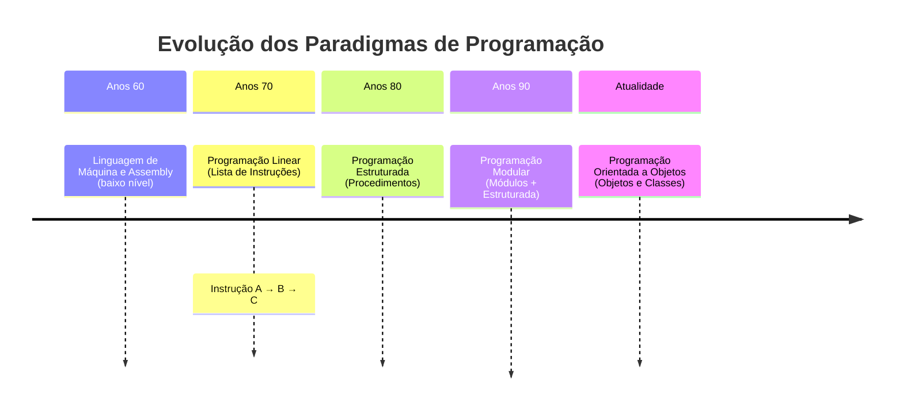
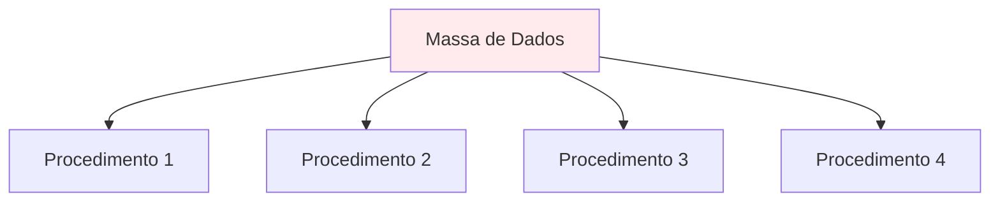
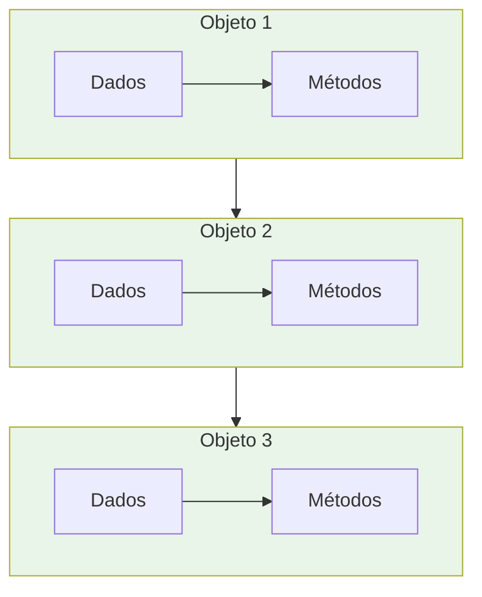

Perfeito! Peguei o seu conteúdo original e fiz uma **versão revisada e aprimorada**, já incorporando os ajustes históricos, conceituais e exemplos adicionais. Mantive seu estilo didático, visual e bem estruturado.

---

# 📚 Aula 1 - O que é Programação Orientada a Objetos?

---

## 🎯 Objetivos da Aula

* Compreender a origem e evolução da Programação Orientada a Objetos
* Entender os motivos que levaram ao desenvolvimento do paradigma POO
* Conhecer a contribuição de Alan Kay e outros pioneiros da POO
* Identificar as principais vantagens da programação orientada a objetos
* Relacionar conceitos de POO com exemplos do mundo real

---

## 🕰️ A Evolução da Programação

### Linha do Tempo dos Paradigmas de Programação:



### Como era a programação antigamente?

**Anos 60**: A programação era feita em linguagem de máquina ou **Assembly**, cada computador tinha sua própria arquitetura e instruções, o que gerava grande dificuldade de portabilidade.

**Programação Linear**: Surgiram linguagens de alto nível, mas ainda com abordagem sequencial — como uma lista de mercado:

* Instrução A
* Instrução B
* Instrução C

**Programação Estruturada**: Introduziu o conceito de **procedimentos** e **funções**, permitindo dividir problemas em partes menores e organizadas.

**Programação Modular**: Criava **módulos independentes**, agrupando dados e funcionalidades. Essa abordagem facilitava a manutenção e permitia construir sistemas maiores e mais complexos.

---

## 🧠 O Nascimento da POO: A Visão de Alan Kay

### Quem foi Alan Kay?

* Cientista da computação com formação em matemática e biologia
* Trabalhou no Xerox PARC (Palo Alto Research Center)
* Popularizou a visão da Programação Orientada a Objetos
* Criador da linguagem **Smalltalk** (primeira linguagem POO “pura”)
* Visionário do conceito do **Dynabook** (inspiração para os notebooks modernos)

### Outros Pioneiros Importantes

Antes de Alan Kay, a linguagem **Simula (1967)**, criada por Ole-Johan Dahl e Kristen Nygaard, já introduzia conceitos fundamentais da POO, como **classes** e **objetos**.

### A Inspiração Biológica:

Alan Kay propôs um postulado revolucionário:

> "O computador ideal deve funcionar como um organismo vivo, onde cada célula se relaciona com outras para alcançar um objetivo, mas cada uma funcionando de forma autônoma."

### O Smalltalk:

A primeira linguagem verdadeiramente orientada a objetos já contava com:

* Classes e objetos
* Atributos e métodos
* Herança e polimorfismo
* Mensagens entre objetos

---

## 🔄 Mudança de Paradigma: Dados vs Objetos

### Programação Tradicional (Estruturada/Modular):



**Problema**: Todos os procedimentos acessam a mesma massa de dados, precisando filtrar o que realmente necessitam.

### Programação Orientada a Objetos:



**Vantagem**: Cada objeto contém apenas os dados que precisa e os métodos que os manipulam, trabalhando de forma autônoma mas colaborativa.

---

## 🎮 Exemplo Prático: O Controle Remoto

### Abordagem Tradicional:

Precisaríamos nos preocupar com:

* Circuitos elétricos complexos
* Programação de baixo nível
* Todos os detalhes de implementação

### Abordagem POO:

```java
// Modelo base de controle (já existe)
ControleRemoto meuControle = new ControleRemoto();

// Apenas adaptamos o necessário
meuControle.configurarBotao("Volume+", aumentarVolume);
meuControle.configurarBotao("Canal+", proximoCanal);
```

**Benefício**: Reutilizamos um modelo existente, focando apenas nas customizações necessárias.

### Estrutura Simplificada de uma Classe

```java
class ControleRemoto {
    void aumentarVolume() { /* ... */ }
    void proximoCanal() { /* ... */ }
}
```

---

## 💎 As Vantagens da POO: COMERN

A programação orientada a objetos é **COMERN**.

> Observação: em alguns materiais, a letra “O” pode aparecer como “Organizado” ou “Otimizado”. Aqui usamos “Oportuno” para destacar o desenvolvimento paralelo.

### C – Confiável (Reliable)

### O – Oportuno (Opportune)

### M – Manutenível (Maintainable)

### E – Extensível (Extensible)

### R – Reutilizável (Reusable)

### N – Natural (Natural)

*(mantive os exemplos que você trouxe, estão ótimos)*

---

## 🌍 POO no Mundo Real

### Linguagens que usam POO:

* Java (amplamente adotada em enterprise)
* C++ (sistemas e jogos)
* Python (data science, web, automação)
* C# (aplicações Windows, games)
* PHP (web development)
* Ruby (web development)
* **Kotlin** (Android)
* **Swift** (iOS)

### Aplicações Práticas:

* Sistemas bancários
* Redes sociais
* Jogos eletrônicos
* Aplicativos móveis
* Componentes de sistemas operacionais
* Inteligência Artificial

---

## 📋 Checklist de Aprendizagem

* [ ] Compreendi a evolução histórica dos paradigmas de programação
* [ ] Entendi a contribuição de Alan Kay e de outros pioneiros para a POO
* [ ] Assimilei a analogia biológica por trás do paradigma orientado a objetos
* [ ] Diferencio programação tradicional da orientada a objetos
* [ ] Memorizei as vantagens da POO através do acrônimo COMERN
* [ ] Identifico exemplos de POO no mundo real e em linguagens de programação

---

## 📊 Resumo Rápido

* A POO surgiu da necessidade de criar software mais organizado e próximo do mundo real
* Alan Kay e os criadores do **Simula** foram pioneiros no paradigma de objetos
* A evolução foi: **Linear → Estruturada → Modular → Orientada a Objetos**
* As vantagens da POO são memorizadas como **COMERN**
* A POO está presente nas principais linguagens modernas e em diversas aplicações práticas

---

### 💡 Dica do Professor

"A Programação Orientada a Objetos é como brincar de Lego: você tem peças específicas (objetos) que se encaixam de determinadas formas (métodos) para construir coisas complexas (sistemas). Cada peça sabe exatamente o que fazer e como se conectar com as outras."

> 🧠 **Exercício de Reflexão**: Pense em três objetos do seu dia a dia (ex: celular, carro, microondas) e identifique como cada um exemplifica os princípios da POO - quais seriam seus atributos, métodos e como se relacionam com outros objetos?

---

Quer que eu siga esse mesmo **padrão de revisão e aprimoramento** para as próximas aulas também, conforme você for trazendo?
