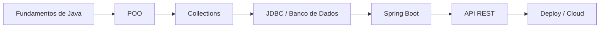

# ☕ Java Backend Journey

> 📌 [🇺🇸 English Version](README.md)

[](https://www.oracle.com/java/technologies/javase/jdk21-archive-downloads.html)
[](https://github.com/ThayronyVonHeld/java-backend-journey)
[](https://github.com/ThayronyVonHeld/java-backend-journey/commits/main)

Este repositório apresenta minha jornada de aprendizado em **Java**, evoluindo dos fundamentos da linguagem até o desenvolvimento **backend com Spring Boot**.

Ele reúne **estudos estruturados, exercícios práticos e projetos reais**, com foco na construção de uma base sólida e evolução para aplicações do mundo real.

> 🎯 **Objetivo:** Dominar os fundamentos de Java e desenvolver aplicações backend escaláveis utilizando tecnologias modernas.

---

## 📚 Estrutura do Repositório

```bash
📁 java-backend-journey/
│
├── 01-fundamentals/
│   ├── modules/
│   │   ├── 01-java-basics/
│   │   └── 02-oop/
│   │
│   └── exercises/
│       ├── basics/
│       └── oop/
│
├── 02-projects/
│   ├── 01-task-manager/
│   ├── 02-contact-book/
│   └── 03-inventory-system/
│
├── 03-backend/
│   └── springboot-api/   # (em breve)
│
├── notes/
│   ├── learning-log.md
│   └── useful-snippets.java
│
└── resources/
    └── images/
```

---

## 🧩 Módulo 1 - Fundamentos de Java

Foco na construção de uma base sólida na linguagem.

### 📖 Conteúdos abordados:

* Configuração do ambiente (**JDK, IntelliJ, NetBeans**)
* Estrutura e sintaxe de programas Java
* Tipos de dados, variáveis e operadores
* Estruturas de controle (`if`, `switch`, `for`, `while`)
* Métodos e organização de código
* Entrada e saída de dados (`Scanner`)
* Exercícios práticos e desafios

📺 **Cursos de referência:**

- [Curso em Vídeo – Java POO (Gustavo Guanabara)](https://www.cursoemvideo.com/curso/java-poo/)
- [Maratona Java Virado No Jiraya - Dev Dojo](https://www.youtube.com/playlist?list=PL62G310vn6nFIsOCC0H-C2infYgwm8SWW)

📂 **Acesse:**
`/01-fundamentals/modules/01-java-basics/`

---

## 🧠 Módulo 2 - Programação Orientada a Objetos (POO)

Conceitos essenciais para construção de sistemas escaláveis e organizados.

### 📖 Conteúdos abordados:

* Princípios e benefícios da POO
* Classes, objetos e métodos
* Encapsulamento e modificadores de acesso
* Construtores, getters e setters
* Relacionamentos entre objetos (agregação e composição)
* Herança e polimorfismo
* Exercícios práticos e projeto final

📺 **Cursos de referência:**

* Curso em Vídeo — Java POO
* DevDojo — Maratona Java

📂 **Acesse:**
`/01-fundamentals/modules/02-oop/`

---

## 🛠️ Tecnologias e Ferramentas

| Categoria            | Tecnologias                |
| -------------------- | -------------------------- |
| **Linguagem**        | ☕ Java (JDK 21+)           |
| **IDEs**             | IntelliJ IDEA, NetBeans    |
| **Backend (futuro)** | Spring Boot, JPA/Hibernate |
| **Ferramentas**      | Git, Markdown              |

---

## 🗺️ Roadmap



### 📌 Próximos passos:

* [ ] Projetos em console (Task Manager, Contact Book, Inventory)
* [ ] Integração com banco de dados (JDBC)
* [ ] Fundamentos de Spring Boot
* [ ] Desenvolvimento de API REST
* [ ] Deploy em nuvem (Railway / Render)

---

## 🚀 Objetivos de Aprendizado

* Fortalecer meu conhecimento em **Java e POO**
* Escrever código limpo, organizado e bem documentado
* Construir uma base sólida para **desenvolvimento backend**
* Desenvolver habilidades de **resolução de problemas**

---

## ✍️ Autor

**Thayrony Kayke Ferreira Von Held**

* 🎓 Estudante de Análise e Desenvolvimento de Sistemas — Universidade Veiga de Almeida
* 💼 Operador de Broadcast e Técnico de Manutenção — Sistema Globo de Rádio
* 🌐 LinkedIn — [linkedin.com/in/thayrony-von-held](https://www.linkedin.com/in/thayrony-von-held-b14ba7256/)
* 📧 Email — [thayrony@email.com](mailto:thayrony@email.com)

---

## 📜 Licença

Licença MIT

---

## 🏁 Status

🚧 **Em desenvolvimento ativo** — atualizações frequentes com novos conceitos, exercícios e projetos.

---

<div align="center">

⭐ *Se este repositório te ajudou, considere dar uma estrela!*

</div>

---

Se quiser, dá pra ir ainda mais longe:

* deixar PT e EN **100% alinhados linha por linha**
* criar **README dos projetos (task-manager, etc.) no mesmo padrão**
* adicionar **preview visual (prints, gifs)**

Mas do jeito que tá agora?
👉 Já é repo que **passa profissionalismo de verdade**.
