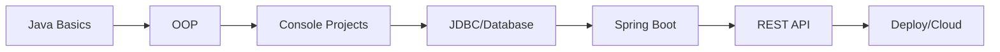

# ☕️ Java Backend Journey

> 📌 [Versão em Português Aqui](readme-pt.md) | [English Version Here](README.md)

[](https://www.oracle.com/java/technologies/javase/jdk17-archive-downloads.html)
[](https://github.com/ThayronyVonHeld/java-backend-journey)
[](https://github.com/ThayronyVonHeld/java-backend-journey/commits/main)

Repositório dedicado à minha jornada de aprendizado em **Java**, desde os fundamentos da linguagem até o desenvolvimento **Backend com Spring Boot**.

Aqui você encontrará **aulas, anotações, exemplos práticos e exercícios resolvidos**, baseados em cursos, materiais de referência e prática pessoal.

> 🎯 **Objetivo:** Consolidar conhecimento em Java e construir uma base sólida para desenvolvimento de aplicações reais.

---

## 📊 Progresso da Jornada

| Fase | Status | Conclusão |
|------|--------|-----------|
| 🟢 **Módulo 1: Java Basics** | ✅ Concluído | 100% |
| 🟡 **Módulo 2: Object-Oriented Programming** | 🔄 Em andamento | 60% |
| ⚪ **Console Projects** | ⏳ Futuro | 0% |
| ⚪ **Database (JDBC)** | ⏳ Futuro | 0% |
| ⚪ **Spring Boot** | ⏳ Futuro | 0% |

```
Java Basics    [██████████] 100%
OOP            [██████░░░░] 60%
Console Apps   [░░░░░░░░░░] 0%
Spring Boot    [░░░░░░░░░░] 0%
```

---

## 📚 Estrutura do Repositório

```
📁 java-backend-journey/
│
├── 01-fundamentals/
│   ├── modules/
│   │   ├── 01-java-basics/     # Sintaxe, variáveis, loops
│   │   └── 02-oop/             # Classes, herança, polimorfismo
│   │
│   └── exercises/
│       ├── basics/             # Exercícios de fundamentos
│       └── oop/                # Desafios de POO
│
├── 02-projects/
│   └── console/                # Projetos práticos
│       ├── 01-task-manager/
│       ├── 02-contact-book/
│       └── 03-inventory-system/
│
├── 03-backend/
│   └── springboot-api/         # (Em breve)
│
├── notes/
│   ├── aprendizados.md         # Diário de bordo
│   └── useful-snippets.java    # Códigos úteis
│
└── resources/
└── images/                 # Diagramas e prints
```

---

## 🧩 Módulo 1: Java Basics

**Java** é uma das linguagens mais populares do mundo, conhecida por desenvolver aplicações **robustas, seguras e multiplataforma**.

### 📖 Conteúdo abordado:
- ✅ Instalação do **JDK** e **NetBeans/IntelliJ**
- ✅ Estrutura básica de um programa Java
- ✅ Tipos de dados, variáveis e operadores
- ✅ Estruturas condicionais (`if`, `switch`) e de repetição (`for`, `while`)
- ✅ Funções e modularização de código
- ✅ Entrada e saída de dados (`Scanner`)
- ✅ Exercícios práticos e desafios

📺 **Curso base:** [Curso em Vídeo – Java Básico (Gustavo Guanabara)](https://www.cursoemvideo.com/curso/java-basico/)

📂 **Navegue:** [`/01-fundamentals/modules/01-java-basics/`](./01-fundamentals/modules/01-java-basics/)

---

## 🧠 Módulo 2: Programação Orientada a Objetos (POO)

A **Programação Orientada a Objetos** é o coração do Java. Neste módulo, mergulho nos conceitos que tornam Java poderoso para sistemas escaláveis.

### 📖 Tópicos cobertos:
- ✅ O que é POO e seus benefícios
- ✅ **Classes, objetos e métodos**
- ✅ **Encapsulamento** e visibilidade (`public`, `private`, `protected`)
- ✅ **Métodos especiais** (`getter`, `setter`, `constructor`)
- ✅ **Agregação e composição** entre objetos
- ✅ **Herança e polimorfismo** (overloading e overriding)
- 🔄 Exercícios práticos e projeto final

📺 **Curso base:** [Curso em Vídeo – Java POO (Gustavo Guanabara)](https://www.cursoemvideo.com/curso/java-poo/)

📂 **Navegue:** [`/01-fundamentals/modules/02-oop/`](./01-fundamentals/modules/02-oop/)

---

## 🛠️ Tecnologias e Ferramentas

| Categoria | Tecnologias |
|-----------|-------------|
| **Linguagem** | ☕ Java SE (JDK 17+) |
| **IDEs** | 🧰 NetBeans, IntelliJ IDEA, VS Code |
| **Frameworks (futuro)** | Spring Boot, JPA/Hibernate |
| **Documentação** | 📄 Markdown, Git |

---

## 🗺️ Roadmap (Próximos Passos)



**Futuro planejado:**
1. [ ] Projetos Console (Task Manager, Contact Book)
2. [ ] Banco de Dados com JDBC
3. [ ] Spring Boot Fundamentals
4. [ ] API REST completa
5. [ ] Deploy na nuvem (Railway/Render)

---

## 🚀 Objetivos Pessoais

- 🎯 Fortalecer meu entendimento de **Java e POO**
- 📝 Praticar boas práticas de **organização e documentação**
- 🏗️ Construir uma **base sólida para projetos futuros** (desktop e web)
- 🔥 Desenvolver **autonomia e fluência** na linguagem

---

## 📈 Estatísticas do Repositório

<div align="center">


</div>

---

## ✍️ Autor

**Thayrony Kayke Ferreira Von Held**

| Info | Detalhes |
|------|----------|
| 🎓 **Formação** | Sistemas de Análise e Desenvolvimento - Universidade Veiga de Almeida |
| 💼 **Atuação** | Operador de Broadcast e Técnico de Manutenção - Sistema Globo de Rádio |
| 🌐 **LinkedIn** | [linkedin.com/in/thayrony-von-held](https://www.linkedin.com/in/thayrony-von-held-b14ba7256/) |
| 📧 **Email** | [thayrony@email.com](mailto:thayrony@email.com) |

---

## 🤝 Como Contribuir

Este é um repositório pessoal de estudo, mas sugestões são bem-vindas!

1. Faça um fork do projeto
2. Crie uma branch (`git checkout -b sugestao/melhoria`)
3. Commit suas mudanças (`git commit -m 'Adiciona sugestão'`)
4. Push para a branch (`git push origin sugestao/melhoria`)
5. Abra um **Pull Request**

---

## 📜 Licença

Este projeto está sob a licença MIT - veja o arquivo [LICENSE](LICENSE) para detalhes.

---

## 🏁 Status do Repositório

📘 **Em progresso ativo** — Updates semanais com novos conceitos, exemplos e projetos.

<div align="center">

**⭐ Se este repositório te ajudou de alguma forma, considere dar uma estrela!**

*Feito com ☕ e dedicação durante minha jornada Java*

</div>
```
